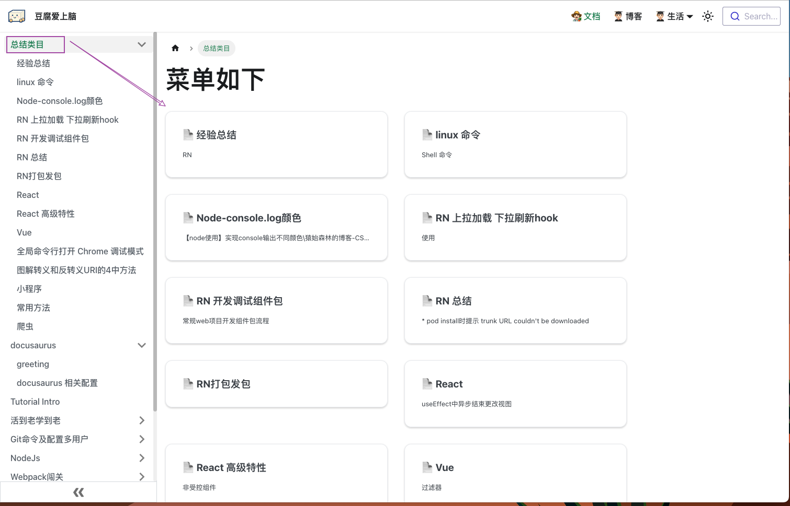
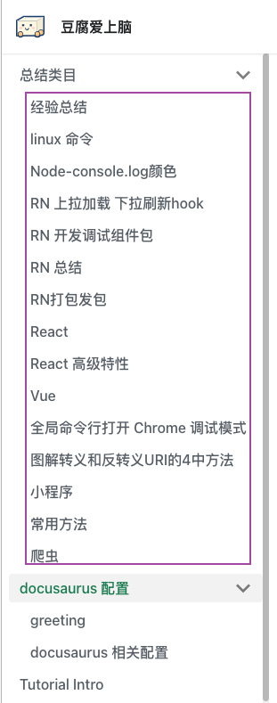
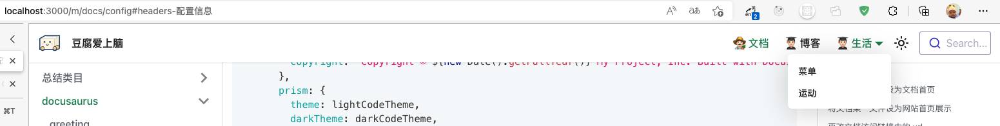

# docusaurus 相关配置

:::info
详情可参照 [官网](https://docusaurus.io/)
:::

## 将文档某一文件设为文档首页

只需将如下内容添加到文档头部即可，docs 文档下只能有一个这样的文件，否则会覆盖

```md title="配置头部展示为 host/docs 首页"
---
slug: /
---
```

## 将文档某一文件设为网站首页展示

> **分 3 步**

1. 修改 `docusaurus.config.js` 中 presets-docs 对象， 添加 `routeBasePath: "/"`。此时并不会生效
2. docs 中找到需要首页展示的 md 文档，然后文档头部添加下面的格式

```md title="配置头部展示为首页"
---
slug: /
---
```

3. 将 src-pages 下的 index.js 重命名，因为默认首页时候该目录下的 index.js

经过以上配置后，首页就会展示为配置的 docs 的文档了

## 更改文档访问链接中的 url

文档的 url 路径默认是它相对于 docs 文件夹的路径，如 docs --> greeting.md 文件，则该文件的访问路径是 `host/docs/greeting`
如何更改呢：就需要用到 slug 配置
在文档的头部添加如下内容，则该文档的访问 url 就会从 `docs/文件名` 更改为 `docs/config`

```js title="配置头部展示为首页"
---
slug: /config
---
```

## 侧边栏

### 配置可隐藏的侧边栏

```javascript title="docusaurus.config.js"
module.exports = {
  themeConfig: {
    docs: {
      sidebar: {
        hideable: true,
        autoCollapseCategories: true,
      },
    },
  },
};
```

配置之后侧边栏的下方会有可收缩标识

### 侧边栏展开隐藏同级菜单

```js title="docusaurus.config.js"
module.exports = {
  themeConfig: {
    docs: {
      sidebar: {
        autoCollapseCategories: true,
      },
    },
  },
};
```

配置之后，展开一个菜单，展开另一个菜单时，第一个菜单就会收起。

### 侧边栏面包屑导航隐藏

```js title="docusaurus.config.js"
module.exports = {
  presets: [
    [
      {
        docs: {
          breadcrumbs: false,
        },
      },
    ],
  ],
};
```

配置之后，内容区头部的面包屑就会隐藏

### 侧边多级菜单点击显示子菜单卡片列表

说不明白，直接上效果图


以上效果很简单，前提是总结类目下有子菜单，只需要给 `docs/总结类目`下新建 `_category_.json`文件，添加以下信息，就会自动生成

```json title="docs/总结类目/_category_.json"
{
  "label": "总结类目", // 菜单显示的名称
  "position": -1, // 侧边显示的顺序
  "link": {
    "type": "generated-index",
    "title": "菜单如下" // 显示的卡片列表的大标题
  }
}
```

### 侧边菜单子选项显示顺序

如何配置菜单下方的内容显示顺序呢



- 方法 1
  像上面给每个菜单下配置 `_category_.json` 的方式，通过添加 position 值，可以进行配置顺序

- 方法 2
  可以在子菜单的 md 文件头部添加如下内容

```md
---
sidebar_position: 1
# sidebar_label: 简单
---
```

- 方法 3
  直接在子菜单的文件夹上添加`00`、`01`这样的顺序，会被自动排序，比较推荐这种，应该优先级比较高点，还方便

**优先级**： `_category_.json` > 文件顺序命名 > md 头部添加 sidebar_position

sidebar_position 就是用来定义显示顺序的

### 侧边栏菜单配置

侧边栏菜单项有 4 钟格式

1. category 层次菜单
2. doc 文档格式
3. link 链接格式
4. html 自定义样式

#### category 格式

```js title="sidebars.js"
module.exports = {
  docs: [
    {
      type: "category", // 类别是层级菜单
      label: "Guides", // 菜单标题
      collapsible: true, // 可展开关闭
      collapsed: false, // 默认关闭
      items: [
        "creating-pages", // 第一级菜单
        {
          // 嵌套二级菜单
          type: "category",
          label: "Docs",
          items: ["introduction", "sidebar", "markdown-features", "versioning"],
        },
      ],
    },
  ],
};
```

以上会生成一个可打开关闭的菜单，默认是关闭的二级菜单，写法比较繁琐，下面是简写形式

```js
module.exports = {
  docs: {
    Guides: [
      "creating-pages",
      {
        Docs: ["introduction", "sidebar", "markdown-features", "versioning"],
      },
    ],
  },
};
```

说明：Guides 指层级菜单的标题，数组中每一项是子菜单的文件 id(默认对应目录的位置，如：`docs/coms/nav.md`, 的文件 id 是 `coms/nav`)，嵌套的二级层级菜单是一个对象，key 是二级菜单的 label，value 是 子菜单的文件 id

## docusaurus.config.js 配置信息

### headers 配置信息

```js title="docusaurus.config.js"
module.exports = {
  themeConfig:
    /** @type {import('@docusaurus/preset-classic').ThemeConfig} */
    ({
      docs: {
        sidebar: {
          hideable: true,
          autoCollapseCategories: true,
        },
      },
      navbar: {
        title: "豆腐爱上脑", // navbar的标题
        logo: {
          alt: "My Site Logo",
          src: "img/logo.svg", // navbar的图标
        },
        items: [
          // navbar的项目标题
          {
            type: "doc", // 类型是doc类型
            docId: "docusaurus/配置", // 点击跳转的文档路径
            position: "right", // 居于navbar的右侧
            label: "👨🏻‍🌾 文档", // 标题项
          },
          { to: "/blog", label: "👨🏻‍🎓 博客", position: "right" },
          {
            to: "/life",
            label: "👨🏻‍🎓 生活",
            position: "right",
            items: [{ label: "菜单", to: "/life" }], // 配置下拉菜单 to 标识跳转的链接
          },
          // {
          //   href: "https://github.com/facebook/docusaurus", // 外链的形式 也可以不加http 跳转的是项目内
          //   label: "GitHub",
          //   position: "right",
          // },
        ],
      },
      footer: {
        style: "dark",
        copyright: `Copyright © ${new Date().getFullYear()} My Project, Inc. Built with Docusaurus.`,
      },
      prism: {
        theme: lightCodeTheme,
        darkTheme: darkCodeTheme,
      },
    }),
};
```

经过以上配置后，效果如下：


## 添加全局搜索

目前看只有这个支持的好一点，但是搜索中文得加 npm 包：nodejieba
[@cmfcmf/docusaurus-search-local](https://github.com/cmfcmf/docusaurus-search-local)

## 部署问题

### 发布到 Github page

#### 流程

1. 先 github 新建一个仓库 如：`markdowns`
2. 将项目的 `docusaurus.config.js` 配置中的 baseUrl 修改为 仓库名 `/markdowns/`
3. 建立远程连接 并推送

```bash
git remote add origin https://github.com/iu-peng/markd.git && git push -u origin "main"
```

4. 仓库新建分支 `gh-pages`，然后到 settings --> pages 中修改分支为 gh-pages
5. 项目新建工作流 ，新建文件 `.github/workflows/deploy.yml`

```yml title=".github/workflows/deploy.yml"
name: Deploy to GitHub Pages

on:
  push:
    branches:
      - main
    # 如果你想要进一步定义触发条件、路径等，可以查看文档
    # https://docs.github.com/en/actions/using-workflows/workflow-syntax-for-github-actions#on

jobs:
  deploy:
    name: Deploy to GitHub Pages
    runs-on: ubuntu-latest
    steps:
      - uses: actions/checkout@v2
      - uses: actions/setup-node@v3
        with:
          node-version: 18
          cache: yarn

      - name: Install dependencies
        run: yarn install --frozen-lockfile
      - name: Build website
        run: yarn clear && yarn build

      # 部署到 GitHub Pages 的热门选择：
      # 文档：https://github.com/peaceiris/actions-gh-pages#%EF%B8%8F-docusaurus
      - name: Deploy to GitHub Pages
        uses: peaceiris/actions-gh-pages@v3
        with:
          github_token: ${{ secrets.GITHUB_TOKEN }}
          # 要发布到 `gh-pages` 分支的构建输出：
          publish_dir: ./build
          # 下面两行会将此次部署 commit 的作者设置为官方的
          # GH-Actions 机器人：
          # https://github.com/actions/checkout/issues/13#issuecomment-724415212
          # 如果不设置这两个字段，GH actions 机器人会被默认使用。
          # 你可以用自己的用户信息替换它们。
          user_name: github-actions[bot]
          user_email: 41898282+github-actions[bot]@users.noreply.github.com
```

提交之后，GitHub 就会自动在 action 中帮你构建，完成之后，访问 url + baseUrl 就能看到结果了

#### 问题

```js title="docusaurus.config.js"
module.exports = {
  url: "https://iu-peng.github.io",
  baseUrl: "/markd/",
};
```

其中 baseUrl 是你 github 仓库的名字，如果你的仓库是 `iu-peng.github.io`，则 baseUrl 必须是 `/`，否则会部署失败
