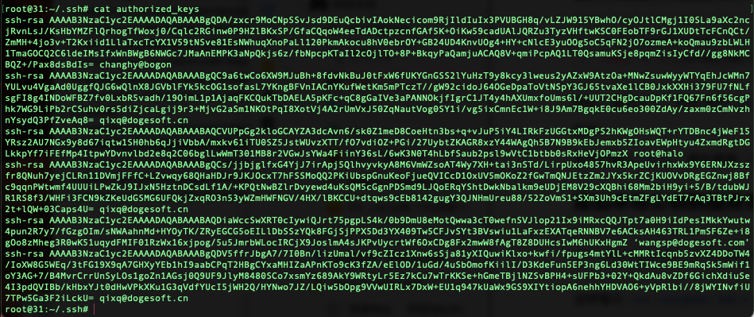
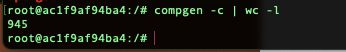

# linux 命令

## Shell 命令

### 1. 判断文件夹是否存在

[Linux 中 Shell 脚本判断文件或文件夹是否存方法 - 简书 (jianshu.com)](https://www.jianshu.com/p/d69895d48124 "Linux中Shell脚本判断文件或文件夹是否存方法 - 简书 (jianshu.com)")

```bash
# 文件夹存在的话 会输出1 否则会输出0
test -d node_modules && echo 1 || echo 0
```

### 2. 判断文件是否存在

```bash
# 判断文件是否存在 是的话输出1 否则会输出0
test -f package.json && echo 1 || echo 0
```

## 添加 oh-my-zsh

命令行直接安装，如果之前有安装过，可以先删除.zshrc 文件

### 从 bash 切换到 zsh 导致 command not found 问题

需要编辑.zshrc 文件 ，让 bash 内的配置导入到 zsh

```bash
vi ~/.zshrc

# 之后在这个位置添加
# User configuration
source ~/.bash_profile

```

### zsh 添加别名 alias

可以在.zshrc 文件尾部追加 alias 配置，为了好管理 建议新建一个文件，

```bash
touch .custom_cmd
vi .custom_cmd

# 将以下内容复制到该文件内
alias duty="code ~/Document/work/duty"

```

此时可以将该文件添加到.zshrc 中进行解析

```bash
# 在开头位置进行加载
test -f ~/.custom_cmd && source ~/.custom_cmd
```

到此，就可以了，然后 执行 `source ~/.zshrc` ，让配置生效

验证：

命令行输入`duty`，就会直接 `vscode` 打开`duty`工作目录

## 添加本地公钥到服务实现免密登录

```bash
ssh-copy-id -i ~/.ssh/id_rsa.pub root@192.168.2.31
```

这样每次`ssh root@192.168.2.31`就可以直接进入，不用每次都输入密码了、

说明：这样会把本地的公钥 id_rsa.pub 复制到目标服务器上 \~/.ssh/authorized_keys 文件内，这样每次就不需要输入密码，直接可以登录了



## 压缩

```bash
zip -q -r duty.zip ./duty
```

说明: 压缩当前目录中的 duty 文件夹下所有内容，-q 不显示指令过程

## 解压

```bash
unzip duty.zip -d ./test
```

说明：解压该压缩包 到 指定目录（当前目录下 test）中

## 查看目录所有文件

```bash
// 显示所有文件
ls -a

// 显示所有文件及拥有者、权限、文件大小等信息
ls -la


```

## tree 查看目录树状结构

没有的话需要安装对应系统的 tree

ubuntu 可以通过`apt-get install tree`进行安装，如果提示不可以，可以先更新`apt-get update`

```typescript
// 查看三层目录结构 不指定的话是查看所有
tree -L 3
```

### 排除指定目录

```bash
# 排除项目中 node_modules 目录
tree -L 3 -I 'node_modules'
```

## 查看命令

### 所有可执行命令

```bash
compgen -c
```

### 查看某一个命令

```bash
compgen -c |grep apt-get
```

### 查看有多少命令可执行

```bash
compgen -c | wc -l
```



## 编辑命令

```bash
按ESC键 跳到命令模式，然后输入：

:w            - 保存文件，不退出 vim
:w file  -将修改另外保存到 file 中，不退出 vim
:w!          -强制保存，不退出 vim
:wq          -保存文件，退出 vim
:wq!        -强制保存文件，退出 vim
:q            -不保存文件，退出 vim
:q!          -不保存文件，强制退出 vim
:e!          -放弃所有修改，从上次保存文件开始再编辑 相当于git放弃所有更改

# 方向操作
h←  j↓  k↑  l→

# 撤销
u

# 删除后面的
x
```

## 安装 curl

[Easy way to install nvm on Ubuntu 18.04 | by Ndamulelo Nemakhavhani | Medium](https://nbanzyme.medium.com/easy-way-to-install-nvm-on-ubuntu-18-04-2cfb19ee5391 "Easy way to install nvm on Ubuntu 18.04 | by Ndamulelo Nemakhavhani | Medium")

curl（client-url）是用来请求 web 服务器的工具，用来请求或安装一些东西

## curl 安装 node 实践

1.  首先安装 curl

    1.  apt install curl

2.  通过 curl 安装 nvm

    - 下载 nvm

      curl -o- [https://raw.githubusercontent.com/creationix/nvm/v0.33.0/install.sh](https://raw.githubusercontent.com/creationix/nvm/v0.33.0/install.sh "https://raw.githubusercontent.com/creationix/nvm/v0.33.0/install.sh") | bash

    - 配置环境变量

      ```bash
      export NVM_DIR="$HOME/.nvm"
      [ -s "$NVM_DIR/nvm.sh" ] && \. "$NVM_DIR/nvm.sh"
      [ -s "$NVM_DIR/bash_completion" ] && \. "$NVM_DIR/bash_completion"
      ```

    - nvm 就已经生效了

3.  通过 nvm 安装指定版本 node

    ```bash
    nvm install 14
    node -v
    ```

4.  全局安装 yarn

    ```bash
    npm -g i yarn
    ```

## Linux 中 vim 模式-中文乱码

编辑 `~/.vimrc` 文件，没有就手动创建 `touch .vimrc` ，输入以下内容

```bash
set fileencodings=utf-8,ucs-bom,gb18030,gbk,gb2312,cp936
set termencoding=utf-8
set encoding=utf-8
```

### 安装 vim

没有 vim 时， 可以先安装

```bash
apt install vim
# 不行的话先执行该命令
apt-get update
```
