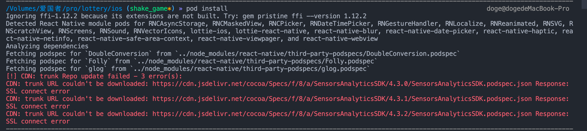
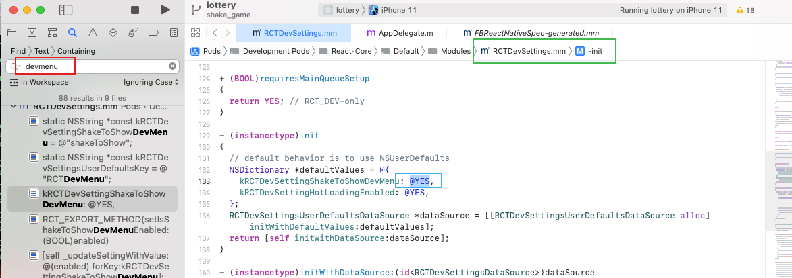
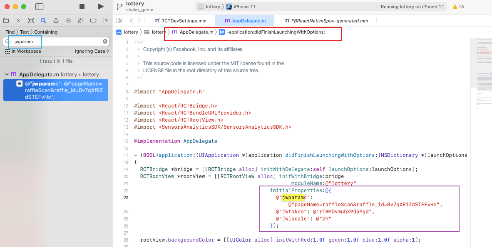

# RN 总结


*   `pod install`时提示 `trunk URL couldn't be downloaded`

    切换梯子工具后也不好使，应该不是梯子的原因。

    

    解决办法：

    在 Podfile 文件开头添加&#x20;

    ```bash
     source https://github.com/CocoaPods/Specs.git
    ```

    执行pod install还是不行，这时还不行，还是同样的报错，没有走上面配置的链接，走的还是trunk

    命令行执行 `pod repo remove trunk`，移除pod源trunk

    查看pod源 `pod repo list`，发现没有trunk了

    然后在进行pod install，就可以成功了

*   手机开发摇一摇时，总是摇出开发菜单

    解决办法：

    在以下文件中将`YES`改为`NO`，重新run一下就行

    

*   需要移动端传参进入，或者模拟移动端调起RN时

    解决办法：

    以下文件中修改定义的参数就行

    

*
