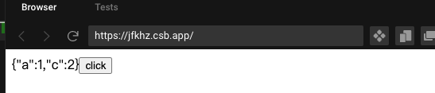
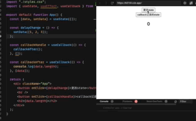

# React


# 常见问题 及 解决方案


### useEffect中异步结束更改视图

在实际开发中，往往会碰到请求数据列表之后，按顺序遍历列表数据，然后根据数据id请求相应的子数据，理想情况是1请求完之后，开始请求2，然后是3，以此类推。但是代码写出来就不是这个结果了

```react&#x20;tsx
async function delay(i){
  return new Promise((rel, rej) => {
    setTimeout(()=> {
      rel(i)
    },1000)
  })
}

useEffect(() => {
    (async () => {
      [1,2,3,4].forEach(async (i) => {
        const a = await delay(i)
        console.log('log--',a)
      })
    })()
  },[])
```

这样写的结果是，1s过后，同时打印了1，2，3，4。foreach会把所有的回调函数都执行了一遍，并没有按顺序await等待

#### 解决办法：

```react&#x20;tsx
useEffect(() => {
    (async () => {
      for (const i of [1,2,3,4]) {
        const a = await delay(i)
        console.log('log--',a)
      }
    })()
  },[])
```

使用`for of` 或者`for in` 都可以达到这样的效果：按顺序每隔一秒按次打印

<https://codesandbox.io/s/render-async-2n54k?file=/src/index.js>


### 异步中state为对象直接更改键值

如下代码直接更改对象键值并不会触发重新渲染

```react&#x20;tsx
const [schema, setSchema] = useState({ a: 1 });

useEffect(() => {
    (async () => {
      for (const i of [1,2,3,4]) {
        const a = await delay(i)
        console.log('log--',a)
        schema.a = a
      }
    })()
  },[])
  
  return <h2>{schema.a}</h2>

```

#### 解决办法：

```react&#x20;tsx
const [schema, setSchema] = useState({ a: 1 });
const [, update] = useState(false);

useEffect(() => {
    (async () => {
      for (const i of [1,2,3,4]) {
        const a = await delay(i)
        console.log('log--',a)
        schema.a = a
        update(pre => !pre)
        // if (i === 4) update(pre => !pre)
      }
    })()
  },[])
  
  return <h2>{schema.a}</h2>
```

更改完键值对后，再次update调用刷新，就会看到页面刷新了，schema.a依次显示1，2，3，4。

也可以在最后一次调用刷新


### setState同步异步

看当前组件更新是否是处于isBatchingUpdate（更新时true， 结束为false）， 如果当前处于批处理更新中，那么就不会走，如果不处于更新中，那就会更新

*   异步

    1.  直接使用setState

        ```javascript
        <button onClick={clickHandle}>

        // js
        const clickHandle = () => {
          this.setState({count: this.state.count++})
          console.log(this.state.count) // 此处还是之前的count
        }
        ```

*   同步

    1.  setTimeout

        ```javascript
        const clickHandle = () => {
          setTimeout(()=> {
            this.setState({count: this.state.count++})
            console.log(this.state.count) // 此处是最新的count
          },0)
        }
        ```

    2.  自定义DOM事件

        ```javascript
        componentDidMount(){
          document.body.addListener('click', ()=>{
            this.setState({count: this.state.count++})
            console.log(this.state.count) // 此处也是最新的count
          })
        }
        ```

### setState 合并

1.  传入对象会被合并

    ```javascript
    const clickHandle = () => {
      // count: 0
      this.setState({count: this.state.count+1})
      this.setState({count: this.state.count+1})
      this.setState({count: this.state.count+1})
      // 1
    }
    ```

    以上setState传入的是对象会被合并，最终输出1

2.  传入函数不会被合并

    ```javascript
    const clickHandle = () => {
      // count: 0
      this.setState((preState, props) => ({count: preState.count+1}))
      this.setState((preState, props) => ({count: preState.count+1}))
      this.setState((preState, props) => ({count: preState.count+1}))
      // 3
    }
    ```

    如果setState传入的是函数，则不会被合并，最终输出3


### 多次set只会走最后一次

```javascript
import React, {useState, useEffect} from "react";

export default function App() {
  const [data, setData] = useState({a: 1})
  const clickHandle = () => {
    ['b','c'].forEach((key) => {
      // setData(pre => ({...pre, [key]: 2})) // 解决办法
      setData({...data, [key]: 2})
    })
  }
  return (
    <div className="App">
      {JSON.stringify(data)}
      <button onClick={clickHandle}>click</button>
    </div>
  );
}
```



上面的例子点击后的data值是`{"a":1,"c":2}`，并非 `{"a":1,"b":2,"c":2}`,多次set只会走最后一次，解决办法是使用回调函数，就是以上注释的部分


### Event: target currentTarget

**target**是触发事件的对象，可能它没有绑定事件

**currentTarget**是绑定事件的对象

如：react17之前，事件都绑定在`document`上，如果一个button触发了事件，那么target就是button，currentTarget却是document

### React useCallback的坑

useCallback返回的函数会缓存一个函数，如果缓存的函数里有调用别的函数fn，即使fn函数没有使用useCallback，该函数fn也会被缓存，fn依赖的数据也不是最新的。

```javascript
function App() {
  const [data, setData] = useState([]);

  const delayChange = () => {
    setData([1, 2, 3]);
  };

  const callbackHandle = useCallback(() => {
    callbackAfter();
  }, []);

  const callbackAfter = () => {
    console.log(data.length); // 此处会打印0
  };

  return (
    <div className="App">
      <button onClick={delayChange}>更改state</button>
      <br />
      <button onClick={callbackHandle}>callback记录的state</button>
      <h2>{data.length}</h2>
    </div>
  );
}

```

因为`callbackHandle`使用了`useCallback`，它内部的函数`callbackAfter` 也会被缓存，`callbackAfter` 记录的data的值还是`[]` ,所以会打印0




解决办法：

```javascript
  const callbackHandle = useCallback(() => {
    callbackAfter();
  }, [data]);
```

即使看似 callbackHandle 和data无关， 但是内部的函数和data有关，所以加data依赖


### React Hooks return顺序

```react&#x20;jsx
const Demo = (props) => {
  if(!props.data) return null
  useEffect()
  const [] = useState()
}
```

如果在hooks之前就 return结果，那么有数据和没数据的时候，两次渲染hooks就会有不同的执行顺序，没有data时不走下面的hook，有data时会走hook，这样两次渲染就会有不一样的顺序，这是不允许的，迟早会出错

### React Memo优化组件渲染

```react&#x20;tsx
import { ComponentType, memo, SFC } from "react"

const memoComponent = <T>(
  component: ComponentType<T>,
  excludeParams: Array<keyof T> = undefined,
  func: typeof contrastProps = contrastProps,
) => {
  return memo(component, (pre, next) => func(pre, next, excludeParams))
}

function contrastProps<T>(pre: T, next: T, excludeParams: Array<keyof T> = []) {
  const keys = Object.keys(next)
  excludeParams.forEach(item => {
    const onchangeIdx = keys.findIndex(it => it === item)
    if (onchangeIdx >= 0) keys.splice(onchangeIdx, 1)
  })
  return keys.every(it => pre[it] === next[it])
}
// 使用
export const MemberItem = memoComponent(_MemberItem, ["onPress"])

```


### RN 上拉加载hook

[RN 上拉加载 下拉刷新hook](https://www.wolai.com/wosMxztZa6ynbYVg3BhEHu "RN 上拉加载 下拉刷新hook")

# 知识点


## 监听useRef值的变化

useRef返回的值带current的对象，所以useEffect无法监听到他的变化

```javascript
function App() { 
  const ref = useRef({a: 1})
  useEffect(() => {
    console.log('更改了吗', ref.current)
  },[ref.current])
  
  const click = () => {
    ref.current.a = Math.random()
    // ref.current = {a: Math.random()};
  };
  
  const show = () => setV((pre) => ++pre)
  
  console.log("render", ref.current);

  return (
    <div className="App">
      {JSON.stringify(ref.current)}
      <button onClick={click}>更改ref</button>
      <button onClick={show}>显示</button>
    </div>
  );
 }
```

1.  依赖项是`ref` 或者`ref.current` 或者 `ref.current.a`， 只点击更改ref按钮，并不会触发更新，因为并没有让函数组件App重新走一遍

2.  点击显示按钮，会让组件重新走一遍，如果之前更改了`ref.current.a`的值，而useEffect的依赖项恰好是 `[ref.current.a]` 而不是 `[ref]` 或 `[ref.current]` 的话，重新render会让该useEffect执行

3.  如果useEffect 的依赖项是 `[ref.current]` ，想让该useEffect 执行，只有更改该current的引用才会让该useEffect执行。

4.  如果依赖项是 `[ref]` ，即使给ref重新赋值，让该函数组件从新render，也不会让useEffect执行，也没这个必要。

总结：&#x20;

如果依赖项是useRef的返回值 `ref.current.a` 或者 `ref.current` ，更改了依赖项，本应该触发useEffect的更新，但是因为没有重新render函数组件，所以并不会触发useEffect。

**想触发依赖ref的useEffect，只有让该函数组件重新render才会取到ref的最新值，从而触发useEffect。**

codesandbox地址

<https://codesandbox.io/s/ref-test-t3kzc>


## React 高级特性

[React 高级特性](https://www.wolai.com/7X1un6fRM95BqieH7UEemL "React 高级特性")

