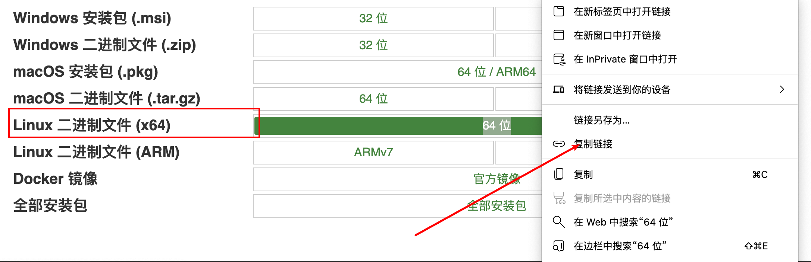

# Vue

## 过滤器

```vue
<div>{{item.price | formatPrice}}</div>

exprot default {
  filters: {
    formatPrice(val){
      if(!val) return '0.00'
      else return val.toFix(2)+'元'
    }
    
  }
}
```


## 路由懒加载&#x20;

下面的方式是全量加载，不利于首屏优化

```javascript
import Foo from './pages/detail.vue'
const router = new VueRouter({
  routes: [
    {
      path: '/foo',
      name: 'foo',      
      component: Foo
    }
  ]
})
```

### 方式1

使用 `@babel/plugin-syntax-dynamic-import` 插件进行加载

```javascript
const router = new VueRouter({
  routes: [
    {
      path: '/foo',
      name: 'foo',      
      component: () => import('./pages/detail.vue')
    }
  ]
})
```

### 方式2

在`router.js`中&#x20;

```javascript
const router = new VueRouter({
  routes: [
    {
      path: '/foo',
      name: 'foo',      
      component: resolve => require(['./pages/detail.vue'], resolve),
      children: []
    }
  ]
})
```


以上方式虽然可以做到按需加载，但是还是会在head标签中有link方式加载带加载的文件而发生预加载，所以为了解决让她真正到相关的路由再去加载相应的文件，需要在vue.config.js 进行如下配置去删除预加载

```javascript
{
  ...
  chainWebpack: (config) => {
    config.plugin.delete('prefetch')
  }
}
```

这样就删除了预加载，只有真正到相关页面才会加载相应的页面


## 项目部署

### Nginx部署

centos系统

1.  购买服务器 进行解析

2.  ssh root@服务器ip地址  进入服务器

3.  安装nginx 使用yum  `yum install nginx`

4.  查看安装目录 `which nginx`

5.  检查nginx配置是否有问题 `nginx -t` ,会输出配置目录和状态 主要关注`nginx.conf`文件

6.  进入配置目录 `cd /etc/nginx` ，查看配置信息 `cat nginx.conf`，主要关注server服务器部分的listen 和location > root | index等

7.  nginx命令&#x20;

    1.  停止服务:  `nginx -s stop`

    2.  启动服务: 直接`nginx` ，启动后直接ip访问就可以了

    3.  服务器上更改文件后重新加载：`nginx -s reload`

8.  默认启动页文件地址 `/usr/share/nginx/html`

9.  更改 `nginx.conf` 配置文件后，需要重启 `nginx -s reload`&#x20;

10. 将nginx默认的启动页`/usr/share/nginx/html/index.html` ，更换为其他html文件步骤：

    1.  拷贝当前index.html文件到另一个目录文件中&#x20;

        1.  进入 `cd /usr/share/nginx/html/`

        2.  拷贝index.html 文件到根目录下的workspace中`cp index.html /workspace/index.html`&#x20;

    2.  修改`nginx.conf` 配置文件

        1.  `cd /etc/nginx`  & `vi nginx.conf` 修改配置文件

        2.  将`server → location → root` 修改为 `/workspace`

        3.  esc :wq保存

    3.  重新reload `nginx -s reload`


### 二级域名部署

通过在 `/etc/nginx/nginx.conf`  配置文件最下方添加额外的配置二级域名信息就行

现在将二级域名配置信息都放在`/etc/nginx/vhosts`目录中，然后在`/etc/nginx/nginx.conf`中进行配置，填加第二行的配置

```javascript
...nginx原配置
include /etc/nginx/vhosts/*.conf;
```

然后在vhosts中添加新的二级域名配置文件

假如一级域名是`baidu.com`，要配置的二级域名是`demo.baidu.com`

vhosts中新建`demo.baidu.conf`配置文件

内容如下

```conf
server {
  listen 80; // 监听的端口
  server_name demo.baidu.com; // 二级域名
  root /workspace/demo; // 文件目录
  index index.html index.htm; // 文件入口
  location ^~/api/ { // 代理信息
    proxy_pass http://api.springboot.cn/;
  }
  location ~ .*\.(gif|jpg|png)$
  {
    root /workspace/demo
  }
  ...
}
```

之后只需要将前端打好的包资源放到`/workspace/demo`中就行了，可以使用ftp或者git


### 服务器通过wget安装Node

由于服务器是linux内核，所以可以选择Linux x86版本（intel版本）的包，由于wget是通过链接形式安装，所以复制该地址



然后进入服务器 目录 cd /soft 将node下载到该目录中

```javascript
wget 上面的链接
```

下载的node包是压缩包，需要解压，有两种解压方式

1.  `tar -zxvf node.tar.gz`  -zxvf 是解压gz压缩格式的压缩包

2.  `tar -xvf node.tar.xz`  -xvf 是解压非gz的压缩包

加压后的node文件夹中有 bin include lib 等文件夹，其中bin目录中有node npm npx等命令

但是现在node npm 的命令还不能全局使用 node -v会提示找不到命令，

所以需要将node添加到环境变量中

查看环境变量 `echo $PATH `,会列出存放变量的目录，一般将我们的命令存放到/usr/local/bin目录中

将node添加到`/usr/local/bin`环境变量 `ln -s /soft/node-v12.1.0/bin/node /usr/local/bin/node` &#x20;

同样的npm 也可以添加  `ln -s /soft/node-v12.1.0/bin/npm /usr/local/bin/npm`&#x20;

添加后 通过命令查看是否有node 和npm环境变量 `ll /usr/local/bin` 会输出node 和 npm 信息

然后全局就可以使用node命令了


