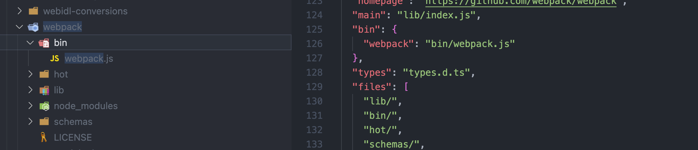
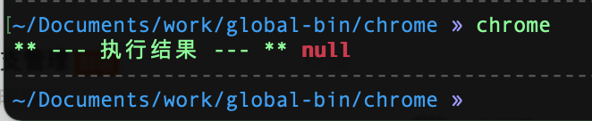

# package.json/bin 定义全局命令行

[npm 自定义全局命令 - SegmentFault 思否](https://segmentfault.com/a/1190000041040161 "npm 自定义全局命令 - SegmentFault 思否")

## npm Link原理

[符号链接(Symbolic)、package.json的bin属性与Shebang - 掘金 (juejin.cn)](https://juejin.cn/post/6844903774843043853 "符号链接(Symbolic)、package.json的bin属性与Shebang - 掘金 (juejin.cn)")

## package.json bin命令使用

### 单个命令的定义1

```json
{
  "name": "my-program",
  "version": "1.2.5",
  "bin": "./demo.js"
}
```

### 单个命令的定义2

```json
{
  "name": "my-program",
  "version": "1.2.5",
  "bin": {
      "demo": "./demo.js"
  }
}
```

方式1 如上所示，如果这个包里只有一个需要的命令，可以直接使用 `bin: 文件路径` 的方式来定义

需要注意的是，demo.js 开头位置需要指定解释器 `#!/usr/bin/env node`，以node环境变量来解析文件

方式2，bin对象下的key，就是直接可以使用的命令，将该npm包执行 `npm link` 之后，就可以直接使用`demo`命令来执行对应的demo.js文件了。


以下是webpack中bin的定义方式



### 多个命令的定义

如果npm包下有多个bin命令，下面的方式亲测是不好使的

**错误❌方式**

```json
{
  "name": "my-program",
  "version": "1.2.5",
  "bin": {
      "cmd1": "./demo.js",
      "cmd2": "./demo2.js"
  }
}
```

**正确✅方式**：

在package.json同级新建文件夹 `bin` ，然后将各个命令对应的文件放在bin目录下，修改package.json的bin字段如下

```javascript
{
  "name": "my-program",
  "version": "1.2.5",
  "bin": {
      "cmd1": "bin/demo.js",
      "cmd2": "bin/demo2.js"
  }
}
```

此时执行`npm link` 后，两个命令就都可以直接使用了！


## zx 方式定义全局命令

全局安装`zx` 后，`package.json → bin` 字段定义如下

```json
"bin": {
    "chrome": "bin/index.js",
    "mark": "bin/mark/markdown.mjs"
}
```

`"bin/mark/markdown.mjs"` 内容如下

```javascript
#!/usr/bin/env zx
$.verbose = false; // 加了这个就不需要 `zx ./a.mjs` 的方式运行了

await $`cd ~/Documents/work/oc/markdown-notes/markdown && yarn start -p 3333`;
```

这样npm link之后也可以成功，文件头部指定的解析器是zx。


> 🤦🏾`注意点` 必须使用npm link，  yarn link会执行不成功


## 全局定义RN 打开chrome disable-web-security调试模式

> RN有个需求，打开chrome的调试模式，如果放在某个项目里，package.json-scripts中定义命令，这就只能在改项目中启动chrome，现在想把它放在全局中，直接命令行输入`chrome` 就打开chrome浏览器

1.  新建文件夹 chrome

    ```bash
    mkdir chrome
    ```

2.  `npm init -y`

3.  package.json定义bin命令

    ```json
    "bin": {
        "chrome": "./index.js"
    },
    ```

4.  新建 `index.js` 文件

    ```javascript
    #!/usr/bin/env node

    /**
     * 打开调试
     */
    const achild_process = require("child_process")
    const user = process.argv[2] || "doge"

    achild_process.exec(
      `open -n /Applications/Google\\ Chrome.app/ --args -u http://localhost:8081/debugger-ui/ --disable-web-security --user-data-dir=/Users/${user}/data`,
      (err, stdout, stderr) => {
        console.log("** --- 执行结果 --- **", err, stdout, stderr) // wsp-log
      },
    )


    ```

5.  然后 `npm link` 到全局

    ```bash
    cd chrome && npm link
    ```

6.  这样在 对应的node版本下就有全局的 bin 命令了

    


**主要用到的就是package.json里的bin命令。**

**请务必在js文件最前方加 ****** ，**否则会不生效**

