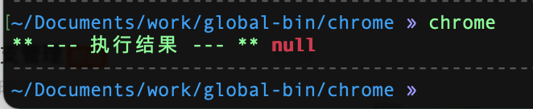

# 全局命令行打开 Chrome 调试模式

[npm 自定义全局命令 - SegmentFault 思否](https://segmentfault.com/a/1190000041040161 "npm 自定义全局命令 - SegmentFault 思否")


> RN有个需求，打开chrome的调试模式，如果放在某个项目里，package.json-scripts中定义命令，这就只能在改项目中启动chrome，现在想把它放在全局中，直接命令行输入`chrome` 就打开chrome浏览器

1.  新建文件夹 chrome

    ```bash
    mkdir chrome
    ```

2.  `npm init -y`

3.  package.json定义bin命令

    ```json
    "bin": {
        "chrome": "./index.js"
    },
    ```

4.  新建 `index.js` 文件

    ```javascript
    #!/usr/bin/env node

    /**
     * 打开调试
     */
    const achild_process = require("child_process")
    const user = process.argv[2] || "doge"

    achild_process.exec(
      `open -n /Applications/Google\\ Chrome.app/ --args -u http://localhost:8081/debugger-ui/ --disable-web-security --user-data-dir=/Users/${user}/data`,
      (err, stdout, stderr) => {
        console.log("** --- 执行结果 --- **", err, stdout, stderr) // wsp-log
      },
    )


    ```

5.  然后 `npm link` 到全局

    ```bash
    cd chrome && npm link
    ```

6.  这样在 对应的node版本下就有全局的 bin 命令了

    


**主要用到的就是package.json里的bin命令。**

**请务必在js文件最前方加 ****** ，**否则会不生效**

