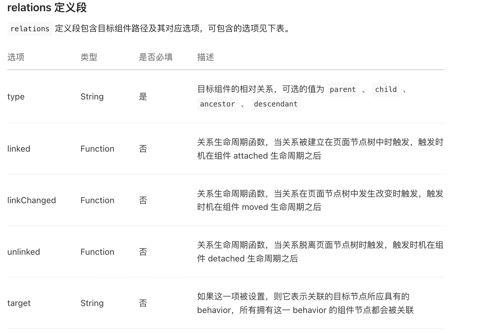
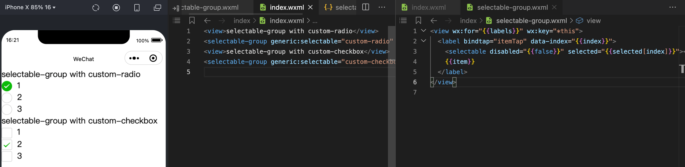

# 小程序


## 云开发限额

[配额说明 | 微信开放文档 (qq.com)](https://developers.weixin.qq.com/miniprogram/dev/wxcloud/billing/quota.html "配额说明 | 微信开放文档 (qq.com)")


## 自定义组件

*   样式隔离

    <https://developers.weixin.qq.com/miniprogram/dev/framework/custom-component/wxml-wxss.html#组件样式隔离>

    默认情况下，自定义组件的样式只受到自定义组件 wxss 的影响。除非以下两种情况

    *   app.wxss或页面内的wxss中使用了标签选择器（或特殊选择器）来直接指定样式，这些选择器会影响到页面和全部组件，这是不推荐的

    *   自定义组件样式隔离选项 `styleIsolation` 使用了 `apply-shared` 、`shared`

        *   `isolated`: 表示启用样式隔离，在自定义组件内外，使用 class 指定的样式将不会相互影响（一般情况下的默认值）；

        *   `apply-shared` 表示页面 wxss 样式将影响到自定义组件，但自定义组件 wxss 中指定的样式不会影响页面；

        *   `shared` 表示页面 wxss 样式将影响到自定义组件，自定义组件 wxss 中指定的样式也会影响页面和其他设置了 `apply-shared` 或 `shared` 的自定义组件。（这个选项在插件中不可用。）

*   组件接收外部样式

    [组件模板和样式 | 微信开放文档 (qq.com)](https://developers.weixin.qq.com/miniprogram/dev/framework/custom-component/wxml-wxss.html#外部样式类 "组件模板和样式 | 微信开放文档 (qq.com)")

    如果使用样式隔离，组件可能希望接收外部的样式传入，此时就需要组件属性 `externalClasses` ,接收字符串数组，在使用组件的地方以`externalClasses` 中定义的名称来定义class

    代码示例：

    ```javascript
    // nav.js
    Component({
      externalClasses: ['nav-class']
    }

    // nav.wxml
    <view class="nav nav-class"></view>

    // index.wxml 使用nav组件
    <topnav nav-class="nav-bar"></view>


    ```

*   组件引用页面或父组件样式

    [组件模板和样式 | 微信开放文档 (qq.com)](https://developers.weixin.qq.com/miniprogram/dev/framework/custom-component/wxml-wxss.html#外部样式类 "组件模板和样式 | 微信开放文档 (qq.com)")

    即使组件启用了样式隔离，组件仍然可以在局部引用组件所在页面的样式或父组件的样式

    *   组件引用所在页面中的样式

        ```html
        // 页面样式
        .blue-text {
          color: blue;
        }


        // 组件内引用
        <view class="~blue-text"> 这段文本是蓝色的 </view>

        ```

    *   组件引用父组件中的样式

        ```html
        // 父组件样式
        .red-text {
          color: red;
        }

        // 组件内引用
        <view class="^red-text"> 这段文本是红色的 </view>

        ```

*   插槽slot

    类似Vue的插槽，如果组件内只有一个slot，如果有多个slot，需要在js文件中声明

    ```javascript
    Component({
      options: {
        multipleSlots: true // 在组件定义时的选项中启用多 slot 支持
      },
      properties: { /* ... */ },
      methods: { /* ... */ }
    })
    ```

    如果有多个slot，则需要给各自slot声明name，这样就可使用多个slot了

    ```html
    <view class="wrapper">
      <slot name="before"></slot>
      <view>这里是组件的内部细节</view>
      <slot name="after"></slot>
    </view>
    ```

    使用

    ```html
    <!-- 引用组件的页面模板 -->
    <view>
      <component-tag-name>
        <!-- 这部分内容将被放置在组件 <slot name="before"> 的位置上 -->
        <view slot="before">这里是插入到组件slot name="before"中的内容</view>
        <!-- 这部分内容将被放置在组件 <slot name="after"> 的位置上 -->
        <view slot="after">这里是插入到组件slot name="after"中的内容</view>
      </component-tag-name>
    </view>

    ```

*   自定义组件构造页面

    <https://developers.weixin.qq.com/miniprogram/dev/framework/custom-component/component.html>

    *   页面也可以使用 `Component` 构造器构造，拥有与普通组件一样的定义段与实例方法。但此时要求对应 json 文件中包含 `usingComponents` 定义段

    *   页面的生命周期方法（即 `on` 开头的方法），应写在 `methods` 定义段中

    *   组件作为页面后，原本的 `properties` 可以通过路由方式query传参进来。如:

        ```javascript
        // /pages/index/index?paramA=123&paramB=xyz

        Component({
          properties: {
            paramA: Number,
            paramB: String,
          },
          methods: {
            onLoad: function() {
              this.data.paramA // 页面参数 paramA 的值
              this.data.paramB // 页面参数 paramB 的值
            }
          }
        })

        ```

    *   使用 `Component` 构造器来构造页面的一个好处是可以使用 `behaviors` 来提取所有页面中公用的代码段。例如，在所有页面被创建和销毁时都要执行同一段代码，就可以把这段代码提取到 `behaviors` 中。

        ```javascript
        // page-common-behavior.js
        module.exports = Behavior({
          attached: function() {
            // 页面创建时执行
            console.info('Page loaded!')
          },
          detached: function() {
            // 页面销毁时执行
            console.info('Page unloaded!')
          }
        })
        ```

        ```javascript
        // 页面 A
        var pageCommonBehavior = require('./page-common-behavior')
        Component({
          behaviors: [pageCommonBehavior],
          data: { /* ... */ },
          methods: { /* ... */ },
        })
        ```

        ```javascript
        // 页面 B
        var pageCommonBehavior = require('./page-common-behavior')
        Component({
          behaviors: [pageCommonBehavior],
          data: { /* ... */ },
          methods: { /* ... */ },
        })
        ```

*   组件间通信

    组件间通信方式有3中

    1.  wxml标签属性props向下传递的父向子传递数据

        ```html
        <custom-component propsaA"{{a}}" propsB="{{b}}"></custom-component>
        ```

    2.  事件，用于子组件触发函数向父组件传递数据

        首先父组件添加监听事件

        ```javascript
        // 父组件
        <component-tag-name bindmyevent="onMyEvent" />
        // 父组件js
        Page({
          onMyEvent: function(e){
            e.detail // 自定义组件触发事件时提供的 detail 对象
          }
        })


        ```

        然后子组件通过`triggerEvent`触发事件，触发的是引用子组件的bind函数属性名myevent

        ```javascript
        <!-- 在自定义组件中 -->
        <button bindtap="onTap">点击这个按钮将触发“myevent”事件</button>

        Component({
          properties: {},
          methods: {
            onTap: function(){
              var myEventDetail = {} // detail对象，提供给事件监听函数
              var myEventOption = {} // 触发事件的选项
              this.triggerEvent('myevent', myEventDetail, myEventOption)
            }
          }
        })


        ```

        子组件 `triggerEvent` 函数说明

        triggerEvent(name, data, options)

        *   name<`string`> 通知父组件的监听函数名

        *   data <`any`>传递给父组件的数据

        *   options <`object`> 触发事件的选项 `bubbles` 是否冒泡 ，`capturePhase` 是否捕获，`composed` 是否可以穿越组件边界

    3.  `this.selectComponent`获取组件实例对象

        ```javascript
        const child = this.selectComponent('.my-component');
        child.setData({childData: 1})
        ```

        selectComponent可以选择当前页面的组件class、id等，也支持类似jquery的写法，同时也支持跨组件选择，比如选择当前页面组件A中的组件B，具体写法如下：

        [NodesRef | 微信开放文档 (qq.com)](https://developers.weixin.qq.com/miniprogram/dev/api/wxml/SelectorQuery.select.html "NodesRef | 微信开放文档 (qq.com)")

        ```javascript
        this.selectComponent('.classA >>> .classB')
        ```

    4.  自定义组件外部调用 `this.selectComponent` 的返回结果

        ```javascript
        // 自定义组件 my-component 内部
        Component({
          behaviors: ['wx://component-export'],
          export() {
            return { myField: 'myValue' }
          }
        })

        <!-- 使用自定义组件时 -->
        <my-component id="the-id" />

        // 父组件调用
        const child = this.selectComponent('#the-id') // 等于 { myField: 'myValue' }
        ```

    5.

*   组件自己的生命周期

    定义在`lifetimes`中，这是推荐的方式，优先级最高，旧版方式是定义在lifetimes同级，重要常用的有三个：

    `created` ：组件刚被创建，可以拿到组件的data，但是不可以调用setData、

    `attached`：组件初始化完毕，进入页面节点树了。大多初始化都在这里处理

    `detached`：组件离开页面节点树。

*   组件所在页面的生命周期

    定义在 `pageLifetimes`中的页面的生命周期，可用的有三个：

    `show`：组件所在的页面被展示时执行

    `hide`：组件所在的页面被隐藏时执行

    `resize`：组件所在的页面尺寸变化时执行

*   behaviors

    用于组件间公共代码抽离，类似mixins

    > 每个 `behavior` 可以包含一组属性、数据、生命周期函数和方法。**组件引用它时，它的属性、数据和方法会被合并到组件中，生命周期函数也会在对应时机被调用。** 每个组件可以引用多个 `behavior` ，`behavior` 也可以引用其它 `behavior` 。

    详细的参数含义和使用请参考 [Behavior 参考文档](https://developers.weixin.qq.com/miniprogram/dev/reference/api/Behavior.html "Behavior 参考文档")。

    *   使用

        ```javascript
        // my-component.js
        var myBehavior = require('my-behavior')
        Component({
          behaviors: [myBehavior],
          properties: {
            myProperty: {
              type: String
            }
          },
          data: {
            myData: 'my-component-data'
          },
          created: function () {
            console.log('[my-component] created')
          },
          attached: function () { 
            console.log('[my-component] attached')
          },
          ready: function () {
            console.log('[my-component] ready')
          },
          methods: {
            myMethod: function () {
              console.log('[my-component] log by myMethod')
            },
          }
        })
        ```

        由于组件 `my-component` 引用了公共逻辑`my-behavior` ，所以my-behavior中的`behaviors`、`properties`、`lifetimes`、`methods`都会复用到my-component中，这就导致my-component 中的内容并非眼睛看到的那些，还包括`my-behavior`中的内容。

        这将使 `my-component` 最终结构为：

        *   属性：`myBehaviorProperty`、`myProperty`

        *   数据字段：`myBehaviorData`、`myData`

        *   方法：`myBehaviorMethod`、`myMethod`

        *   生命周期函数：`attached`、`created`、`ready`

        当组件触发生命周期时，会先触发`my-behavior`的生命周期，上例生命周期函数执行顺序为：

        1.  `[my-behavior] created`

        2.  `[my-component] created`

        3.  `[my-behavior] attached`

        4.  `[my-component] attached`

        5.  `[my-behavior] ready`

        6.  `[my-component] ready`


    *   同名字段的覆盖和组合规则

        [behaviors | 微信开放文档 (qq.com)](https://developers.weixin.qq.com/miniprogram/dev/framework/custom-component/behaviors.html#同名字段的覆盖和组合规则 "behaviors | 微信开放文档 (qq.com)")

        1.  同名的属性 (properties) 或方法 (methods)

            1.  若组件本身有这个属性或方法，则组件的属性或方法会覆盖 `behavior` 中的同名属性或方法；

                组件与组件内behavior**优先级：引用者>被引用者**

            2.  若组件本身无这个属性或方法，则在组件的 `behaviors` 字段中定义靠后的 `behavior` 的属性或方法会覆盖靠前的同名属性或方法；优先级

                组件behaviors的**优先级：靠后的behavior > 靠前的behavior**

            3.  在 2 的基础上，若存在嵌套引用 `behavior` 的情况，则规则为：`引用者 behavior` 覆盖 `被引用的 behavior` 中的同名属性或方法。

                组件behaviors中存在嵌套behavior时**优先级**：**引用者behavior > 被引用者的behavior**

        2.  同名的数据字段 (data)

            *   若同名的数据字段都是对象类型，会进行对象合并；

            *   其余情况会进行数据覆盖，覆盖规则为： `引用者 behavior` > `被引用的 behavior` 、 `靠后的 behavior` > `靠前的 behavior`。（优先级高的覆盖优先级低的，最大的为优先级最高）

        3.  生命周期函数不会相互覆盖，而是在对应触发时机被逐个调用

            *   对于不同的生命周期函数之间，遵循组件生命周期函数的执行顺序；

            *   对于同种生命周期函数，遵循如下规则：

                *   `behavior` 优先于组件执行；

                *   `被引用的 behavior` 优先于 `引用者 behavior` 执行；

                *   `靠前的 behavior` 优先于 `靠后的 behavior` 执行；

            *   如果同一个 `behavior` 被一个组件多次引用，它定义的生命周期函数只会被执行一次。

            **总结：**如果组件`A`中behaviors是`[a(d), b(d), c]`，其中`a`和`b`引用了`d`，则该behaviors的生命周期执行为：`d —> a —> b —> c —> A`


*   组件间关系 relations

    <https://developers.weixin.qq.com/miniprogram/dev/framework/custom-component/relations.html>

    分两大类

    1.  自定义组件间有直接的父子关系，相互间通信比较复杂，可在组件的relations 字段中定义跟其有关联的其他组件，需注明其他组件的type，也可选注明其他组件关联的生命周期`linked`, `linkChanged`, `unlinked`。

        ```html
        <custom-ul>
          <custom-li> item 1 </custom-li>
          <custom-li> item 2 </custom-li>
        </custom-ul>
        ```

        custom-ul.js

        ```javascript
        Component({
          relations: {
            './custom-li': {
              type: 'child', // 关联的目标节点应为子节点
              linked: function(target) {
                // 每次有 custom-li 被插入时执行，target是该li，触发在该节点 attached 生命周期之后
                // 此时可以拿到li的data 数据，也可以调用li的setData方法
                target.setData({lidata: newData})
              },
              linkChanged: function(target) {
                // 每次有 custom-li 被移动后执行，target是该li，触发在该节点 moved 生命周期之后
              },
              unlinked: function(target) {
                // 每次有 custom-li 被移除时执行，target是该li，触发在该节点 detached 生命周期之后
              }
            }
          },
          methods: {
            _getAllLi: function(){
              // 使用 getRelationNodes 可以获得 nodes 数组，包含所有已关联的custom-li，且是有序的
              var nodes = this.getRelationNodes('path/to/custom-li')
            }
          },
          ready: function(){
            this._getAllLi()
          }
        })
        ```

        custom-li.js

        ```javascript
        Component({
          relations: {
            './custom-ul': {
              type: 'parent', // 关联的目标节点应为父节点
              linked: function(target) {
                // 每次被插入到 custom-ul 时执行，target是 custom-ul 节点实例对象，触发在 attached 生命周期之后
              },
              linkChanged: function(target) {
                // 每次被移动后执行，target是 custom-ul 节点实例对象，触发在 moved 生命周期之后
              },
              unlinked: function(target) {
                // 每次被移除时执行，target是 custom-ul 节点实例对象，触发在 detached 生命周期之后
              }
            }
          }
        })
        ```

        **注意**：**必须在两个组件定义中都加入 relations 定义，否则不会生效。**

    2.  自定义组件间无直接的父子关系，父子通过behavior 建立联系

        可能希望最外层的节点和两三层以内的节点建立关系，此时type可选`ancestor`(祖先)，`descendant`（子孙）

        ```html
        <custom-form>
          <view>
            input
            <custom-input></custom-input>
          </view>
          <custom-submit> submit </custom-submit>
        </custom-form>
        ```

        > 子节点：custom-input.js | custom-submit.js&#x20;

        ```javascript
        var customFormControls = require('./custom-form-controls')
        Component({
          behaviors: [customFormControls],
          relations: {
            './custom-form': {
              type: 'ancestor', // 关联的目标节点应为祖先节点
            }
          }
        })
        ```

        > 公共behavior：custom-form-controls.js

        ```javascript
        module.exports = Behavior({
          // ...
        })
        ```

        > 父节点：custom-form.js

        设置了target，表示所有拥有这一behavior的组件都会被关联进来

        ```javascript
        var customFormControls = require('./custom-form-controls')
        Component({
          relations: {
            'customFormControls': {
              type: 'descendant', // 关联的目标节点应为子孙节点
              target: customFormControls
            }
          }
        })

        ```

    relations: 字段属性说明

    

*   数据监听 observers

    **注意**：*该监听并不会对比字段变化前后的值是否一致，即使是并未改变的简单类型，只要setData触发了，就会触发该监听。*

    1.  数据监听器

        类似vue中的computed ，属性C = 属性A+属性B，如果A 和 B发生变化的时候，都手动去更改C的值，就会比较繁琐，那么observers就能发挥它的作用了，它会监听 属性A和B的变化，其中一个发生变化，就会触发。

        ```javascript
        Component({
          attached: function() {
            this.setData({
              numberA: 1,
              numberB: 2,
            })
          },
          observers: {
            'numberA, numberB': function(numberA, numberB) {
              // 在 numberA 或者 numberB 被设置时，执行这个函数
              this.setData({
                sum: numberA + numberB
              })
            }
          }
        })
        ```

    2.  监听对象子属性字段

        observers 下的key不仅可以是逗号分割的data属性，也可以是data中的对象子字段。如：

        ```javascript
        Component({
          observers: {
          // 此处监听的是对象的某个key
            'dataObj.a': function (dataObj) {
                console.log('监听', dataObj); // 1   ==>   2
            }
          },
          attached: function () {
            this.setData({
              dataObj: {
                  a: 1
              },
            })
            // 可以用 对象.key的方式来设置data，同样会被observers监听到
            setTimeout(()=> this.setData({'dataObj.a': 2}), 2000)
          }
        })
        ```

    3.  通配符\*\* 监听所有子字段的变化

        如果需要监听一个大对象下的所有字段的变化，可以使用通配符\*\*

        ```javascript
        Component({
          observers: {
            'some.field.**': function(field) {
              // 使用 setData 设置 this.data.some.field 本身或其下任何子数据字段时触发
              // （除此以外，使用 setData 设置 this.data.some 也会触发）
              field === this.data.some.field
            },
          },
          attached: function() {
            // 这样会触发上面的 observer
            this.setData({
              'some.field.xxx': { /* ... */ }
            })
            // 这样也会触发上面的 observer
            this.setData({
              'some.field': { /* ... */ }
            })
            // 这样还是会触发上面的 observer
            this.setData({
              'some': { /* ... */ }
            })
          }
        })
        ```

        **总结**：监听对象深层字段的变化时，如a.b.c.d，那么setData导致a b c d变化时，都会触发该监听。

*   纯数据字段 pureDataPattern

    <https://developers.weixin.qq.com/miniprogram/dev/framework/custom-component/pure-data.html>

    定义：指那些既不会用于页面展示，也不会传递给其他组件的data属性或者接收的props属性。

    用法：

    1.  Component构造器的options中定义 pureDataPattern属性，值为正则表达式。

    2.  也可以在json文件中定义pureDataPattern，值为去掉 `/` 的正则字符串，如："^\_"

    ```javascript
    Component({
      options: {
        pureDataPattern: /^_/ // 指定所有 _ 开头的数据字段为纯数据字段
      },
      data: {
        a: true, // 普通数据字段
        _b: true, // 纯数据字段
      },
      properties: {
        Pa: Boolean,
        _Pb: {
          type: Boolean,
          observer() {
            // 不要这样做！这个 observer 永远不会被触发
          }
        },
      }
    })
    <view>{{_b}}</view>
    ```

    以上的\_b并不会展示在view中，只会有一个空view标签

    总结：纯数据字段虽然不能展示在页面中，但是可以用observers来监听他的变化。

*   抽象节点 componentGenerics

    <https://developers.weixin.qq.com/miniprogram/dev/framework/custom-component/generics.html>

    **定义**：有时，自定义组件模板中的一些节点，其对应的自定义组件不是由自定义组件本身确定的，而是自定义组件的调用者确定的。这时可以把这个节点声明为“抽象节点”

    

    上图所示，调用`selectable-group`时，选择器的样式是圆的还是方的，我们不希望在`selectable-group`内部写死，希望可以自定义传入，那么custom-radio就是传入的节点，接收位置在`selectable-group`内部的`selectable`。那么selectable就可以承载虚拟节点的作用，其上的属性disabled，selected可以传到`custom-radio`组件上

    ```html
    <selectable-group generic:selectable="custom-radio" />

    ```

    注意：

    1.  抽象节点所在组件的json文件，必须先声明componentGenerics

    2.  引用`selectable-group`的页面json中，得在`usingComponents`中声明引入的`custom-radio`组件

    3.  节点的 generic 引用 `generic:xxx="yyy"` 中，值 `yyy` 只能是静态值，不能包含数据绑定。因而抽象节点特性并不适用于动态决定节点名的场景。

    ```json
    {
      "componentGenerics": {
        // 以下两种方式任选一个
        // 方式1
        "selectable": true
        // 方式2 指定默认组件
        "selectable": {
          "default": "path/to/default/component"
        }
      }
    }

    ```

    `selectable`可以是任意名称，对应wxml文件中需要用它作为承载传入节点的位置。

*   自定义组件扩展， `behavior`内置参数`definitionFilter`

    <https://developers.weixin.qq.com/miniprogram/dev/framework/custom-component/extend.html>

    **这部分有点难理解，些微有段绕。打开开发者工具的官方示例，仔细一看就明白了**

    简单来说，就是组件的数据或方法可以通过behaviors 内部处理修改。如下是修改数据例子：

    ```javascript
    // behavior.js
    module.exports = Behavior({
      definitionFilter(defFields) {
        defFields.data.from = 'behavior'
      },
    })

    // component.js
    Component({
      data: {
        from: 'component'
      },
      behaviors: [require('behavior.js')],
      ready() {
        console.log(this.data.from) // 此处会发现输出 behavior 而不是 component
      }
    })
    ```

    上面例子中，behavior.js 中定义了`definitionFilter`函数，第一个参数是调用该behavior的组件（component），然后它修改了component中data.from，所以component生命周期ready中会拿到修改后的值。

    下面的例子介绍 behavior 嵌套 behavior的例子，且都有`definitionFilter` 过滤函数的情况

    component.js

    ```javascript
    Component({
      data: {
        from: 'component'
      },
      behaviors: [require('./behavior.js')],
      ready() {
        console.log('in component', this.data.from)
      }
    })
    ```


    behavior.js

    ```javascript
    module.exports = Behavior({
      data: {
        from: 'beh'
      },
      behaviors: [require('./behavior2'), require('./behavior3')],
      definitionFilter(defFields, definitionFilterArr) {
        console.log('beh definitionFilter', defFields.data.from, definitionFilterArr)
        defFields.data.from = defFields.data.from + '-addsome'
        definitionFilterArr.forEach(func => {
          func(defFields)
        })
      },
    })
    ```


    behavior2.js

    ```javascript
    module.exports = Behavior({
      data: {
        from: 'beh2'
      },
      behaviors: [require('./behavior4')],
      definitionFilter(defFields, definitionFilterArr) {
        console.log('beh2 definitionFilter', defFields.data.from, definitionFilterArr)
        definitionFilterArr.forEach(func => {
          func(defFields)
        })
      },
    })
    ```


    behavior3.js

    ```javascript
    module.exports = Behavior({
      data: {
        from: 'beh3'
      },
      behaviors: [require('./behavior4')],
      definitionFilter(defFields, definitionFilterArr) {
        console.log('beh3 definitionFilter', defFields.data.from, definitionFilterArr)
        definitionFilterArr.forEach(func => {
          func(defFields)
        })
      },
    })
    ```


    behavior4.js

    ```javascript
    module.exports = Behavior({
      data: {
        from: 'beh4'
      },
      behaviors: [],
      definitionFilter(defFields, definitionFilterArr) {
        console.log('beh4 definitionFilter', defFields.data.from, definitionFilterArr)
        definitionFilterArr.forEach(func => {
          func(defFields)
        })
      },
    })
    ```


    引用关系为：

    component —> behavior.js —> behavior2.js —> behavior4.js&#x20;

    &#x20;                                     ╰┈> behavior3.js —> behavior4.js &#x20;

    打印结果如下：

    ```javascript
    beh4 definitionFilter beh2 []
    // behavior.js中先后引用了behavior2.js behavior3.js，所以先执行behavior2.js
    // behavior2.js引用了behavior4.js，所以再执行behavior4.js
    // behavior4.js中definitionFilter函数第一个参数指向调用它的文件，即behavior2，behavior2.data.from = 'beh2'
    // 第二个参数definitionFilterArr为[]，是因为后续再没有调用文件有definitionFilter函数了

    beh4 definitionFilter beh3 []
    // 与上同理

    beh2 definitionFilter beh [ƒ]
    // behavior2 执行完引用的 behavior4 之后，就要执行自己的 definitionFilter 了
    // 所以第一个参数是调用它的文件即behavior，behavior.data.from = 'beh'
    // 第二个参数是 behavior2 引用的 behavior的definitionFilter函数列表，只有引用的behavior4
    // 所以 [f] 中的f就是 behavior4 的 definitionFilter

    beh4 definitionFilter beh []
    // behavior2中的函数
    // definitionFilterArr.forEach(func => {
    //    func(defFields) func是 behavior4 的 definitionFilter，将behavior当做参数传入了
    // })
    // 所以此处是调用的 behavior4 的 definitionFilter，只不过第一个参数改成了 behavior，
    // 所以 behavior.data.from = 'beh' 

    beh3 definitionFilter beh [ƒ]
    // 与第10行原理一样

    beh4 definitionFilter beh []
    // 与第16行原理一样

    beh definitionFilter component (2) [ƒ, ƒ]
    // behavior 的 behaviors: [b2,b3] 执行完后，开始执行 behavior 自己的 definitionFilter
    // definitionFilter 第一个参数 指向调用它的 component.js 
    // [f, f] 是它引用的behaviors列表的 definitionFilter 函数，所以分别是[behavior2Filter, behavior3Filter]

    beh2 definitionFilter component-addsome [ƒ] 
    // 执行第33行的 [behavior2Filter, behavior3Filter] 的第一个behavior2Filter
    // 开始执行 behavior2 的 definitionFilter ，只是第一个参数修改为了 component
    // [f] 是 behavior2 引用的 behavior4的 definitionFilter

    beh4 definitionFilter component-addsome []
    // 执行上面的 [f] f为 behavior4的 definitionFilter

    beh3 definitionFilter component-addsome [ƒ]
    // 同第36行

    beh4 definitionFilter component-addsome []
    // 同第41行

    in component component-addsome
    // behavior执行完后，开始执行 component的 ready 生命周期
    // 拿到的data 数据是 经过上面 behaviors 修改后的 data
    ```

*

<!---->

*

