# 经验总结

### RN

[RN打包发包](./RN打包发包)

[RN 总结](../RN%20%E6%80%BB%E7%BB%93/index.md)

### 小程序

[小程序](../%E5%B0%8F%E7%A8%8B%E5%BA%8F/index.md)

### 常用方法

[常用方法](../%E5%B8%B8%E7%94%A8%E6%96%B9%E6%B3%95.md)

### Linux命令

[命令](../Linux%20%E5%91%BD%E4%BB%A4//index.md)

### RN 开发调试组件包

[RN 开发调试组件包](../RN%20%E5%BC%80%E5%8F%91%E8%B0%83%E8%AF%95%E7%BB%84%E4%BB%B6%E5%8C%85.md)

### 解决Mac Touchbar Esc键不显示

[如何获取您的Mac的Esc键重新映射Caps Lock-howtoip.com在线科技杂志](https://www.howtoip.com/how-to-get-your-macs-esc-key-back-by-remapping-caps-lock/ "如何获取您的Mac的Esc键重新映射Caps Lock-howtoip.com在线科技杂志")

**设置  —> 键盘 —> 修饰键 —> 可以将不常用的中英文切换更改为Esc**

这样就可以用大写键来代替Esc了

### 查看全局的npm包

```bash
npm list -g --depth 0
```

### Node创建全局命令

[全局命令行打开 Chrome 调试模式](../%E5%85%A8%E5%B1%80%E5%91%BD%E4%BB%A4%E8%A1%8C%E6%89%93%E5%BC%80%20Chrome%20%E8%B0%83%E8%AF%95%E6%A8%A1%E5%BC%8F/index.md)

### Node console颜色

[Node-console.log颜色](../Node-console.log%E9%A2%9C%E8%89%B2/index.md)

### 优雅捕获 async await 错误

按规范应该使用try...catch...，但是不够优雅，await后面跟的就是一个返回promise的函数，可以对其进行封装，在reject 有错误时拿到错误信息，进行处理。

```javascript
// 统一封装函数
const unity = promise => {
    return promise.then(res=>[null, res]).catch(err=>[err]);
}

// 使用
(async function () {
    let [err, res] = await unity(new Promise((resolve, reject) => {reject('error')}));
    if (err !== null) {
        console.log(err);   //error
        return false;
    }
    console.log(res);
})()
```

### Css Filter滤镜属性

*   blur：景深，值越大越模糊

*   grayscale：灰度，0-1，值越大越灰

*   opacity：透明度

*   hue-rotate(): 色相旋转

    [CSS 色相旋转（） 函数 (quackit.com)](https://www.quackit.com/css/functions/css_hue-rotate_function.cfm "CSS 色相旋转（） 函数 (quackit.com)")

    旋转是通过下方的色轮上旋转的，如果背景色是红色，那么hue-rotate(240deg)就会是蓝色

色轮

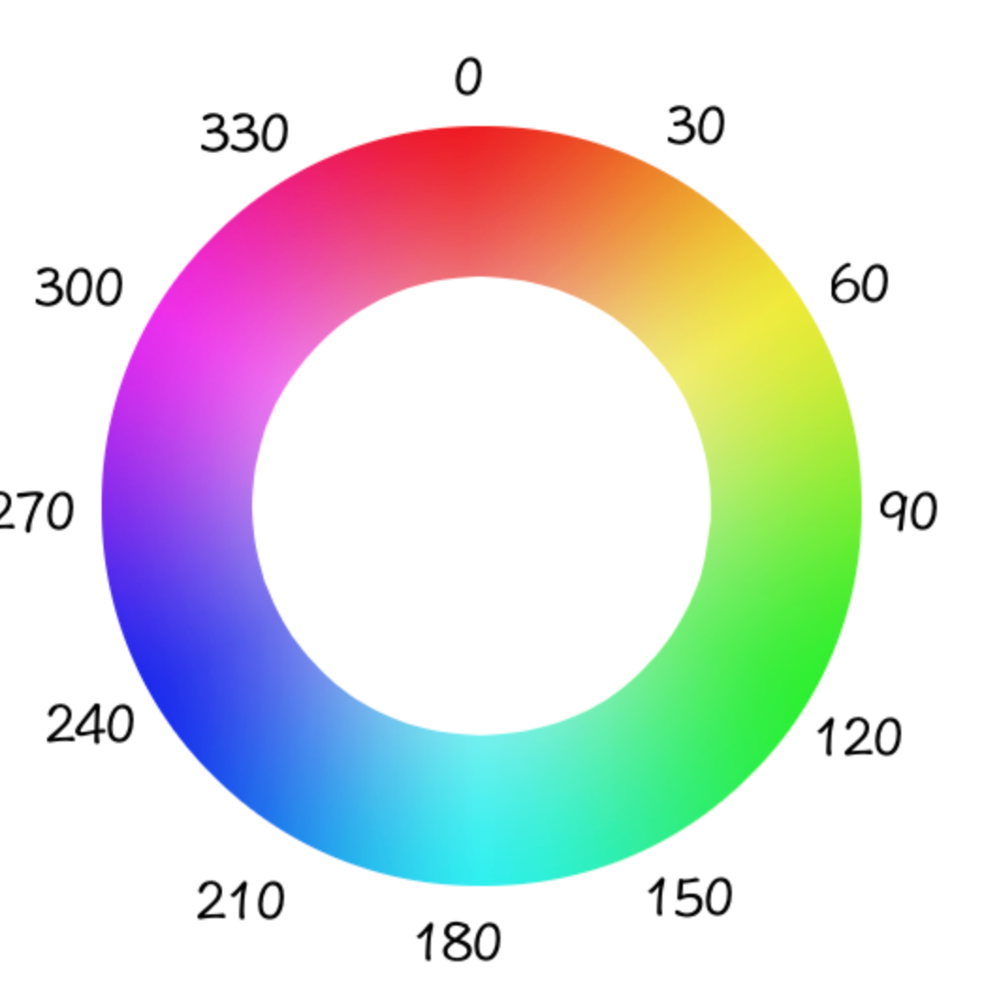

狐狸边缘为红色

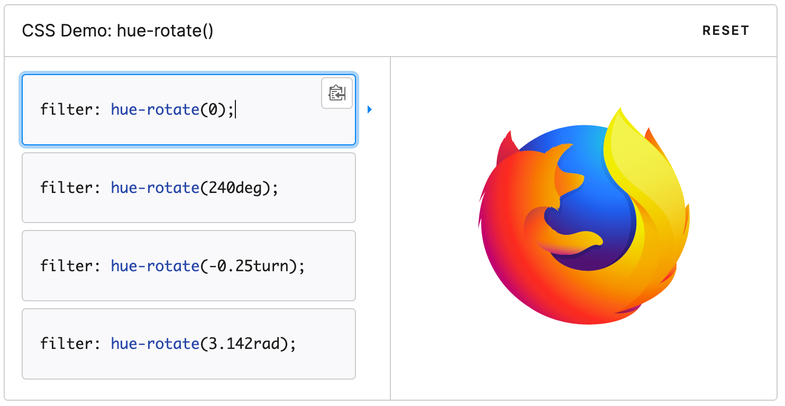

旋转240度后变成了蓝色

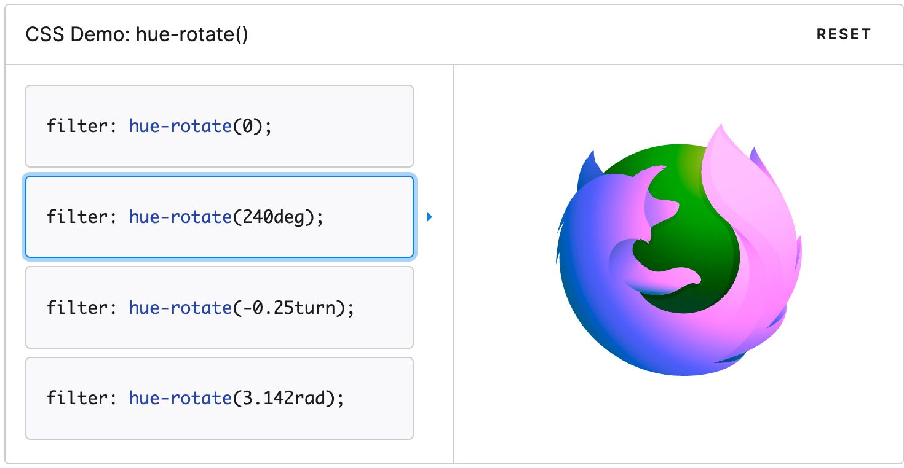

*

上面属性值可以同时使用，

### 颜色转指定透明度颜色

```javascript
function hexToRgba(hex, opacity) {
  const RGBA =
    "rgba(" +
    parseInt("0x" + hex.slice(1, 3)) +
    "," +
    parseInt("0x" + hex.slice(3, 5)) +
    "," +
    parseInt("0x" + hex.slice(5, 7)) +
    "," +
    opacity +
    ")"
  //  return {
  //   red: parseInt("0x" + hex.slice(1, 3)),
  //   green: parseInt("0x" + hex.slice(3, 5)),
  //   blue: parseInt("0x" + hex.slice(5, 7)),
  //   rgba: RGBA,
  // }
  return RGBA
}
```

### Proxy给对象设置默认属性值

应用场景：

有多种判断获取值的逻辑，抽离到一个对象中了，但是多个不同的条件对应的是一个逻辑，只有几个不同的逻辑处理，如：

```javascript
const foo = {
  a: 1,
  b: 1,
  c: 1,
  d: 2,
  e: 3
}
```

这样也可以，但是很啰嗦，会有多个重复的写法，我们现在的目的是把不同的逻辑放在对象中，相同的逻辑抽离出来。RN中应用如下

```typescript
const FORMITEM: ViewStyle = { paddingHorizontal: d(15), marginBottom: d(15) }

const inputGroupStyle: { [key: string]: ViewStyle } = {
  custominput: { ...FORMITEM, paddingRight: 0 },
  inputselectrange: { ...FORMITEM, paddingRight: 0 },
}
const formElementHorizonHandle = {
  get(target, name) {
    return target.hasOwnProperty(name) ? target[name] : FORMITEM
  },
}
/**
 * 各个元素 所在FORM_ITEM的样式
 */
export const FORM_ELEMENT_HORIZON = new Proxy(inputGroupStyle, formElementHorizonHandle)
```

### 获取今天0点的时间戳

```javascript
const tamp = (new Date().setHours(0, 0, 0, 0))
```

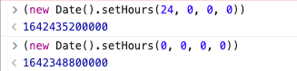

### TS 获取react组件的props

```typescript
type ButtonProps = React.ComponentProps<typeof Button>;
```

### Ts将属性都变为可选

```typescript
type A = Partial<B>
```

### Ts获取函数返回值的类型

```typescript
const eachSection = useCallback((len: number, data: typeof formData = null) => {
    sectionNameRef.current++
    return {
      eachSectionName: "add",
      element: "Section",
      name: "block-section-" + len,
      schema: JSON.parse(JSON.stringify(originSchema)), // 解决多组时 如果第二组高级输入组无数据 会覆盖第一组schema引用
      formData: data,
    }
  }, [])
  
// 每组section的结构 拿到的是eachSection函数返回值的类型
  type TypeEachSection = ReturnType<typeof eachSection>
```

### TS 提取对象部分属性

```typescript
export interface FormScreenProps {
  route?: {
    params: {
      schema: SchemaTypes
      formData?: { [key: string]: any }
      /**
       * 草稿
       */
      snapData?: any

      from?: "access" | "task" | ""
      // 是否是最后一个任务表单
      isLastForm?: boolean
      submitParams: {
        formid: string
        task_id: string
        app_id: string
        dept_id: string
        date_id: number
      }
    }
  }
}

type GoFormParams = Pick<
  FormScreenProps["route"]["params"],
  Exclude<keyof FormScreenProps["route"]["params"], "snapData">
>

GoFormParams 将没有snapData 属性

```

### 打开Chrome调试模式

RN直接在浏览器中打开调试，会提示跨域，此时可以打开chrome这个模式，直接通过node运行该文件，或者命令行运行exec的命令

```javascript
/**
 * 打开调试
 */
const achild_process = require("child_process")
// 电脑用户名
const user = process.argv[2] || "doge"

achild_process.exec(
  `open -n /Applications/Google\\ Chrome.app/ --args -u http://localhost:8081/debugger-ui/ --disable-web-security --user-data-dir=/Users/${user}/data`,
  (err, stdout, stderr) => {
    console.log("** --- 执行结果 --- **", err, stdout, stderr) // wsp-log
  },
)

```

### 库-本地修改同步到项目中

```javascript
// 需要安装该库node-watch
const watch = require("node-watch")
const fs = require("fs")
const path = require("path")

// 复制文件到对应目录中
const copyFile = function (srcPath, tarPath, filter = []) {
  fs.readdir(srcPath, function (err, files) {
    if (err === null) {
      files.forEach(function (filename) {
        let filedir = path.join(srcPath, filename)
        let filterFlag = filter.some((item) => item === filename)
        if (!filterFlag) {
          fs.stat(filedir, function (errs, stats) {
            let isFile = stats.isFile()
            if (isFile) {
              // 复制文件
              const destPath = path.join(tarPath, filename)
              fs.copyFile(filedir, destPath, (err) => {})
            } else {
              // 创建文件夹
              let tarFiledir = path.join(tarPath, filename)
              fs.mkdir(tarFiledir, (err) => {})
              copyFile(filedir, tarFiledir, filter) // 递归
            }
          })
        }
      })
    } else {
      if (err) console.error(err)
    }
  })
}
// 修改的库 要监听的库
const inPath = "/Users/doge/Documents/work/jwform"
// 复制到目标目录
const outPath = "/Users/doge/Documents/work/duty/node_modules/form-engine"

watch(inPath, { recursive: true }, function (evt, name) {
  console.log("%s changed.", name)
  copyFile(inPath, outPath, ["node_modules", "Example", "src/components"])
  console.log("移动完成")
})

```

### Git 追加提交文件到上传提交记录

应用场景：比如修改图片圆角，第一次提交只修改了borderRadius，没有设置overflow：hidden, commit之后才发现没生效，此时再增加overflow提交一次commit，就不合理。

此时就可以将overflow的更改和borderRadius 的更改合并为一次commit更改。

```bash
git add <指定文件>
git commit --amend --no-edit 
// 直接使用上次的提交文案
```

### VSCode 冲突文件合并提示

有没有这个提示是受配置文件控制的

vscode的配置有 用户配置和工作区配置两种

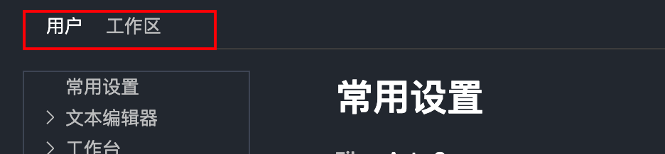

如果没有冲突合并提示的话，八成是工作区的配置 `"editor.codeLens": false` ,将其修改为true即可

[Visual Studio Code Extensions using CodeLens](https://code.visualstudio.com/blogs/2017/02/12/code-lens-roundup#_version-lens "Visual Studio Code Extensions using CodeLens")

### Git reset 回退

```javascript
git reset commitId
=
git reset --mixed commitId
```

此回退是回退到之前的某一次提交状态 ，该状态之后的提交会变成本地更改但是未git add的状态。

除此之外还有两种reset方式

```javascript
git reset --soft commitId
git reset --hard commitId
```

git reset --hard commitId 会清空commitId 之后的本地更改。

```javascript
git reflog
```

该命令用来查看git reset的状态和记录 ，因为reset之后git log是看不到记录的

### Git查看提交记录树

`git log --graph`

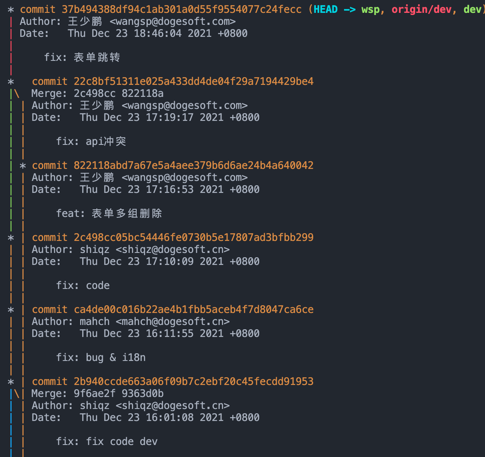

### React 总结

[React](../React/index.md)

### Git commit规范

```javascript
feat：新功能（feature）。

fix/to：修复bug，可以是QA发现的BUG，也可以是研发自己发现的BUG。

fix：产生diff并自动修复此问题。适合于一次提交直接修复问题
to：只产生diff不自动修复此问题。适合于多次提交。最终修复问题提交时使用fix
docs：文档（documentation）。

style：格式（不影响代码运行的变动）。

refactor：重构（即不是新增功能，也不是修改bug的代码变动）。

perf：优化相关，比如提升性能、体验。

test：增加测试。

chore：构建过程或辅助工具的变动。

revert：回滚到上一个版本。

merge：代码合并。

sync：同步主线或分支的Bug。
```

### 微信扫码支付

流程：请求接口—>返回微信支付协议 —> 前端将该协议生成二维码图片 —> 然后进行轮询 —> 如果支付成功，跳转到支付详情

### 阿里支付

流程：请求接口 —> 返回支付宝给的一个带form标签的字符串 —> 然后原生js获取form,手动触发submit —> 到支付宝收银台

***

[Vue](../Vue/index.md)

### Vue mockjs模拟数据

并不会发送真实的请求，而是做发送拦截，网络中看不到真实的请求

可以使用easy-mock 搭建个

在目录 src/mock 文件夹下新建`api.js` ，用来放模拟的接口和返回的数据

```javascript
import Mock from 'mockjs'
Mock.mock('/api/user/login',{
  code: 0,
  data: {
    name: '',
    id: ''
  }
})
```

这样就可以在页面中请求该地址了，`/api/user/login`,其中/api可以抽取出来，放在axios的baseURL上

```javascript
import axios from 'axios'
axios.defaults.baseURL = '/api' // 给请求都添加一个前缀方便后期处理

const mock = true
if(mock){
  require('./mock/api') // 加载上面的mock文件地址 只有mock为true的时候才会加载 commonjs规范
}
```

文档地址

[Getting Started · nuysoft/Mock Wiki · GitHub](https://github.com/nuysoft/Mock/wiki/Getting-Started "Getting Started · nuysoft/Mock Wiki · GitHub")

### Mac 命令目录

/use/local/bin 此目录下是可全局执行的命令

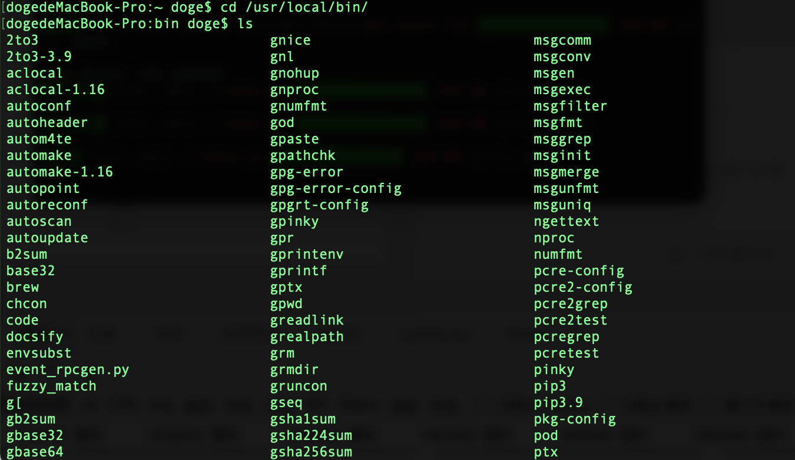

`which -a node` 找到node的位置

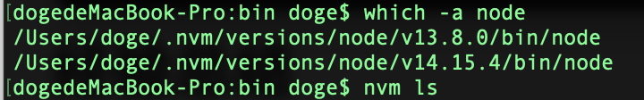

### React 配置路由

传统用的是`<Router>`包裹`<Switch>`再包裹`<Route>`的标签方式声明，可以通过`react-router-config`进行配置

<http://npmjs.com>

### 标签模板字符串

```javascript
function test(...args){
  console.log(args)
}
test('a','b','c') //  ['a', 'b', 'c']

test`ab${12}cd${99}ee` // [['ab', 'cd', 'ee'], 12, 99]
test`ab${12}cd${99}` // [['ab', 'cd', ''], 12, 99]

```

结果会输出一个数组 第一项是变量分隔切割后的一个数组 类似split 后的结果 ，二三项是变量的值

第1列

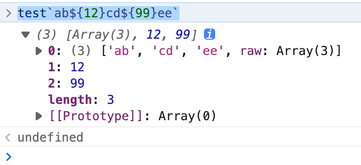

第2列

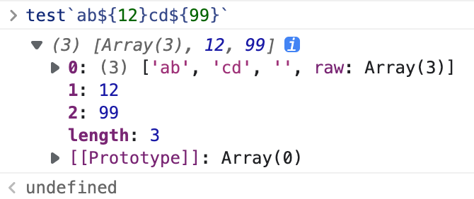

### styled-components

#### 基本使用

styled后面跟的是元素的名称 如div/a/span等，后面跟模板字符串

```react&#x20;jsx
const HYInput = styled.input`
  background: orange;
  font-size: 10em;
`
<HYInput />
```

#### 传递属性

```react&#x20;jsx
const HYInput = styled.input.attr({
  placeholder: '请输入',
  propsa: '1234'
})`
  background: orange;
  font-size: 10em;
  color: ${props => props.color}; // 此处可以拿到attr内的属性 和 标签上的color
`

<HYInput color="red" />

```

#### styled()继承

```react&#x20;jsx
const BASEButton = styled.button`
  padding: 10px 20px;
  color: red;
`
// 继承 将被继承的组件放在styled函数中
const PrimaryButton = styled(BASEButton)`
  background: orange;
`
// PrimaryButton的效果如下
{
  padding: 10px 20px;
  color: red;
  background: orange;
}
```

#### ThemeProvider继承

```react&#x20;jsx
import styled, { ThemeProvider } from 'styled-components'
...
return <ThemeProvider theme={{color: 'red'}}>
  <Home />
</ThemeProvider>

// Home组件内部的组件
const Button = styled.button`
  color: ${props => props.theme.color}
`
// 外部Provider提供类似store的值，内部的组件都是消费者，定义组件的时候，可以直接拿到Provider的值
```

### Scss 定义方法

```sass&#x20;(scss)&#x20;
@mixin font-base($color, $fontSize, $lineHeight) {
  font: {
    size: $fontSize;
  }
  color: $color;
  line-height: $lineHeight;
}
// flex
@mixin flex-base($direction: row, $justifyContent: center, $alignItems: center) {
  display: flex;
  flex-direction: $direction;
  justify-content: $justifyContent;
  align-items: $alignItems;
}
@mixin size-base($width: auto, $height: auto) {
  width: $width;
  height: $height;
}
@mixin text-ellipsis($lines: 1) {
  overflow: hidden;
  text-overflow: ellipsis;
  @if $lines > 1 {
    display: -webkit-box;
    -webkit-box-orient: vertical;
    -webkit-line-clamp: $lines;
    white-space: normal;
  }
  @if $lines == 1 {
    white-space: nowrap;
  }
}

.container {
  @include flex-base();
}
```

### React 高级特性

[React 高级特性](../React%20%E9%AB%98%E7%BA%A7%E7%89%B9%E6%80%A7.md)

### 正则表达式中加变量

```javascript
var myString = "Hello 1 word. Sentence number 2.";
var splits = myString.split(/(\d)/);

console.log(splits); // [ "Hello ", "1", " word. Sentence number ", "2", "." ]

```

上述split可以接收字符串和正则，正则加小括号后，可以将匹配结果包含在返回的数组中，如果将括号中的内容当做参数，就涉及到正则里加变量了

```javascript
'我0Aa'.split(/(0A)/) // ['我', '0A', 'a']

const reg = '0A'
// 第一种方式
'我0Aa'.split(new RegExp('('+reg+')')) // ['我', '0A', 'a']
// 第二种方式 使用eval !不推荐使用
'我0Aa'.split（eval(`/(${reg})/`)）

```

### 逻辑运算符 ||=、&&=、??=

> 这三个运算符相当于先进行逻辑运算，然后根据运算结果，再视情况进行赋值运算。

1.  ||=

    逻辑OR赋值`（x ||=y）`运算符仅在 `x` 为 `falsy`时赋值。

    ```javascript
    const b = { a : 2 }

    b.a ||= 4 ;
    console.log(b.a) ;    // 2

    b.d ||= 8 ;
    console.log(b.d) ;  // 8

    b.age ||= 18; // b上不存在该属性时，给该属性赋值

    ```

2.  &&=

    逻辑 `AND` 赋值 `(x &&= y)` 运算符仅在 `x` 为真时赋值。

    ```javascript
    let a = 1;
    let b = 0;

    // 此时运算符左侧为真，赋值后返回结果 2
    a &&= 2;
    console.log(a);  // 2

    // 此时运算符左侧为假，不进行赋值
    b &&= 2;
    console.log(b);  // 0
    ```

3.  ??=

    逻辑空赋值运算符 (`x ??= y`) 仅在 `x` 是 [nullish](https://link.juejin.cn?target=https://developer.mozilla.org/zh-CN/docs/Glossary/Nullish "nullish") (`null` 或 `undefined`) 时对其赋值。

    ```javascript
    const a = {b : 2, c : 0, d : false} ;
    // 需要单独声明并赋值，所以 ?? 只是起判断的作用
    const l = a.e ?? 99 
    console.log(l)     // 99
    // 接下来使用 ??= 来赋值，结果是可以添加到 a 对象上的
    a.f??=100 ;
    console.log(a) ;    // {b: 2, c: 0, d: false, f: 100}

    ```

### 获取浏览器Url参数

```javascript
const params = Object.fromEntries(new URLSearchParams(location.search))
```

### VS Code 配置文件选项卡样式

<https://code.visualstudio.com/api/references/theme-color#editor-groups-tabs>

### React Native 集成Dva

理念就是在应用开始前注册model和app，使用 context .Provider包裹应用，然后程序内就可以用useDispatch, useStore，useSelector等钩子，获取model的数据。

1.  开始步骤

    `yarn add react-redux dva-core-ts`

2.  注册app

    ```javascript
    import indexModel from "./test-model"
    import indexModel2 from "./test-model2"
    import { Provider } from "react-redux"

    import { create } from "dva-core-ts"

    const models = [indexModel, indexModel2]

    const app = create()

    models.forEach(o => {
      // 装载models对象
      app.model(o)
    })

    app.start() // 实例初始化

    const store = app._store // 获取redux的store对象供react-redux使用
    ```

3.  Provider包裹app

    ```javascript
    const App: Component<{}> = props => {
      const navigationRef = useRef<NavigationContainerRef>()

      const renderNavigator = () => {
        return <RootNavigator ref={navigationRef} />
      }

      return (
        <Provider store={store}>
          <SafeAreaProvider>{renderNavigator()}</SafeAreaProvider>
        </Provider>
      )
    }
    ```

4.  引入model

    ```javascript
    // text-model.ts
    export default {
      namespace: "user",
      state: {
        num: 100,
        loading: false,
      },
      effects: {
        *fetch({ payload }, { call, put }) {
          yield put({
            type: "changeData",
            payload: {
              loading: true,
            },
          })
          const res = yield call(fetchService)
          yield put({
            type: "changeData",
            payload: {
              num: res,
              loading: false,
            },
          })
        },
      },
      reducers: {
        add(state, { payload }) {
          return { ...state, num: state.num + payload }
        },
        changeData(state, { payload }) {
          return { ...state, ...payload }
        },
      },
    }

    ```

5.  组件关联model

    组件有两种方式获取store中对应model的值，

    *   connect(state => state)(Component)

        `const DvaDemo12 = connect(({ user, more }) => ({ user, more }))(_DvaDemo12)`

    *   通过 react-redux 的 hook获取

6.  使用钩子函数

```javascript
export function DvaDemo(props) {
  const { navigation } = useGoback()
  const { user } = useSelector(state => state) // 接收一个类似connect的回调函数返回store

  const dispatch = useDispatch()

  const { more } = useStore().getState() // 返回全量的store

  return (
    <View style={BOX_CENTER}>
      <Text>-----------dva1-----------</Text>

      <Text>dva1 num: {user.num}</Text>
      <Text>dva2 count: {more.count}</Text>
      <TouchableOpacity style={BUTTON} onPress={() => navigation.navigate("dva2")}>
        <Text>to dva2</Text>
      </TouchableOpacity>
      <TouchableOpacity style={BUTTON} onPress={() => dispatch({ type: "user/add", payload: 10 })}>
        <Text>++</Text>
      </TouchableOpacity>

      <TouchableOpacity
        style={BUTTON}
        onPress={() => dispatch({ type: "user/fetch", payload: 10 })}
      >
        <Text>请求{user.loading ? "中..." : ""}</Text>
      </TouchableOpacity>
    </View>
  )
}
```

### react-native 通讯录

<https://www.sheng00.com/2840.html>

### Css 展开收起

<https://juejin.cn/post/6963904955262435336>

### ReactNative WebView 引用本地html

<https://blog.csdn.net/sunshinezx8023/article/details/80702443>

#### encodeURI / encodeURIConponent 和 decodeURI / decodeURIComponent的区别

除了encodeURI、encodeURIComponent、decodeURI、decodeURIComponent四个用来编码和解码 URI 的函数之外 ECMAScript 语言自身不提供任何使用 URL 的支持。

URI中的保留字符：` , :  /  ; @ & = + $ ?`  10个

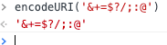

*   区别

    1.  encodeURI 和 decodeURI 函数操作的是完整的 URI，这俩函数假定 URI 中的任何保留字符都有特殊意义，所有不会编码它们

    2.  encodeURIConponent 和 decodeURIComponent函数操作的是组成 URI 的个别组件，这俩函数假定任何保留字符都代表普通文本，所以必须编码它们，所以它们（保留字符）出现在一个完整 URI 的组件里面时不会被解释成保留字符了

    [图解转义和反转义URI的4中方法](../%E5%9B%BE%E8%A7%A3%E8%BD%AC%E4%B9%89%E5%92%8C%E5%8F%8D%E8%BD%AC%E4%B9%89URI%E7%9A%844%E4%B8%AD%E6%96%B9%E6%B3%95/index.md)

### hover 同级元素闪烁

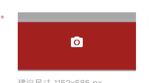

如图，背景图和mask蒙层是同级元素，如果给背景图设置hover，让蒙层`display:block;`显示，就会出现闪烁的问题，原因是hover后，蒙层出来，此时鼠标是在蒙层上，但是蒙层没有hover事件，所以他会`display:none`, 之后鼠标又回到了背景图上，重复以上循环就会造成闪烁。

**解决办法**：给蒙层相同的hover事件，就可以避免

### 元素坐标属性

#### 定位父元素：Ele.offsetParent

返回一个指向最近的（指包含层级上的最近）包含该元素的定位元素或者最近的 `table,td,th,body`元素，当获取元素的offsetParent属性时，会从该元素往上查找，如果某个祖先元素的position值是除static之外的属性，那么这个祖先元素就是该元素的offsetParent，offsetLeft/offsetTop都是相对于offsetParent内边距定位获取的

当元素的 `style.display` 设置为 "none" 时，`offsetParent` 返回 `null`

#### Ele.offsetHeight/offsetWidth

是一个只读属性,返回一个元素的布局宽度，offsetWidth是测量包含元素的边框(border)、水平线上的内边距(padding)、竖直方向滚动条(scrollbar)（如果存在的话）、以及CSS设置的宽度(width)的值

offsetWeight=content+padding2+滚动条宽度+border2


#### 定位父元素内距离Ele.offsetLeft/offsetTop

是一个只读属性，返回当前元素\_左上角\_相对于  [HTMLElement.offsetParent](https://developer.mozilla.org/zh-CN/docs/Web/API/HTMLElement/offsetParent "HTMLElement.offsetParent") 节点的左边界偏移的像素值

如果Ele是类似div的块级元素，`offsetLeft/offsetTop`描述的是该元素距离定位父元素的left/top的距离；

如果Ele是类似span的行内元素，则通过`offsetLeft/offsetTop/offsetWidth/offsetHeight`这几个参数无法描述该行内元素的边界；如：

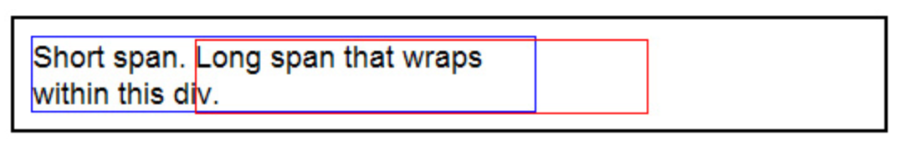

```javascript
<div style="width: 300px; border-color:blue;
  border-style:solid; border-width:1;">
  <span>Short span. </span>
  <span id="long">Long span that wraps withing this div.</span>
</div>

<div id="box" style="position: absolute; border-color: red;
  border-width: 1; border-style: solid; z-index: 10">
</div>

<script>
  var box = document.getElementById("box");
  var long = document.getElementById("long");
  //
  // long.offsetLeft这个值就是span的offsetLeft.
  // long.offsetParent 返回的是body（在chrome浏览器中测试）
  // 如果id为long的span元素的父元素div，设置了position属性值，只要不为static,那么long.offsetParent就是div

  box.style.left = long.offsetLeft + document.body.scrollLeft + "px";
  box.style.top = long.offsetTop + document.body.scrollTop + "px";
  box.style.width = long.offsetWidth + "px";
  box.style.height = long.offsetHeight + "px";
</script> 
```

上面例子里id=long的span元素的边界应该是蓝色的区域，但是通过`offsetLeft/offsetTop/offsetWidth/offsetHeight`这几个属性定位到的区域却是红色区域，显然是错的

#### Ele.clientWidth/clientHeight

该属性包括内边距 padding，但不包括边框 border、外边距 margin 和垂直滚动条（如果有的话）。

clientWidth = content + padding\*2

offsetWeight=content+padding2+滚动条宽度+border2

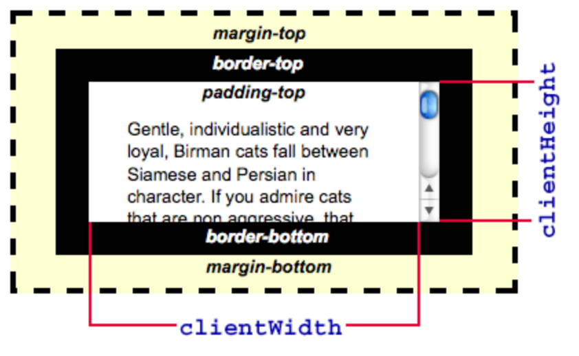

#### Ele.clientLeft/clientTop&#x20;

clientLeft: 元素的内边距(padding)的外边缘和边框的外边缘的距离，实际就是边框的左边框宽度

clienttop: 同理边框的上边框的宽度

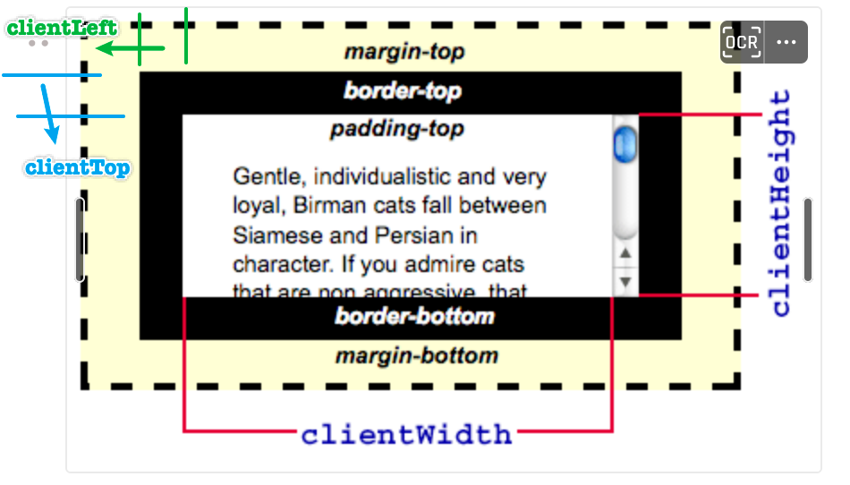

#### Ele.scrollWidth/scrollHeight

这个只读属性是元素内容宽度的一种度量，包括由于overflow溢出而在屏幕上不可见的内容。`scrollWidth`值等于元素在不使用水平滚动条的情况下适合视口中的所有内容所需的最小宽度,它包含元素的内边距，但不包括边框，外边距或垂直滚动条（如果存在）(scrollWidth = content + padding\*2)

如果元素的内容可以适合而不需要水平滚动条，则其`scrollWidth`等于[clientWidth](https://developer.mozilla.org/zh-CN/docs/Web/API/Element/clientWidth "clientWidth")

#### Ele.getBoundingClientRect()&#x20;

方法返回元素的大小及其相对于视口左边上边的距离

```javascript
let rectObject = object.getBoundingClientRect();

rectObject.top：元素上边到视窗上边的距离;
rectObject.right：元素右边到视窗左边的距离;
rectObject.bottom：元素下边到视窗上边的距离;
rectObject.left：元素左边到视窗左边的距离;

```

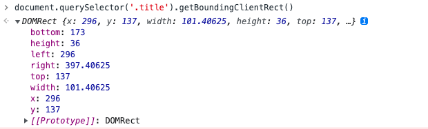

### Event事件坐标

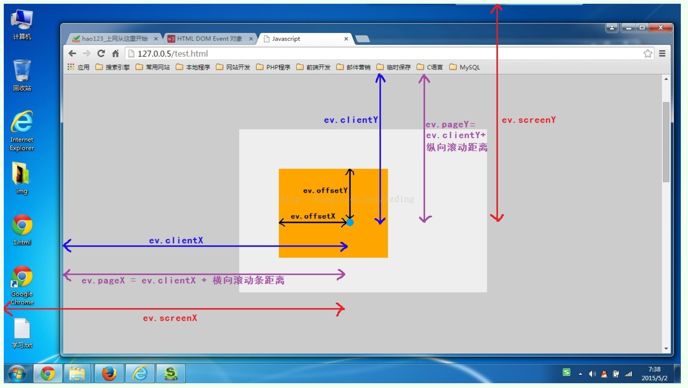

#### e.clientX/clientY

鼠标相对于浏览器（这里说的是浏览器的有效区域）左上角x轴/ y轴的坐标；  不随滚动条滚动而改变；

#### e.pageX/pageY

鼠标相对于浏览器（这里说的是浏览器的有效区域）左上角x轴 / y 轴的坐标；  随滚动条滚动而改变；

#### e.screenX/screenY

鼠标相对于显示器屏幕左上角x轴/y轴的坐标

#### e.offsetX/offsetY

鼠标相对于事件源左上角X轴/ y轴的坐标

### 原生Ajax

```javascript
// 1. 创建连接
let xhr = new XmlHttpRequest()
// 2. 连接服务器
xhr.open('get', url, true)
// 3. 发送请求
xhr.send()
// 4. 接收请求
xhr.onreadstatechange = function(){
  
}

```

## 获取元素的行内style

```javascript
// 获取的是元素的行内style 返回字符串
element.style.cssText

// 对style的值进行覆盖设置
element.style.cssText = 'color: green'

```

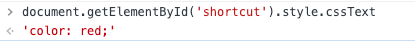

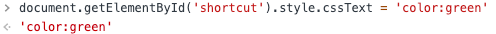

## SVG画圆形进度条

svg画圆形可以用`<circle>`标签，但是这是一整个圆，没法做到圆形百分比，

```javascript
<circle cx="150" cy="100" r="80" fill="green" />
```

但是`<path>`可以精确控制绘制区域, 可以用它创建线条, 曲线, 弧形等等

1.  path元素的形状是通过属性`d`定义的，属性`d`的值是一个“命令+参数”的序列

2.  命令有两种表示方式：大写（绝对定位：采用坐标）和小写（相对定位：采用距离）

### path命令

#### M L H V Z命令

1.`M x y`： 移动到（x, y）坐标；`m dx dy`: x轴移动dx距离，y轴移动dy距离

```javascript
<path d="M10 10"/>
```

2\. `L x y (or l dx dy)`： L命令将会在当前位置和新位置（L前面画笔所在的点）之间画一条线段。

```javascript
<path d="M10 10 L 20 20"/>
```

3\. `H x (or h dx)`: x轴绘制水平线

4\. `V y (or v dy)`： y轴绘制垂直线

这俩命令都只需一个参数表示目的坐标的x轴或y轴值，只在一个方向上移动

```javascript
<path d="M10 10 H 90 V 90 H 10 L 10 10"/>
// 绘制一个80*80的矩形，闭合

```

5.` Z(z)`： 闭合曲线，经常放到路径的最后，不区分大小写

上面例子可以简化为⬇️

```javascript
<path d="M10 10 H 90 V 90 H 10 Z" fill="transparent" stroke="black"/>
```

#### 贝塞尔曲线

1.  三次贝塞尔曲线

    `C x1 y1, x2 y2, x y (or c dx1 dy1, dx2 dy2, dx dy)`：

    (x,y)表示终点的坐标，(x1, y1)起点控制点坐标,(x2,y2)终点控制点的坐标，

    ```javascript
    <svg width="190px" height="160px" version="1.1" xmlns="http://www.w3.org/2000/svg">

      <path d="M10 10 C 20 20, 40 20, 50 10" stroke="black" fill="transparent"/>
      <path d="M70 10 C 70 20, 120 20, 120 10" stroke="black" fill="transparent"/>
      <path d="M130 10 C 120 20, 180 20, 170 10" stroke="black" fill="transparent"/>
      <path d="M10 60 C 20 80, 40 80, 50 60" stroke="black" fill="transparent"/>
      <path d="M70 60 C 70 80, 110 80, 110 60" stroke="black" fill="transparent"/>
      <path d="M130 60 C 120 80, 180 80, 170 60" stroke="black" fill="transparent"/>
      <path d="M10 110 C 20 140, 40 140, 50 110" stroke="black" fill="transparent"/>
      <path d="M70 110 C 70 140, 110 140, 110 110" stroke="black" fill="transparent"/>
      <path d="M130 110 C 120 140, 180 140, 170 110" stroke="black" fill="transparent"/>

    </svg>
    ```

    

2.  接着前一个贝塞尔连接绘制下一个贝塞尔`S x2 y2, x y (or s dx2 dy2, dx dy)`

    > S命令可以用来创建与前面一样的贝塞尔曲线，但是，如果S命令跟在一个C或S命令后面，则它的第一个控制点会被假设成前一个命令曲线的第二个控制点的中心对称点。如果S命令单独使用，前面没有C或S命令，那当前点将作为第一个控制点。下面是S命令的语法示例，图中左侧红色标记的点对应的控制点即为蓝色标记点。

    ```javascript
    <svg width="190px" height="160px" version="1.1" xmlns="http://www.w3.org/2000/svg">
      <path d="M10 80 C 40 10, 65 10, 95 80 S 150 150, 180 80" stroke="black" fill="transparent"/>
    </svg>
    ```

    

3.  二次贝塞尔曲线 `Q x1 y1, x y (or q dx1 dy1, dx dy)`

    (x1,y1)控制点的坐标，(x,y)终点坐标

    ```javascript
    <svg width="190px" height="160px" version="1.1" xmlns="http://www.w3.org/2000/svg">
      <path d="M10 80 Q 95 10 180 80" stroke="black" fill="transparent"/>
    </svg>
    ```

    

4.  延长二次贝塞尔曲线` T x y (or t dx dy)`

    > 和之前一样，快捷命令T会通过前一个控制点，推断出一个新的控制点。这意味着，在你的第一个控制点后面，可以只定义终点，就创建出一个相当复杂的曲线。需要注意的是，T命令前面必须是一个Q命令，或者是另一个T命令，才能达到这种效果。如果T单独使用，那么控制点就会被认为和终点是同一个点，所以画出来的将是一条直线。

    ```javascript
    <svg width="190px" height="160px" version="1.1" xmlns="http://www.w3.org/2000/svg">
      <path d="M10 80 Q 52.5 10, 95 80 T 180 80" stroke="black" fill="transparent"/>
    </svg>
    ```

    

#### 弧形

`A rx ry x-axis-rotation large-arc-flag sweep-flag x y`

`a rx ry x-axis-rotation large-arc-flag sweep-flag dx dy`

rx ry：x轴 y轴的半径

x-axis-rotation：旋转度数，类似360°

large-arc-flag：决定弧线是大于还是小于180度，0表示小角度弧，1表示大角度弧

sweep-flag：表示弧线的方向，0表示从起点到终点沿逆时针画弧，1表示从起点到终点沿顺时针画弧

```javascript
<svg width="325px" height="325px" version="1.1" xmlns="http://www.w3.org/2000/svg">
  <path d="M80 80
           A 45 45, 0, 0, 0, 125 125
           L 125 80 Z" fill="green"/>
  <path d="M230 80
           A 45 45, 0, 1, 0, 275 125
           L 275 80 Z" fill="red"/>
  <path d="M80 230
           A 45 45, 0, 0, 1, 125 275
           L 125 230 Z" fill="purple"/>
  <path d="M230 230
           A 45 45, 0, 1, 1, 275 275
           L 275 230 Z" fill="blue"/>
</svg>
```


### 圆形进度条组件

```javascript
import React, { Component } from "react";

const svgStyle = {
  overflow: "visible",
  display: "block",
};
// 内容为空组件
export default function SvgChart({
  width = 140,
  percent = 0,
  gap = 5,
  strokenWidth = 8,
  frontColor = "#1AC388",
  backColor = "#E7E7E7",
  totalNumber = 0,
  style,
} = {}) {
  const angle = (2 * Math.PI * percent) / 100;
  const overHalf = percent >= 50;
  const isFill = percent === 100;
  const isZero = percent === 0;
  const R = width / 2;
  const bgCircle = `M${R} 0 A${R} ${R} 0 1 1 ${R - 1} 0 z`;

  const halfStrokeWidth = strokenWidth / 2;
  const frontR = R - halfStrokeWidth;

  const frontEndX = frontR + frontR * Math.sin(angle) + halfStrokeWidth;
  const frontEndY = frontR - frontR * Math.cos(angle) + halfStrokeWidth;

  const frontCircle = `M${R} ${halfStrokeWidth} A${frontR} ${frontR} 0 ${overHalf ? 1 : 0} 1 ${
    isFill ? frontEndX - 0.1 : frontEndX
  } ${frontEndY} ${isFill ? "z" : ""}`;

  const backCircle = `M${frontEndX} ${frontEndY} m${gap * Math.cos(angle)} ${
    gap * Math.sin(angle)
  } A${frontR} ${frontR} 0 ${overHalf ? 0 : 1} 1  ${R - gap} ${halfStrokeWidth}  ${isZero ? "z" : ""}`;

  return (
    <svg
      width={`${width}px`}
      height={`${width}px`}
      style={{ ...svgStyle, ...style }}
      xmlns="http://www.w3.org/2000/svg"
    >
      <path d={bgCircle} fill="white" />

      <path d={frontCircle} fill="none" strokeWidth={strokenWidth} stroke={frontColor} />
      {percent <= 98 && <path d={backCircle} fill="none" strokeWidth={strokenWidth} stroke={backColor} />}

      <text x={R} y={R} textAnchor="middle" fontSize={parseInt(totalNumber) >= 10000 ? 20 : 32} fontWeight="bold" fill="#333333">
        {totalNumber}
      </text>
      <text x={R} y={R + 32 / 1.5} textAnchor="middle" fill="#999999" fontSize={12}>
        总数
      </text>
    </svg>
  );
}

```

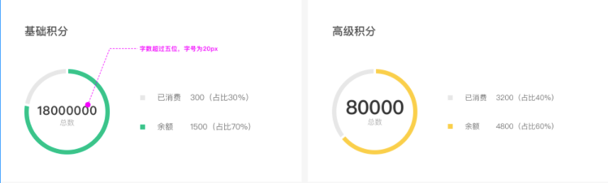

### Css实现左侧固定宽，右侧自适应

#### float + margin

```javascript
<div class="box">
  <div class="box-left"></div>
  <div class="box-right"></div>
</div>

// css
.box {
 height: 200px;
}

.box > div {
  height: 100%;
}

.box-left {
  width: 200px;
  float: left;
  background-color: blue;
}

.box-right {
  margin-left: 200px;
  background-color: red;
}

```

效果如下

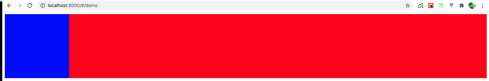

用法： 第一个元素采用float, 使得父元素高度塌陷，触发BFC, 第二个元素会重新开始从父元素排列，使用marginLeft or marginRight对应第一个元素的固定宽.

#### calc

```javascript
<div class="box">
  <div class="box-left"></div>
  <div class="box-right"></div>
</div>

// css
.box {
 height: 200px;
}

.box > div {
  height: 100%;
}

.box-left {
  width: 200px;
  float: left;
  background-color: blue;
}

.box-right {
  width: calc(100% - 200px);
  float: right;
  background-color: red;
}

```

效果跟上面一样

用法：calc(100% - 100px); 100%指的是父元素的宽度，并非window窗口的宽度

#### float + overflow

```javascript
<div class="box">
  <div class="box-left"></div>
  <div class="box-right"></div>
</div>

// css
.box {
 height: 200px;
}

.box > div {
  height: 100%;
}

.box-left {
  width: 200px;
  float: left;
  background-color: blue;
}

.box-right {
  overflow: hidden;
  background-color: red;
}
```

重点在于右侧的`overflow: hidden;`，没有使用这个的话，右侧红色块会默认占满父元素，使用之后会紧接着左侧蓝色延伸到父元素右侧（不懂为啥）

#### flex(flex-basis)

```javascript
<div class="box">
  <div class="box-left"></div>
  <div class="box-right"></div>
</div>

// css
.box {
  height: 200px;
  display: flex;
}

.box > div {
  height: 100%;
}

.box-left {
  width: 200px;
  background-color: blue;
}

.box-right {
  flex: 1; // 设置flex-grow属性为1，默认为0
  overflow: hidden;
  background-color: red;
}

```

flex是一个简写，全写是`flex: flex-grow flex-shrink flex-basis;`，flex-grow定义子元素占父元素的比率，flex-shrink定义子元素总宽度超出后，每个子元素要减小宽度的比率，子元素同等宽度条件下，值越大，要被分割的比率就越大，结果就是宽度越小。

```javascript
<div id="content">
  <div class="box" style="background-color:red;">A</div>
  <div class="box" style="background-color:lightblue;">B</div>
  <div class="box" style="background-color:yellow;">C</div>
  <div class="box1" style="background-color:brown;">D</div>
  <div class="box1" style="background-color:lightgreen;">E</div>
</div>

.box { 
  flex-shrink: 1;
}
.box1 { 
  flex-shrink: 2; 
}

```

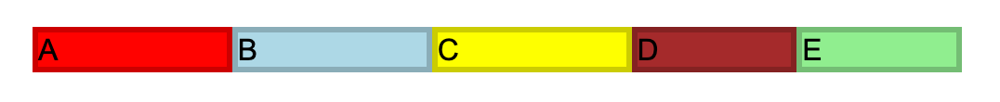

> flex-shrink的默认值为1，如果没有显示定义该属性，将会自动按照默认值1在所有因子相加之后计算比率来进行空间收缩。本例中A、B、C 显式定义了 flex-shrink 为 1，D、E 定义了 flex-shrink 为 2，所以计算出来总共将剩余空间分成了 7 份，其中 A、B、C 占 1 份，D、E 占 2 份，即1:1:1:2:2。我们可以看到父容器定义为 500px，子项被定义为 120px，子项相加之后即为 600 px，超出父容器 100px。那么超出的 100px 需要被 A、B、C、D、E 消化 通过收缩因子，所以加权综合可得 100*1+100*1+100*1+100*2+100\*2=700px。

于是我们可以计算 A、B、C、D、E 将被移除的溢出量是多少：

A 被移除溢出量：(100*1/700)* 100，即约等于14px \*

*B 被移除溢出量：(100*1/700)\*100，即约等于14px \*

*C 被移除溢出量：(100*1/700)\*100，即约等于14px \*

*D 被移除溢出量：(100*2/700)\*100，即约等于28px \*

*E 被移除溢出量：(100*2/700)\*100，即约等于28px

#### flex:1 时 内容纯数字不换行的问题

```javascript
<div class="box">
  <div class="box-left"></div>
  <div class="box-right">123456789876543212345612</div>
</div>

.box {
  display: flex;
  width: 250px;
  height: 50px;
}
.box-left {
  width: 100px;
  background-color: blue;
}
.box-right {
  flex: 1;
  background-color: red;
}

```

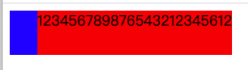

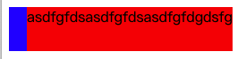

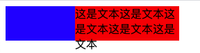

以上内容右侧的内容为纯数字或不带空格的纯英文，默认不会折行显示，如果是中文文本就没有这个问题

解决办法：

给右侧内容设置： `word-break: break-all;`

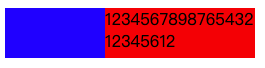

上述还会出现另一个问题，就是右侧内容不换行的话，左侧内容会被压缩，这是因为父元素`display:flex;`后，子元素默认会设置`flex-shrink: 1;`所以会进行压缩。

解决办法：

给左侧内容设置`flex-shrink: 0;`，这样左侧内容就不参与压缩了

### 跨域

<https://segmentfault.com/a/1190000015597029>

[RN 上拉加载 下拉刷新hook](../RN%20%E4%B8%8A%E6%8B%89%E5%8A%A0%E8%BD%BD%20%E4%B8%8B%E6%8B%89%E5%88%B7%E6%96%B0.md)

[爬虫](../%E7%88%AC%E8%99%AB.md)
