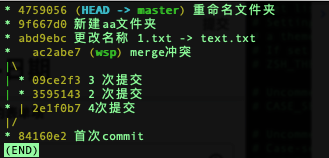
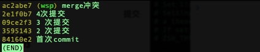
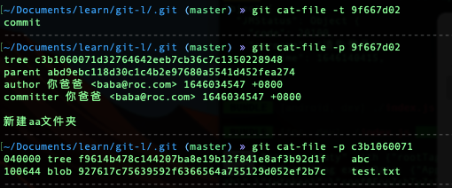

# Git 命令及配置多用户

### merge

```bash
git merge --no-ff branch_name
```

## Git 配置

### 配置用户名和接收消息邮箱

```bash
# 配置单个仓库的用户名和邮箱
git config --local user.name "jitwxs"
git config --local user.email "jitwxs@foxmail.com"

# 配置全局的用户名和邮箱
git config --global user.name "jitwxs"
git config --global user.email "jitwxs@foxmail.com"

# 配置系统级的用户名和邮箱 系统多个账户情况
git config --system user.name "jitwxs"
git config --system user.email "jitwxs@foxmail.com"

```

**local 优先级更高**

### 查看配置

命令：`git config —<local | global | system> —list`

```bash
git config --<local | global | system> --list
```

**注意：**—local 需要在一个仓库中进行使用

<https://www.cnblogs.com/cangqinglang/p/12462272.html>

## 查看全局配置

`git config —-global —-list` 会列出所有全局的配置

## 查看项目配置

`git config -—local —-list` 会列出该项目下的配置

---

## 文件内容类型

commit: 代表的是 commit 的本项目快照

tree: 代表本次 commit 的一个文件夹

blob: 代表本次 commit 的一个文件

，黄色块的tree指向包含readme的blob文件的tree，最后blob文件为新建的readme文件")

## 命令

1.  跟踪重命名文件

    重命名后，会显示删除了源文件，新增了重命名后的文件；这样不对，因为只是重命名了，可以用

    `git mv 重命名前的文件/文件夹 准备重命名后的文件/文件夹`

    ```bash
    ├── abcd
    │   └── 11.js
    └── test.txt

    # 会把abcd文件夹更名为abc
    git mv abcd abc
    ```

    更名之后，查看 git status 会提示文件为重命名状态，已经是暂存区的状态了

2.  git log

    1.  `git log —-oneline` 查看提交记录 一行一次的方式

        

    2.  `git log -—n2 -—oneline` : 以行的形式展示最近两次的记录

    3.  `git log -—oneline --graph` : 以树形结构展示提交记录

        

    4.  `git log -—oneline <分支名>` ：列出指定分支的提交记录

        

    5.

3.  git cat-file

    1.  查看文件类型 tree blob commit git cat-file -t <commitid\>

    2.  查看文件内容 git cat-file -p <commitid\>

    

4.  git 分离头指针

    1.  `git checkout <commitid>` ,直接切换到某一次提交记录上，适合做基于此次提交的尝试修改，可能以后不需要。

    2.

5.  删除分支

    1.  `git branch -D/-d 分支名` 删除分支，-d 会加一层判断逻辑，看是否合并到拉出的分支，确保删除动作的安全，-D 不做这个判断直接删除。

6.  git commit&#x20;

    1.  `git commit —amend` 修改最后提交记录：进入 vim 编辑状态 `:wq` 保存退出

    2.  `git rebase -i <commitid>` 修改某一次提交记录。前提：没有合并到集成分支前，因为更改某一次提交后，该提交之后的 commitid 都会发生改变

        **注意**：`commitid` 是需要修改提交 msg 的再上一次的提交 id；回车后会进入 vim 编辑模式，最上方会列出 commitid 之后的所有的记录，pick 代表原先的提交，可以将 pick 修改为 reword，保存退出再次进入提交记录编辑，编辑后退出就生效了.

        > 修改历史的 Commit message，通常用在还没有提交到集成分支之前：`git rebase -i father_commit_id`交互界面里的命令选 reword

    3.  `git rebase -i <commitid>` 也可以进行多次连续提交的合并：

        **重点：**进入 vim 后，pick 是原先的提交，reword 是修改本次提交，s 是将本次提交记录合并到上面的提交中，可以多条

    4.  `git rebase -i <commitid>` 进行不连续提交的合并：比如将首尾两次的提交合并为一次

        由于 rebase 需要指定父级 commitid，第一次没有父级 commitid，所以我们可以手动添加 pick 首次 commitid

        `git rebase -i 首次提交id` ，之后在最上方补全第一次的 commitid，`pick 首次提交id`

        然后进行首尾两次的合并：将最后的提交 `pick lastcommitid` 更改为`s lastcommitid` ，然后放到第二行，保存后会提示，继续使用 `git rebase -—continue` ，继续编辑合并信息，保存退出就生效了。这是首尾合并的例子，中间的同理

    5.

7.  git diff 查看差异

    1.  `git diff -—staged <文件名>` : 查看**暂存区**和**HEAD**的差异，不加文件名的话就是查看所有差异

    2.  `git diff -—cached <文件名>` : 查看**暂存区**和**HEAD**的差异，不加文件名的话就是查看所有差异

    3.  `git diff <文件名>` ：查看**暂存区**和**工作区**的差异，可指定文件

#### 变更工作区内容

```bash
# 将工作区的制定文件恢复成暂存区的内容
git checkout -- <文件名>
```

#### 变更暂存区内容

```bash
# 将暂存区指定文件恢复成缓存区 HEAD 的文件内容
git reset HEAD -- <文件名> <文件名>
```

## 配置多用户步骤

### 清除全局的 global 配置

`git config --global --unset user.name`

`git config --global --unset user.email`

### 生成钥对

先删除 `~/.ssh `目录下的公钥和密钥文件

然后通过 `ssh-keygen -t rsa -C “jitwxs@githubemail.com”` enter 后输入用于区分 github 的公钥文件 `id_rsa_github` ,然后一路回车

同样的步骤 `ssh-keygen -t rsa -C “gitlab@gitlabemail.com”` ,生成 gitlab 的公钥文件 `id_rsa_gitlab`

### 添加 SSH_key

分别到 github 和 gitlab 的设置中配置 SSH，将上述两个.pub 公钥文件内容复制到网站的设置-SSH 中

### 添加私钥

ssh-add \~/.ssh/id_rsa_github // 将 GitHub 私钥添加到本地 &#x20;
ssh-add \~/.ssh/id_rsa_gitlab // 将 GitLab 私钥添加到本地

之后通过 `ssh-add -l` 进行验证

### 管理秘钥

修改 `~/.ssh/config `文件的内容如下

```纯文本
Host github
HostName github.com
User github的名
IdentityFile ~/.ssh/id_rsa_github

Host gitlab
HostName gitlab.mygitlab.com
User gitlab的名
IdentityFile ~/.ssh/id_rsa_gitlab
```

### 仓库配置

进到项目根目录中

```bash
git config --local user.name "jitwxs"
git config --local user.email "jitwxs@foxmail.com"
```
