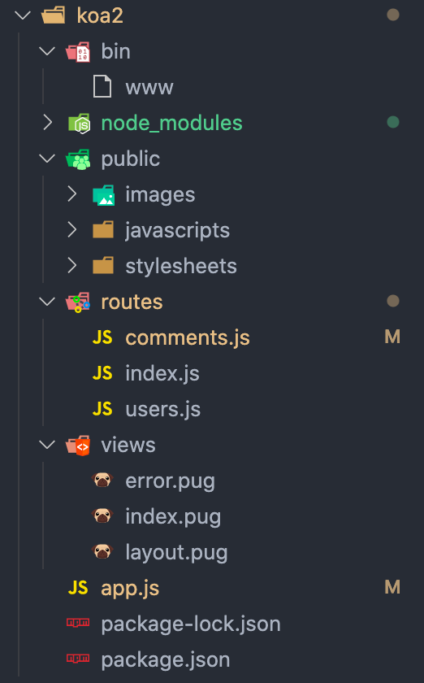

## commonjs 语法

module.exports 导出

通过 require 引入

require 有三个层级：&#x20;

1.  系统自带的模块

2.  npm 安装的模块

3.  自定义的模块

## es module 语法

> export 或者 export default 导出 通过 import \* from 引入

### 两者区别

commonjs 引入是动态的，可以在条件 if 语句中 require

```javascript
const { sum, test } = require("./test");

if (true) {
  test();
  console.log(sum(1, 2));
}
```

而 ES6module 的引入是静态的，只能放在文件顶部，以下语法是错误的

```·js
if (true) {
  import * from './test'
}
```

## inspect 调试

package.json 的 scripts 添加，nodemon 是一个包，监听本地文件变动的包

```javascript
"scripts": {
    "tt": "nodemon --inspect-brk ./commonjs-test/index.js"
},
```

—inspect=9229 也可以但是这次没成功，下次尝试

然后 chrome 打开`chrome://inspect` ，在最下方 Remote Target 中点击 inspect 就打开了执行文件

## 创建简单的 server

```javascript
const http = require("http");

const server = http.createServer((req, res) => {
  const url = req.url.split("?")[0];
  res.end(url);
});
server.listen(3000);
```

### 分析路由

```javascript
const http = require("http");
const queryString = require("querystring");
const port = 3000;

const server = http.createServer((req, res) => {
  const params = queryString.parse(req.url.split("?")[1]);
  console.log("收到请求", params);

  const path = req.url.split("?")[0];
  const method = req.method;
  if (path === "/api/list" && method === "GET") {
    const result = [
      {
        user: "张三",
        content: "内容1",
      },
    ];
    res.writeHead(200, { "Content-type": "application/json" });
    res.end(JSON.stringify(result));
  }

  res.writeHead(404, { "Content-type": "text/plain" });
  res.end("404 not found");
});
server.listen(port);
console.log(`服务启动了 请访问 http://localhost:${port}`);
```

1.  { "Content-type": "application/json" } 返回的是 json 格式

2.  { "Content-type": "text/plain" } 返回的是文本格式

3.  { "Content-type": "text/html" } 返回的是 html 格式

### post

```javascript
if (path === "/api/create" && method === "GET") {
  const result = {
    date: "success",
  };
  const bodyStr = "";
  res.on("data", (chunk) => {
    bodyStr += chunk;
  });
  res.on("close", () => {
    console.log("结束了");
    res.writeHead(200, { "Content-type": "application/json" });
    res.end(JSON.stringify(result));
  });
  return;
}
```

## koa2

### 启动一个服务

```javascript
const Koa = require("koa");
const app = new Koa();

app.use(async (ctx) => {
  ctx.body = "hello koa";
});

app.listen(3000);
console.log("服务启动了");
```

### 使用 koa-generator&#x20;

使用脚手架搭建 koa 开发环境，先安装，可以全局也可以在项目中单独安装，下面是在项目中安装使用

`npm i koa-generator` 安装之后，会在 node_modules 中的.bin 目录中有 koa2 命令，如何执行该命令呢，使用 npx `npx koa2 -—version`，如果出现`koa-generator`的版本号，就说明可以使用了

### 创建项目

`koa2 demo`，会创建 demo 项目目录，之后`cd demo & & npm i`

目录结构如下



其中 routes 目录里是对应路由的逻辑，public 文件夹是公共目录，views 是渲染模板

`routes/comments.js`的内容如下

```javascript
const router = require("koa-router")();
router.prefix("/api"); // 定义当前路由前缀

router.get("/list", async (ctx, next) => {
  // '/api/list'
  const query = ctx.query; // get 的？后的参数
  console.log("参数", Object.keys(ctx));
  // ctx.body = "api list"; // 返回的是文本格式
  // 返回的是json格式
  ctx.body = {
    errno: 0,
    data: [
      { content: "内容1234r", user: "roc" },
      { content: "内容1234r", user: "roc" },
      { content: "内容1234r", user: "roc" },
    ],
  };
});
router.post("/create", async (ctx) => {
  // '/api/create'
  const body = ctx.request.body; // post 的内容部分
  console.log("post body", body);
  // ctx.body = "api list"; // 返回的是文本格式
  ctx.body = {
    errno: 0,
    message: "成功了",
  };
});

module.exports = router;
```

通过 get 和 post 定义路由方法，ctx 中有 request、reponse 的内容，还有 query 参数等

### 中间件模拟登陆

```javascript
// app.js
// 模拟登陆
app.use(async (ctx, next) => {
  // 通过url里的query参数 localhost:3000/?user=roc 简单判断
  if (ctx.query.user === "roc") {
    console.log("成功登陆");
    await next();
  } else {
    ctx.body = "登录失败";
  }
});
```

### 中间件概念

每个中间件都是个 async 函数，运行机制类似洋葱圈

下面用加载图片做个解释，代码复制到浏览器运行即可

```javascript
async function getImg(url) {
  await fetch(url);
}

async function fn() {
  const url =
    "https://img0.baidu.com/it/u=1796258836,3817865659&fm=26&fmt=auto";
  const now = Date.now();
  await getImg(url);
  const ms = Date.now() - now;
  console.log("加载图片花费了" + ms + "秒");
}
fn();
```

先从 fn 进入，然后进入 getImg，从 getImg 出来，最后从 fn 出来

## mongodb

非关系型数据库，数据库是一个独立的系统，和服务端语言无关

### Mac 电脑安装

[Brew & MongoDB](https://www.wolai.com/cp2tpAWjeMMikyN9DsrRgW "Brew & MongoDB")

## koa 模拟下单举例

[Koa 2 模拟下单](https://www.wolai.com/cwv6kfHyHtwPLR1F9ZuNQ "Koa 2 模拟下单")
