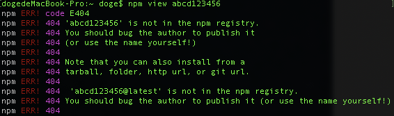
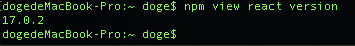
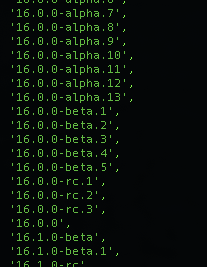

# Npm

## 查看全局的npm包

```bash
npm list -g --depth 0
```


## npm link 调试

[Npm link依赖添加本地包调试](https://www.wolai.com/4Am2wUY5kPb16ffCshhF3r "Npm link依赖添加本地包调试")

# name 包名

## npm view \[包名]

> 查看npm上是否有对应的包，如果有返回具体信息，没有则会404报错




# version 版本号

格式为：**主版本号.次版本号.修订号**

## npm view \[包名] version

> 查看当前包的最新版本



## npm view \[包名] version、

> 查看当前包的所有版本，会列出所有正式版、内部版（alpha）、公测版（beta）、候选版本（rc）。




# nvm

## 列出所有远程可用版本

```javascript
nvm ls-remote --lts
```


[Npm link依赖添加本地包调试](https://www.wolai.com/4Am2wUY5kPb16ffCshhF3r "Npm link依赖添加本地包调试")

