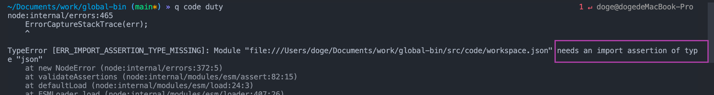
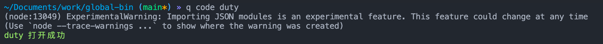
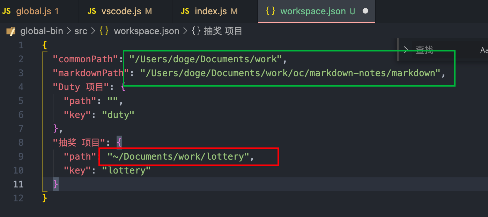
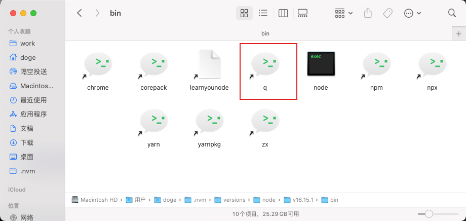
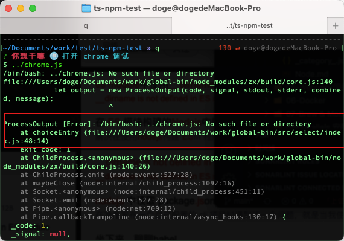
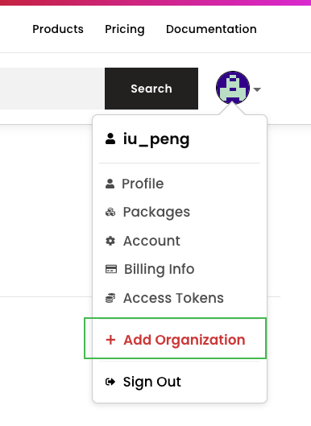

# 自定义Cli

> 通过node 程序，配置npm的package.json文件的bin命令，来执行一些重复的可自定义的任务或命令。


## 命令优先级

link: 使用npm link链接到全局的命令

global: 使用 npm -g i 或者 yarn global add 安装的命令

优先级：**link > global**

link 和 global都有同样的命令，会先执行link的，除非删除link的，才会执行global的命令


[使用 NPM 发布和使用 CLI 工具 - 掘金 (juejin.cn)](https://juejin.cn/post/6844904153030852621 "使用 NPM 发布和使用 CLI 工具 - 掘金 (juejin.cn)")

## 可能需要的第三方库

| 名称               | 作用                 |
| ---------------- | ------------------ |
| chalk            | 终端console样式库，log颜色 |
| commander        | 命令行交互              |
| inquirer         | 命令行交互（输入/选择等）      |
| ora              | 加载效果，图标            |
| downoad-git-repo | 从gitll拉模板          |
| fs-extra         | fs操作扩展             |
| log-symbols      | 日志输出               |


## Node命令

### fs.existsSync 判断文件路径是否存在


## 问题总结

### js文件中引入json文件会提示错误信息



解决办法：尾部添加附加信息

```javascript
import workJson from "./workspace.json" assert { type: "json" };

```

[import导入JSON - 掘金 (juejin.cn)](https://juejin.cn/post/6978033638533234719 "import导入JSON - 掘金 (juejin.cn)")

但是 ，这样会有警告信息



解决办法：改为如下方式

```javascript
import { createRequire } from "module";
const require = createRequire(import.meta.url);
const workJson = require("./workspace.json");
```


### 数组 forEach 遍历时动态更改数组的长度和内容

```javascript
option.forEach((i, d) =>
    option.splice(d * 2 + 1, 0, new inquirer.Separator("〰️〰️〰️〰️〰️〰️〰️〰️〰️〰️"))
);
```

以上操作会拿到原有数组的长度，然后遍历数组，在原有数组的每项后面添加一项。


### zx 命令 执行 code path 时，路径问题



执行代码如下

```javascript
switch (inquirerResult.type) {
    case "vscode":
      vsCode();
      break;
    case "chrome":
      // node bin/index.js 与 zx bin/index.js打印的 process.argv不一样，后者会是 node zx bin/index 多了zx
      await $`../chrome.js`;
      break;
    case "markserve":
      console.log(chalk.yellow("笔记 Server 启动中!"));
      const res = await $`cd ${workJson.markdownPath} && yarn start -p 3333`;
      console.log(
        res.stderr
          ? chalk.red(`笔记 Server 启动失败! \n${res.stderr}`)
          : chalk.yellow("笔记 Server 启动成功!")
      );
      break;
    case "codem":
      console.log(chalk.yellow("vscode 打开笔记!"));
      await $`code ${workJson.markdownPath}`;
      break;
    default:
      exit();
      break;
  }
```

在执行zx命令的 \$\`code path\`时，path必须是文件夹的绝对路径，上图绿框圈住的部分，红色部分这样的也不行。


### node项目中执行内部的某个js文件问题

```javascript
// project/src/select/index.js
import { $ } from 'zx'
case "chrome":
  await $`../chrome.js`;
  break;
```

> 问题描述

如上代码所示，`/src/select/index.js`目录下的文件，想去执行相邻目录下的chrome.js文件时，npm link后，其实是会把bin的命令放到 `/Users/doge/.nvm/versions/node/v16.15.1/bin`目录下，



但是执行`` $`../chrome.js` ``的时候，由于是相对路径，所以他是找不到chrome.js文件的，就会报错



**解决办法：**

获取到当前文件在计算机的实际地址，然后通过path.join 找到相邻目录的chrome.js文件，然后执行。

但是由于项目是`type=module` ，**ES Module中拿不到文件的\_\_dirname，即使拿到了，也是执行命令时所在的目录，并非项目的目录**，所以需要**** 登场了，是js的原生属性，指模块的基本url，也就是模块的绝对路径。

[import.meta - JavaScript | MDN (mozilla.org)](https://developer.mozilla.org/zh-CN/docs/Web/JavaScript/Reference/Operators/import.meta "import.meta - JavaScript | MDN (mozilla.org)")

```javascript
// 拿到当前文件的绝对路径
const dirname = import.meta.url.replace("file:", "");
// 通过 path.join 组合 目标相对路径 拿到绝对路径
await $`${path.join(dirname, "../../mark/markdown.mjs")}`;

```

## node项目(type=module)开发问题

### package.json中 type定义

该文件中type默认是commonjs，项目中使用时是这种格式

```javascript
const path = require("path")
```

如果 type=module，则可以使用如下方式

```javascript
import path from 'path'
```

两种方式差异：

1.  type= module是使用ESM规范，type=commonjs则是使用commonjs规范

2.  ESM规范可以导入commonjs规范的文件，反之则不行

换句话说，如果package.json中type未设置或者设置了commonjs，就不能引入使用了 type=module的ESM的npm包，否则就会报错


### 给项目添加Typescript支持

1.  因为只在开发时用到ts，所以

    ```bash
    yarn add typescript -D
    ```

    之后会在 node\_modules的.bin目录中有个tsc的命令，可以用来编译ts文件到js

2.  给项目添加ts配置，生成tsconfig.json

    ```bash
    npx tsc --init
    ```

3.  修改ts配置

    由于package.json中type=module了，所以ts 的module选项就不能用commonjs了，改为ESNext

    ```json
    {
      "compilerOptions": {
        "target": "es2016",  
        "module": "ESNext",                                /* Specify what module code is generated. */
        "rootDir": "./src",                                  /* Specify the root folder within your source files. */
        "moduleResolution": "NodeNext",  
        "declaration": true,                              /* Generate .d.ts files from TypeScript and JavaScript files in your project. */
        "outDir": "./lib",                                   /* Specify an output folder for all emitted files. */
        "esModuleInterop": true,                             /* Emit additional JavaScript to ease support for importing CommonJS modules. This enables 'allowSyntheticDefaultImports' for type compatibility. */
        "forceConsistentCasingInFileNames": true,            /* Ensure that casing is correct in imports. */

        "strict": true,                                      /* Enable all strict type-checking options. */
        "skipLibCheck": true                                 /* Skip type checking all .d.ts files. */
      }
    }

    ```


4.  如果文件目录如下

    .
    ├── index.ts
    └── utils.ts

    index.ts中这样引入了utils

    ```javascript
    import { vs } from "./utils";

    ```

    那么编译后的文件也是原样，运行时node会提示ESM 引入相对路径的文件时需要加文件后缀，所以只能这么处理下

    ```javascript
    import { vs } from "./utils.js";

    ```

    即使当前的文件是个ts文件，也只能这么干了。

    前提是tsconfig.json中需要配置

    ```json
    {
      ...
      "moduleResolution": "nodeNext"
    }
    ```


5.


## 自定义包发布到npm

[如何发布一个npm包-创建，发布，更新，撤销及常见问题解决\_npm\_Brave\_InfoQ写作社区](https://xie.infoq.cn/article/54bab64360e642efab7641427 "如何发布一个npm包-创建，发布，更新，撤销及常见问题解决_npm_Brave_InfoQ写作社区")

1.  注册 npm 账号

2.  切换到 npm 源，

    > npm config set registry [https://registry.npmjs.org/](https://registry.npmjs.org/ "https://registry.npmjs.org/")

3.  命令行 npm login

    输入昵称，密码，邮箱，邮箱验证码

4.  npm publish


### 更改version版本信息

```bash
update_type取值,意义及演示：

// 1）patch：补丁     v1.0.1->v1.0.2
$ npm version patch
v1.0.2
// 2）minor：小改     v1.0.2->v1.1.0
$ npm version minor
v1.1.0
// 3）major：大改     v1.1.0->v2.0.0
$ npm version major
v2.0.0
```

### 发布带有 @ 形式的包

如： `@types/node` ，types对应的是组织名称，如果想发布这样的包，需要在这里新建一个组织



然后在经过命令行登录后，使用下面的方式进行发布

```bash
npm publish --access public
```

之后就可以像安装正常的包一样使用了

