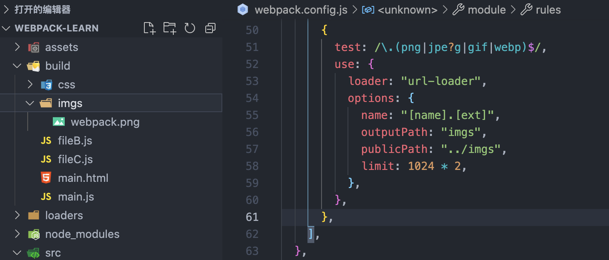

# Webpack闯关

### 开始

进入目录中 `mkdir myapp`，执行 `npm init -y`，安装webpack和webpack-cli

`npm i webpack@4 webpack-cli@3 -D`，将webpack安装到当前项目中，避免全局污染

新建src/index.js 输入以下内容

```javascript
console.log('webpack')

```

之后就可以执行`npx webpack`，自动进行打包了，项目中就会出现`dist/main.js`,这就是打包后的文件，默认采用`mode=production`模式进行打包


之所以`npx webpack`，执行后会进行打包，是因为`npx`会从`node_modules`下的`.bin`目录找到webpack文件，执行该文件。不能直接在项目中执行`webpack`进行打包，因为`webpack`当前不是全局变量。

### 修改启动命令

在package.json中scripts中，添加如下命令，然后执行`npm run dev`，效果跟相面一样，执行的是同一个命令，只是改了个别名而已

```javascript
"scripts": {
    "dev": "webpack"
  },
```

### 配置入口打包文件&#x20;

在项目根目录中新建文件`webpack.config.js`，这是webpack默认的打包配置文件，可以更改

```javascript
const path = require('path')

module.exports = {
    entry: './src/index.js', // 入口文件
    // 打包文件存放信息
    output: {
      path: path.resolve('./build'),
      filename: 'main.js'
    },
    mode: "development", // 采用dev模式进行打包
}
```

打包后的文件将存放在`build/main.js`中


### 更改默认打包配置文件

1.  在根目录中新建`wbepack.custom.js`文件，内容如下

```javascript
const path = require("path");

module.exports = {
  entry: "./src/index.js",
  output: {
    path: path.resolve("./custom"),
    filename: "main.js",
  },
  mode: "development",
};

```

2\. 修改package.json文件配置信息

```javascript
"scripts": {
    "dev": "webpack --config ./webpack.custom.js"
  },
```

此时执行`npm run dev`，将执行`webpack.custom.js`中的配置信息，打包后的文件将出现在`custom/main.js`中，此时执行`npx webpack`，依旧采用的是`webpack.config.js`的配置，因为没有加—config

### 打包后的文件信息

新建src/a.js， 并在index.js中引入

```javascript
// a.js
export let a = "哈哈哈";
// index.js
import { a } from "./a";
console.log(a);

```

执行`npm run dev`，查看`build/main.js`，如下所示：


打包后的文件本质是个自执行函数，接受的对象参数就是文件信息，key是文件路径，value是个函数，函数的参数是自执行函数体内封装好的


### 配置多入口

到目前为止都是单入口文件，`entry`都是字符串形式出现，现在可以给`entry`配置对象格式了，下面的格式与之前字符串格式效果是一样的

```javascript
module.exports = {
  // entry: "./src/index.js",
  entry: {
    main: "./src/index.js",
  },
  output: {
    path: path.resolve("./build"),
    filename: "main2.js",
  },
  mode: "development",
};

```

那么怎么样配置多入口呢，很简单，只需要将entry设置成多个`key-value`格式就可以实现了，在src下新建demo.js，并更改webpack.config.js

```javascript
// demo.js
console.log('demo')

// webpack.config.js
module.exports = {
  entry: {
    main: "./src/index.js",
    fileB: "./src/demo.js",
  },
  output: {
    path: path.resolve("./build"),
    filename: "main.js",
  },
  mode: "development",
};

```

此时output还是输出一个单文件，执行npm run dev后，会报错，如下


意思就是多入口文件应该对应多出口，不能两个入口对应一个出口，将output稍作修改

```javascript
output: {
    path: path.resolve("./build"),
    filename: "[name].js",
},
```

`[name]`是webpack提供的文件占位符，对应entry中的路径的key，如上面的main和fileB，此时进行打包，会发现build目录下就出现了entrykey对应的文件


此时，entry有几个入口，就会输出几个打包后的文件


### entry是数组

如下，entry是数组的情况下，对应打包的还是单页面应用，它只是配置了多个代码片段而已，即使output配置成上面`[name]`这样，打包出的文件依然只有一个main.js

```javascript
module.exports = {
  entry: ["./src/index.js", "./src/demo.js"],
  output: {
    path: path.resolve("./build"),
    filename: "[name].js",
  },
  mode: "development",
};
```


#### entry的对象上配置数组

如下，fileC配置了多个代码片段的打包入口，此时webpack会将这两个文件就行整合打包，输入一个fileC.js文件

```javascript
module.exports = {
  entry: {
    main: "./src/index.js",
    fileB: "./src/demo.js",
    fileC: ["./src/a.js", "./src/demo.js"],
  },
  output: {
    path: path.resolve("./build"),
    filename: "[name].js",
  },
  mode: "development",
};

```


### webpack文件指纹策略

包含：hash、chunkhash、contenthash 。范围依次减小

#### 1. hash&#x20;

以项目为单位，项目内容发生变化，则会生成新的hash，否则hash不变。打包后会输出该Hash值

```javascript
output: {
    path: path.resolve("./build"),
    filename: "[name]-[hash].js",
},
```

"\[name]-\[hash].js"


\[name]-\[hash:5].js


保持内容不变，再次打包hash不变


#### 2. chunkhash

以chunk为单位，当该chunk内的文件有改动，则会引起打包后的该 chunk改变

```javascript
output: {
    path: path.resolve("./build"),
    filename: "[name]-[chunkhash:5].js",
},
```

如果每个chunk对应关系如下

```javascript
entry: {
    main: "./src/index.js",
    fileB: "./src/demo.js",
    fileC: ["./src/a.js", "./src/demo.js"],
},

// css也作chunkhash处理
plugins: [
    ...
    new miniCssExtractPlugin({
      filename: "css/[name]-[chunkhash:8].css",
    }),
],

```

index.js中引入了`index.less`，如果只改动了less文件内容，则会引起main这个chunk的hash发生变化，其他chunk打包后的文件则不变。

改动index.js也会引起css的chunkhash发生变化

改动前的打包结果


改动一个css属性


改动打包后的结果


改动index.js


#### 3. contenthash

以自身内容为单位，如果内容不变化，则打包后文件名不变化。以上面为例，css使用contenthash，js使用chunkhash。

```javascript
plugins: [
    ...
    new miniCssExtractPlugin({
      filename: "css/[name]-[contenthash:8].css",
    }),
],
```

修改前


修改chunkhash的js


修改contenthash的css


修改chunkhash的js后，会引起打包后的js文件变化，但是由于css采用的是contenthash，更改并没有涉及到css，所以打包后的它不变。但是更改了css后，自身内容发生变化，打包后的css文件名肯定变化，由于js采用的是chunkhash，他引用的css发生了变化，相对应的他肯定也要变化

### mode模式差异

mode: "development"


mode: "none"


mode: "production"


以上是mode三种模式的差异，deva模式的时候，会显示chunks名称，而none和pro模式呢，则会用数字表示；pro打包出的文件明显比none和dev模式要小的多；输出信息最下方代表的是该文件被那些chunks所引用，如`./src/a.js 28 bytes {main} {fileB}`，代表a.js被main和fileB对应的chunks所引用过

### chunk bundle module

chunk: 代码片段

bundle: 打包后的文件

module: 加载的文件，如css文件，图片文件，js文件等

chunk可以由一个模块或者多个模块构成 ,多个模块指类似这种：

`fileC: ["./src/a.js", "./src/demo.js"]`

一个bundle对应一个chunk：对应一个module或者多个module

### Loader

loader解析器

webpack默认只支持.js和.json结尾的文件解析，对于其他文件并不支持，所以需要一些解析器来解析这些文件。


#### 使用loader加载css文件

*   第一步：在src文件夹下创建`index.css`,内容如下

    ```css
    body {
        background: orange;
    }
    ```

    接着在index.js中引入

    ```css
    import css from "./index.css";
    console.log(a);
    ```

    此时进行打包会报错

    

    意思是没法解析该类型文件，需要对应的`loader`。处理css文件，我们需要安装`css-loader`

    `npm i css-loader@5 -D`,安装版本5，如果是最新版使用后会报错

*   第二步

    配置`webpack.config.js`下的`module`

    ```css
    module: {
        rules: [
          {
            test: /\.css$/,
            use: "css-loader",
          },
        ],
      },
    ```

    配置了css-loader加载css文件

    此时执行`npx webpack`， 进行打包,会发现打包成功了

    

    打开打包后的`bundle`文件main.js，会发现css文件已经被打包进去了，怎么验证有没有生效呢，在build文件夹下新建`index.html`文件，并引入该`main.js`文件，之后浏览器中打开该html文件，发现body并没有样式

    ```html
    <body>
        <script src="./main.js"></script>
    </body>
    ```

    那是因为`css-loader`只做了一件事，就是把css文件转成webpack能打包的格式，并让对应文件引入。那怎么才能让样式生效呢

*   第三步

    安装`style-loader`，该`loader`是将css放入style标签中，让浏览器能识别

    `npm i style-loader@2 -D`,高版本会报错

*   第四步

    更改webpack配置

    ```javascript
    module: {
        rules: [
          {
            test: /\.css$/,
            use: ["style-loader", "css-loader"],
          },
        ],
      },
    ```

    之所以将`style-loader`放在数组第一项，是因为loader加载的时候，是按从后往前的顺序执行的，`css-loader`处理完后将结果交给`style-loader`处理

    此时进行打包，并在浏览器中打开，会发现生效了，样式被放在了`style`标签中

    


#### 使用file-loader可以加载图片等资源


#### Loader中use的三种写法

1.  直接字符串，针对单个loader

    ```javascript
    module: {
        rules: [
          {
            test: /\.css$/,
            use: "style-loader",
          },
        ],
      },
    ```

2.  单个对象，针对单个loader的进行配置

    ```javascript
    module: {
        rules: [
          {
            test: /\.css$/,
            use: {
              loader: 'css-loader', // 没有options 可以直接使用第一种写法
              opitons: {}
            }
          },
        ],
      },
    ```

3.  多个loader，可以使用数组写法，从下往上执行

    ```javascript
    module: {
        rules: [
          {
            test: /\.css$/,
            use: ["style-loader", "css-loader"],
          },
          {
            test: /\.less$/,
            use: [
              "style-loader",
              {
                loader: 'css-loader',
                options: {}
              }
            ],
          },
        ],
      },
    ```

### Plugin

以上步骤每次打包完都需要手动在build目录下创建index.html文件，在引入对应的js文件，非常不方便，此时就需要`html-webpack-plugin`插件来解决这个繁琐的步骤了。

1.  安装该插件 `npm i html-webpack-plugin@4 -D`

    ```javascript
    "devDependencies": {
        "css-loader": "^5.2.7",
        "html-webpack-plugin": "^4.5.2",
        "style-loader": "^2.0.0",
        "webpack": "^4.46.0",
        "webpack-cli": "^3.3.12"
    }
    ```

2.  配置webpack.config.js

    ```javascript
    const htmlWebpackPlugin = require("html-webpack-plugin");
    ...
    module.exports = {
    ...
     plugins: [
        new htmlWebpackPlugin({
          template: "assets/index.html",
          filename: "main.html",
        }),
      ],
    }
    ```

3.  要使用html-webpack-plugin,就需要先引入。默认可以不进行template等配置，直接进行打包，会在build目录下输出一个index.html，该文件中已经引入了打包后的js文件，以下是默认打包后输出的index.html，可以看到三个js文件都已经被引入了。

    ```html
    <!DOCTYPE html>
    <html>
      <head>
        <meta charset="utf-8">
        <title>Webpack App</title>
      <meta name="viewport" content="width=device-width, initial-scale=1"></head>
      <body>
      <script src="main.js"></script><script src="fileB.js"></script><script src="fileC.js"></script></body>
    </html>
    ```

4.  自定义html模板文件

    在根目录下新建assets/index.html文件，此时该文件将被当做打包的模板文件；filename定义打包后输出在build下的文件名称，配置好第2步的配置后，执行打包，

    

### 截止到当前代码

```javascript
const path = require("path");
const htmlWebpackPlugin = require("html-webpack-plugin");

module.exports = {
  entry: {
    main: "./src/index.js",
    fileB: "./src/demo.js",
    fileC: ["./src/a.js", "./src/demo.js"],
  },
  output: {
    path: path.resolve("./build"),
    filename: "[name].js",
  },
  mode: "development",
  module: {
    rules: [
      {
        test: /\.css$/,
        use: ["style-loader", "css-loader"],
      },
    ],
  },
  plugins: [
    new htmlWebpackPlugin({
      template: "assets/index.html",
      filename: "main.html",
    }),
  ],
};

```


### 使用less-loader处理less文件

新建src/index.less文件，内容如下，并在src/index.js中引入

```css
div {
    &.app {
        border: 1px solid black;
        height: 50px
    }
}

// src/index.js
import csss from "./index.less";

```

此时打包会报错，因为没有相应的loader处理该less文件，所以先进行安装

`npm i less less-loader@7 -D`

修改wbepack.config.js

```javascript
module: {
  rules: [
    {
      test: /\.css$/,
      use: ["style-loader", "css-loader"],
    },
    {
      test: /\.less$/,
      use: ["style-loader", "css-loader", "less-loader"], // less文件最先通过less-loader处理
    },
  ],
}
```

进行打包，less文件就被处理了


### 使用postcss&#x20;

#### autoprefixer处理css样式兼容

安装postcss-loader

`npm i postcss-loader@4 postcss@8 -D`

配置webpack.config.js

```javascript
 module: {
  rules: [
    {
      test: /\.css$/,
      use: ["style-loader", "css-loader"],
    },
    {
      test: /\.less$/,
      use: ["style-loader", "css-loader", "postcss-loader", "less-loader"],
    },
  ],
},
```

之所以将postcss-loader放在less-loader之前，是因为，postcss只能处理less-loader转译之后的css，所以他依赖于less-loader。

此时loader就配置好了，还需要安装autoprefixer，`npm i autoprefixer -D`，接着如何使用呢？

postcss可以在根目录配置`postcss.config.js`来制定对应的css处理，那么新建一个该文件，plugins类似webpack的plugins，直接require对应的包就行

```javascript
module.exports = {
  plugins: [require("autoprefixer")],
};
```

修改index.less文件添加`display: flex;`

```css
div {
    &.app {
        border: 1px solid black;
        height: 50px;
        display: flex;
    }
}
```

此时进行打包，按理说，应该给css3的flex添加对应的浏览器前缀，打包后发现并没有


原因就是需要制定适配的浏览的的名单，但是到目前为止并没有配置

#### 配置适配浏览器名单

1.  package.json配置

    ```json
    "browserslist": ["last 2 versions", "> 1%"]
    // 兼容最近两个版本 占市场份额大于1%的浏览器
    ```

    此时进行打包，就会有如下效果，发现flex已经被做了处理。

    

2.  根目录配置`.browserslistrc`，每个条件单独一行，该文件用来定义支持的浏览器范围。

    ```json
    last 2 versions
    > 1%
    ```

    效果同上

3.  小范围定义浏览器范围

    在postcss.config.js中引入插件的参数中定义

    ```javascript
    module.exports = {
      plugins: [
        require("autoprefixer")({
          overrideBrowserslist: ["last 2 versions", "> 1%"], // 这里也可以定义范围，但只针对该插件生效，非全局范围
        }),
      ],
    };
    ```

    `autoprefixer`打包结果与上述结果一致

经过以上配置，打包后的css就会作对应的css兼容处理

#### 使用cssnano压缩css

安装cssnano `npm i cssnano -D`,配置postcss.config.js

```javascript
module.exports = {
  plugins: [require("autoprefixer"), require("cssnano")],
};
```

此时进行打包，会压缩css代码，效果如下


### 使用mini-css-extract-plugin 抽离css到文件

到目前为止都是将css放在html的style标签中，下面尝试将css抽离成独立的文件

1.  安装该webpack 插件 `npm i mini-css-extract-plugin@1 -D`,并引入

    ```javascript
    // webpack.config.js
    const miniCssExtractPlugin = require("mini-css-extract-plugin");
    ```

2.  使用：在webpack的plugins中配置参数。其中filename的占位符\[name]指的是entry中配置的chunk代码片段的key，如`fileB: "./src/demo.js"`，demo.js中引入了css文件，则会单独打包成一个fileB.css文件

    ```javascript
    plugins: [
        ...
        new miniCssExtractPlugin({
          filename: "[name].css",
        }),
    ]
    ```

    只配置plugins是不生效的，还必须配置loader，因为之前使用的是style-loader将css放入style标签中，现在要打包成一个单独的css文件，配置loader如下

    ```javascript
    module: {
      rules: [
        ...
        {
          test: /\.less$/,
          use: [
            miniCssExtractPlugin.loader, // 使用该插件带的loader处理
            "css-loader",
            "postcss-loader",
            "less-loader",
          ],
        },
      ],
    },
    ```


### 自定义Loader

loader本质上是一个函数，并且不能是箭头函数，因为需要在该函数里访问到this。必须有返回值，返回值是string或者buffer

#### 1第一步，根目录下新建一个文件 loaders/replece.js

```javascript
module.exports = function (source) {
  console.log("---source", source);
  return source // 必须有返回值
};
```

#### 2 webpack.config.js中使用该插件

```javascript
module: {
  rules: [
    ...
    {
      test: /\.js$/,
      use: path.resolve(__dirname, "./loaders/replace.js"), // 加载当前自定义的loader
    },
  ],
},
```

此时进行打包，碰到js文件就会执行该loader函数，结果如下


#### 3那如何给该loader传参呢，此时就需要loader的对象使用语法

```javascript
module: {
  rules: [
    ...
    {
      test: /\.js$/,
      use: {
          loader: path.resolve(__dirname, "./loaders/replace.js"),
          options: {
            title: "卧槽",
          },
        },
    },
  ],
},
```

参数都在options中定义，在loader函数中可以拿到，怎么拿呢

#### 4 loader函数拿到options参数， 通过this.query拿到参数

```javascript
// loaders/replace.js
module.exports = function (source) {
  console.log("---options", this.query);
  return source;
};

```


#### 5 替换传入的参数到输出内容上，此时就完成了对js文件的loader处理

loaders/replace.js

```javascript
module.exports = function (source) {
  console.log("---options", this.query);
  return source.replace("这是", this.query.title);
};
```

src/index.js

```javascript
console.log("这是index.js");
```


打包后输出


#### loader Api之callback

loader函数中可以使用this.callback来向下输入多个参数

```javascript
// 参数说明
this.callback(
  err: Error | null, // 错误信息
  content: string | Buffer, // 返回的内容
  sourceMap?: SourceMap, // 
  meta?: any // 可以使任何东西
);
```

改造replace.js

```javascript
module.exports = function (source) {
  console.log("---options", this.query);
  const content = source.replace("这是", this.query.title);
  this.callback(null, content); // callback将内容返回
};
```


以上都是处理同步任务，如何处理异步任务

#### loader Api之 async

将replace.js修改为异步处理

```javascript
module.exports = function (source) {
  const asyncCallback = this.async();
  const content = source.replace("这是", this.query.title + "22");
  setTimeout(() => asyncCallback(null, content), 2000); // 不使用async直接reutrn的话会报错
};
```

打包2s后会执行完毕

### 多个loader依次执行

将上述异步处理拆分成两个loader进行测试

#### 异步loader

新建`loader/anync-replace.js`,2s后返回信息

```javascript
module.exports = function (source) {
  const asyncCallback = this.async();
  setTimeout(() => asyncCallback(null, source), 2000);
};
```

#### 同步loader

修改`loader/replace.js`

```javascript
module.exports = function (source) {
  const content = source.replace("这是", this.query.title + "33");
  return content;
};
```

#### 配置webpack.config.js -loader

要想执行多个loader，module → rules下对应文件的处理方式就得是个数组了，顺序依然是从后往前加载，先异步加载内容，然后同步执行替换操作

```javascript
module: {
  rules: [
    ...
    {
      test: /\.js$/,
      use: [
        {
          loader: path.resolve(__dirname, "./loaders/replace.js"),
          options: {
            title: "卧槽",
          },
        },
        path.resolve(__dirname, "./loaders/async-replace.js"),
      ],
    },
  ],
},
```

此时打包，就会从后往前执行，结果2s后替换完成


#### 简化自定义Loader名称

可以看到上面的使用自定义loader的方式都是类似`path.resolve(__dirname, "./loaders/async-replace.js")`这样使用绝对路径的方式，能不能用像css-loader那样直接使用字符串的方式呢，是可以的

配置webpack.config.js

```javascript
module.exports = {
  ...
  resolveLoader: {
    modules: ["node_modules", "./loaders"],
  },
  ...
}
```

上面定义了查找loader的方式，先从`node_modules`中查找，没有的话再从./loaders文件夹中查找，这样配置之后，就可以简化自定义loader的名称了

优化前的loader

```javascript
module: {
  rules: [
    ...
    {
      test: /\.js$/,
      use: [
        {
          loader: path.resolve(__dirname, "./loaders/replace.js"),
          options: {
            title: "卧槽",
          },
        },
        path.resolve(__dirname, "./loaders/async-replace.js"),
      ],
    },
  ],
},
```

优化后的自定义loader

```javascript
module: {
  rules: [
    ...
    {
      test: /\.js$/,
      use: [
        {
          loader: "replace",
          options: {
            title: "卧槽",
          },
        },
        "async-replace",
      ],
    },
  ],
},
```

### 手动实现一个Less文件处理

```javascript
 {
    test: /\.less$/,
    use: ["custom-style-loader", "custom-css-loader", "custom-less-loader"],
  },
```

#### custom-less-loader

使用less处理less文件

```javascript
const less = require("less");
module.exports = function (source) {
  // less提供了render函数，用来直接处理less文件，然后输出
  less.render(source, (error, output) => { 
    return this.callback(error, output.css);
  });
};
```

#### custom-css-loader

序列化

```javascript
module.exports = function (source) {
  return JSON.stringify(source);
};

```

#### custom-style-loader

将`css-loader`处理好的结果放入style标签中，添加到head里

```javascript
module.exports = function (source) {
  return `
        const styleTag = document.createElement('style')
        styleTag.innerHTML = ${source}
        document.head.appendChild(styleTag)
    `;
};
```

此时目录结构如下，这样就实现了手动实现加载less的需求


效果如下


### Loader处理图片

src下新建一个图片，然后`index.js`中引入，生成img标签并插入到dom中

```javascript
import pic from "./webpack.png";
const img = new Image();
img.src = pic;
box.appendChild(img);
```

然后配置`webpack.config.js`，并安装file-loader `npm i file-loader -D`

```javascript
module: {
  rules: [
    ...
    {
        test: /\.png$/,
        use: "file-loader",
      },
  ]
}
```

打包后会发现图片呗插入到页面中了

以上是js文件直接使用图片

如果用css引入图片呢


#### file-loader处理css引用图片

给`src/index.less`添加图片背景样式

```css
#box {
    background: url('./webpack.png') 0 0 no-repeat;
}
```

打包后该图片会被放入build第一层目录中，


会发现，webpack.png文件名作了hash处理，如何保证打包后的文件名不发生变化呢，还是需要file-laoder的配置进行处理

#### file-loader处理文件名

webpack.config.js 配置参数

```javascript
module: {
  rules: [
    ...
    {
        test: /\.png$/,
        // use: "file-loader",
        use: {
          loader: "file-loader",
          options: {
            name: "[name].png",
          },
        },
      },
  ]
}
```

打包处理结果


#### file-loader处理多种文件

打包后的图片文件名已经是源文件的名了，当前只处理了png图片，怎么支持其他图片格式呢

```javascript
module: {
  rules: [
    ...
    {
      test: /\.(png|jpe?g|gif|webp)$/,  // 多个格式用|分隔
      use: {
        loader: "file-loader",
        options: {
          name: "[name].[ext]", // name为文件名 ext为文件后缀
        },
      },
    },
  ]
}
```


但是css文件、js文件、图片都在一个build目录下，显得很杂乱，能不能给他们放到对应的目录下呢，下面先处理css的目录问题，

```javascript
module.exports = {
  ...
  plugins: [
    ...
    new miniCssExtractPlugin({
      filename: "css/[name].css", // 手动添加css目录
    }),
  ]
}
```

此时打包就会将css文件放在build/css目录下，但是css文件放在了二级目录，但是css中图片引入还是之前的一级目录，所以会有问题


接下来处理图片的存放路径，`outputPath`：图片打包输出路径，会放放在build/imgs目录下；`publicPath`：图片被引入的路径，上面css文件中引入图片就会变成`../imgs/webpack.png`

wbepack.config.js配置图片输出目录

```javascript
module: {
  rules: [
    ...
    {
      test: /\.(png|jpe?g|gif|webp)$/,  // 多个格式用|分隔
      use: {
        loader: "file-loader",
        options: {
          name: "[name].[ext]", // name为文件名 ext为文件后缀
          outputPath: "imgs",
          publicPath: "../imgs",
        },
      },
    },
  ]
}
```

打包后文件引入信息正常


#### url-loader加强file-loader

url-loader是在file-loader的基础上加了一些功能，所以file-loader的配置它都可以用，还有一些其他功能，下面处理图片大小, 先安装 `npm i url-loader —D`，然后loader使用`url-loader`，配置还是`file-loader`的配置，因为它都可以用

```javascript
module: {
  rules: [
    ...
    {
      test: /\.(png|jpe?g|gif|webp)$/,  // 多个格式用|分隔
      use: {
        loader: "url-loader",
        options: {
          name: "[name].[ext]", // name为文件名 ext为文件后缀
          outputPath: "imgs",
          publicPath: "../imgs",
        },
      },
    },
  ]
}
```

打包后发现build中没有图片资源了，去哪了呢，图片被打包进了base64


怎么限制是否要打包成base64呢，就要使用参数limit了，小于该值，就会被打包成base64了。

比如该图片大小是2.7KB，而设置的limit是`1024*3`， 图片小于该值，则会被转成base64；如果limit是`1024*2`，该图片则不会被转成`base64`。下面是第二种情况

webpack.config.js

```javascript
{
  test: /\.(png|jpe?g|gif|webp)$/,
  use: {
    loader: "url-loader",
    options: {
      name: "[name].[ext]",
      outputPath: "imgs",
      publicPath: "../imgs",
      limit: 1024 * 2, // 最多2KB
    },
  },
},
```

打包后图片没被转base64




### Loader处理字体

也是用`file-laoder`或者`url-loader`处理字体

```javascript
{
  test: /\.(woff|ttf|svg|woff2)$/,
  use: {
    loader: "file-loader",
    options: {
      name: "[name].[ext]",
      outputPath: "fonts", // 文件输出到build/fonts目录下
      publicPath: "../fonts", // 文件被引入时添加路径
    },
  },
},
```

解析字体loader

```javascript
{
  test: /\.(woff|ttf|svg|woff2)$/,
  use: {
    loader: "file-loader",
    options: {
      name: "[name].[ext]",
      outputPath: "fonts", // 输出到build/fonts目录下 
      publicPath: "../fonts",// 文件被引入时的路径
    },
  },
},
```

less中引入字体


### 多页面

之前都是单页面`index.html`引入所有打包后的js文件，下面配置多页面，有几个多页面就new几个htmlwebpackplugin

```javascript
plugins: [
  new htmlWebpackPlugin({
    template: "assets/index.html",
    filename: "main.html",
  }),
  new htmlWebpackPlugin({
    template: "assets/demo.html",
    filename: "demo.html",
  }),
]
```

打包后如下所示


虽然build下有了demo入口文件，但是`index.html`和`demo.html`引入的是相同的js文件。这样没有意义

#### 修改页面对应chunk

html-webpack-plugin的chunks参数指定该html文件引入的chunks，是个数组。

比如index.html引入`main chunks`，那么打包后该html文件就只会引入main的代码段


#### 多页面自动引入

如果有很多个多页面，每个都new一下`html-webpack-plugin` 就显得很繁琐，下面通过配置来自动进行引入

为方便演示，下面对项目结构进行一些修改，src下新建一些页面，每个文件夹下的html对应一个页面；新建一个`webpack.mpa.config.js` 文件，用来配置打包信息，对应的修改`package.json`


下面实现自定义打包配置 `webpack.mpa.config.js`

```javascript
const path = require("path");
const htmlWebpackPlugin = require("html-webpack-plugin");
const miniCssExtractPlugin = require("mini-css-extract-plugin");
const { CleanWebpackPlugin } = require("clean-webpack-plugin");
const glob = require("glob"); // 处理路径匹配

function createChunksMpas() {
  let entry = {}; // 定义入口chunks
  let htmlPlugin = []; // htmlwebpackplugin
  const entryFiles = glob.sync(path.join(__dirname, "./src/*/index.js")); // 匹配到src下的符合条件的路径
  entryFiles.forEach((item) => {
    const match = item.match(/src\/(.*)\/index\.js/); // 匹配src下的文件名
    const entryFile = match[1]; // 拿到 index demo detail字段
    entry[entryFile] = item; // 处理entry
    htmlPlugin.push( // 处理htmlplugin
      new htmlWebpackPlugin({
        template: path.join(__dirname, `./src/${entryFile}/index.html`),
        filename: `${entryFile}.html`,
        chunks: [entryFile],
      })
    );
  });
  return { entry, htmlPlugin };
}
const { entry, htmlPlugin } = createChunksMpas();

module.exports = {
  entry,
  ...
  plugins: [
    ...htmlPlugin,
  }
}
```

经过上面配置后，运行 `npm run mpa`，运行自定义打包配置。

打包后的build目录


各自对应自己的chunks


### 开启sourcemap

```javascript
mode: "development",
devtool: "sourcemap", // 还有其他可选项 按需配置
```


### 开启devserver

安装 `npm i webpack-dev-server@3 -D`，配置package.json

```json
"scripts": {
    "test": "echo \"Error: no test specified\" && exit 1",
    "dev": "webpack",
    "server": "webpack-dev-server", // 开启
    "mpa": "webpack --config ./webpack.mpa.config.js"
},
```

开启之后，打包后的文件就看不到了，但是可以通过在浏览器url中输入对应文件来访问

#### 详细配置

在webpack.config.js中进行配置

```javascript
devServer: {
    contentBase: "./dist", // 
    port: 9999, // 端口
    open: true, // 启动服务后是否打开浏览器
    proxy: { // 解决跨域
      "/api": {
        target: "http://localhost:9990"
      }
    }
},
```


#### 本地mock数据

使用`express`来mock数据， 安装 `npm i express -D`,然后`/server.js`来写mock

```javascript
const express = require("express");
const app = express();

app.get("/api/data", (req, res) => {
  res.json({
    info: "数据来了",
  });
});
app.listen("9990");
```

然后根目录启动该mock服务 `node server.js`

在项目中添加请求 安装axios, 然后使用

```javascript
import axios from "axios";

axios.get("/api/data").then((data) => console.log("请求的数据", data));

```

因为devServer 中配置了proxy 为9990，所以会将请求转到本地起的服务上，结果会返回数据


### Babel转译

#### 语法转义

babel会将js作降级处理，将高版本的js转为ES5等低版本语法，用来作兼容，需要用到loader作处理。

官方已经提供了一些针对特定语法的预设presets，如：

*   [@babel/preset-env](https://www.babeljs.cn/docs/babel-preset-env "@babel/preset-env") for compiling ES2015+ syntax

*   [@babel/preset-typescript](https://www.babeljs.cn/docs/babel-preset-typescript "@babel/preset-typescript") for [TypeScript](https://www.typescriptlang.org/ "TypeScript")

*   [@babel/preset-react](https://www.babeljs.cn/docs/babel-preset-react "@babel/preset-react") for [React](https://reactjs.org/ "React")

*   &#x20;[@babel/preset-flow](https://www.babeljs.cn/docs/babel-preset-flow "@babel/preset-flow") for [Flow](https://flow.org/ "Flow")


安装 `npm i babel-loader @babel/core -D `，babel-loader用来加载，真正干活的是@babel/core，接着配置webpack.config.js ,module → rules，添加如下规则，并在js文件中添加一些ES6+的语法

webpack.config.js

```javascript
{
  test: /\.js$/,
  use: {
    loader: "babel-loader",
  },
}


```

index.js

```javascript
const pros = [
  new Promise(() => {}), 
  new Promise(() => {})
];
pros.map((item, index) => {
  console.log(item);
});

```

打包后发现，build目录中最终的文件里，并没有将ES6语法转成ES5，


这是因为上述配置中只是添加了babel-loader，并没有做对应语法的转译，还需要 `@babel/preset-env` 来做js的编译，接着安装 `@babel/preset-env` ，然后修改webpack.config.js文件，进行打包

webpack.config.js

```javascript
{
  test: /\.js$/,
  use: {
    loader: "babel-loader",
    options: {
      presets: ["@babel/preset-env"],
    },
  },
},
```

打包后结果


对比发现，`@babel/preset-env` 将ES6语法上的箭头函数和const进行了转换，但是并没有将Promise做处理，但是低版本浏览器肯定是不支持Promise的，所以还得借助 `@babel/polyfill` 做处理


#### Polyfill

安装  `npm i @babel/polyfill -S`，然后index.js中使用

引入前打包结果


index.js中引入polyfill

```javascript
import "@babel/polyfill";
const pros = [
    new Promise(() => {}), 
    new Promise(() => {})
];

pros.map((item, index) => {
  console.log(item);
});
```

打包后结果


可以发现，引入后文件打包体积变得很大，这是因为我们全量引入了polyfill，但是我们只用到了一个promise，能不能做到按需引入，并且不在文件开头手动import polyfill呢，这就需要配置 `@babel/preset-env`了。

```javascript
{
        test: /\.js$/,
        use: {
          loader: "babel-loader",
          options: {
            presets: [
              [
                "@babel/preset-env",
                {
                  targets: {
                    edge: "20",
                    chrome: "77",
                  },
                  corejs: 2, // 用来指定使用的core-js的版本
                  useBuiltIns: "usage", // entry | usage | false
                },
              ],
            ],
          },
        },
      },
```

presets是个数组，第一项是` @babel/preset-env` ，为了让polyfill和它一起处理，需要放置在一起

`useBuiltIns` 三个取值，`entry`和`usage`都是按需引入，区别是entry还得再文件开头手动`mport "@babel/polyfill";` 进来，下面看打包后的结果


`corejs: 2` 的含义：因为当前polyfill依赖的core-js是2.x版本，但是最新的core-js版本是3.x，有更多的功能，所以babel官方不推荐使用polyfill，并且推荐如下使用方式，所以polyfill可以通过corejs的值来指定他依赖的core-js版本，用3.x版本打包后体积会比上面的大

```javascript
import "core-js/stable";
import "regenerator-runtime/runtime";
```


#### babelrc

可以将babel的配置抽取到一个单独的文件，不占用webpack.config.js的地方.

根目录新建 `.babelrc` 文件，将`babel-loader` 的options内容都拿出来放到 `.babelrc`文件内

webpack.config.js 抽离前

```javascript
{
  test: /\.js$/,
  use: {
    loader: "babel-loader",
    options: {
      presets: [
        [
          "@babel/preset-env",
          {
            targets: {
              edge: "17",
              chrome: "95",
            },
            corejs: 2,
            useBuiltIns: "usage", // entry | usage | false
          },
        ],
      ],
    },
  },
},
```

webpack.config.js 抽离后

```javascript
{
  test: /\.js$/,
  use: {
    loader: "babel-loader",
  },
},
```

.babelrc

```javascript
{
  "presets": [
    [
      "@babel/preset-env",
      {
        "targets": {
          "edge": "17",
          "chrome": "95"
        },
        "corejs": 2,
        "useBuiltIns": "usage" // entry | usage | false
      }
    ]
  ]
}
```


#### babel处理React

babel处理react用的presets是 `@babel/preset-react`，渲染react则需要React 和 react-dom，下面先来安装这三

`npm i @babel/preset-react -D` : 处理react的

`npm i react@16 react-dom -S` ：处理react

接下来index.js中编写react代码

```javascript
import React, { useState } from "react";
import ReactDom from "react-dom";

const APP = () => {
  const [a] = useState("信息");
  return <div>这是react {a}</div>;
};

ReactDom.render(<APP />, document.getElementById("app"));

```

然后在 `.babelrc` 添加处理react的preset，此时不需要更该 `webpack.config.js` .

```javascript
{
  "presets": [
    ...
    "@babel/preset-react" // 处理react
  ]
}
```

打包发现正常显示


### Plugin

#### compiler 打包阶段

&#x20;webpack从打包开始到结束所经历的阶段hooks，下面查看下这些hooks

修改src/index.js 下的内容如下，然后使用node运行该文件

src/index.js

```javascript
const webpack = require("webpack");
const options = require("../webpack.config.js");

const compiler = webpack(options);

Object.keys(compiler.hooks).forEach((hookName) => {
  if (compiler.hooks[hookName].tap) {
    compiler.hooks[hookName].tap("someName", () => {
      console.log("hook名字--", hookName);
    });
  }
});

compiler.run();
```

打印的hook


结果发现webpack有很多这样的钩子，其中emit很常见，指的是生成资源到 output 目录之前

官网也有文档

<https://www.webpackjs.com/api/compiler-hooks/>


#### 自定义Plugin

<https://www.webpackjs.com/api/plugins/>

通过 `webpack.config.js ` 内的插件，可以看到插件就是一个构造函数或者一个class，下面自己手动写一个插件，用来在打包完成后，给build目录下新增一个文件

在根目录下新建 `plugin/addTxtPlugin.js`，并在webpack.config.js中引入使用，内容如下

```javascript
module.exports = class addTxtPlugin {
  apply(compiler) {
    //   此处是异步的tapAsync 同步的是tap，但是参数就没callback了
    compiler.hooks.emit.tapAsync("addTxtPlugin", (compilation, callback) => {
      const str = "webpack 插件生成的";
      compilation.assets["add.txt"] = {
        source: function () { // 文件内容
          return str;
        },
        size: function () { // 返回的文件的大小，只是用来展示，和真是文件大小没关系
          return str.length;
        },
      };
      callback(); // 异步执行的 需要callback，否则会卡死在这
    });
  }
};

// webpack.config.js
plugins: [..., new addTxtPlugin()]
```

进行打包，结果如下

打包后有了txt文件


build目录


