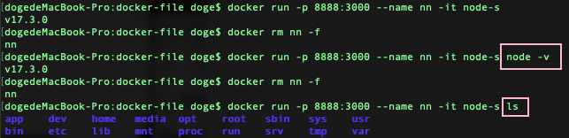
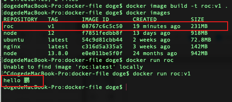
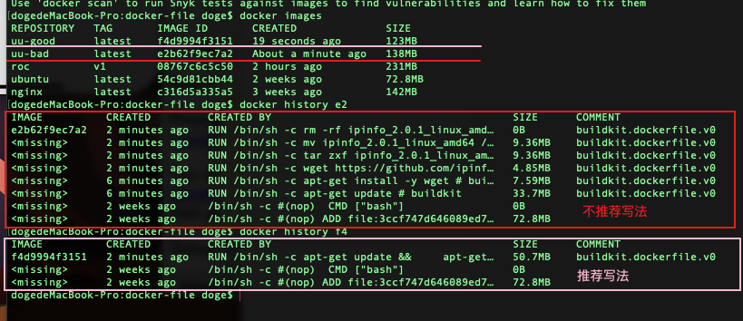
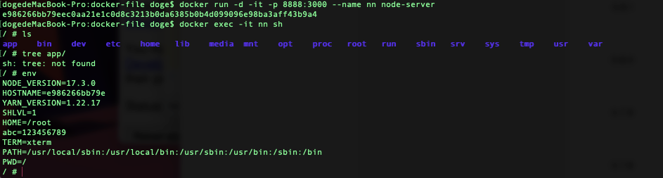
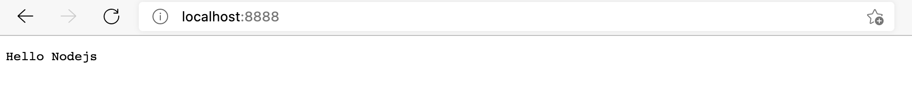

# Docker


## 镜像Image命令

1.  搜索

    `docker search java:8`

2.  拉取镜像

    默认是lastest最新版，可以通过 `:` 指定版本

    `docker pull java:8`

    从 [https://hub.docker.com/](https://hub.docker.com/ "https://hub.docker.com/") 网站下载对应的包

3.  列出本地下载的镜像

    `docker images` or `docer image ls`

4.  删除镜像

    `docker rmi java:8`

    **需要注意的是，当有容器在使用镜像时，是没有办法被删除的。即使容器是停止掉的，依然是没办法删除的。**

    `docker image prune -a` ：删除没有使用中的镜像

5.  查看具体镜像的信息

    1.  `docker image  inspect <IMAGE ID>`

6.  保存镜像

    `docker image save ubuntu -o uu`

    `-o`： 指定保存文件名称

7.  从本地加载镜像

    `docke image load -i uu`

    `-i`：指定加载的镜像文件

8.  通过Dockerfile构建镜像

    `docker image build -f <Dockerfile文件名> -t <Name:tag> <file path>`

    `-t`：指定镜像名称或名称+版本

9.  标记本地镜像，将其归入某一仓库

    `docker image tag <old image name > <new iamge name>`

    标记完后，会复制出一份，原镜像不变

10.


## 容器 container命令


1.  创建容器

    `docker container run nodejs`

    指定别名： 以node:12镜像创建别名为node12的容器

    `docker container run —-name node12 node:12`

2.  删除容器

    `docker container rm <name | id>`

    强制删除： `docker container rm <name | id> -f`

3.  删除多个容器

    \-q：以只显示容器id的形式

    \-a：显示所有内容 包括未运行的

    `docker container rm $(docker ps -qa)`

    `docker system prune -f`   ：删除所有exited的容器 `-f`可选

4.  停止容器

    `docker container stop <name | id>`

5.  停止多个容器

    `docker container stop $(docker pa -aq)`

6.  列出运行中的容器

    `docker container ls`

    别名：`docker ps`

7.  列出运行和停止的容器

    `docker container ls -a`

8.  重启容器

    `docker restart <name | id>`

    以`ubuntu`为例，`run`一个容器并在`ubuntu`中新增一个文件后，`stop`掉该容器，然后重新`restart`该容器，新增的文件还在

9.  杀掉容器

    `docker kill <name | id>`

    杀掉容器后，重复第8点，restart容器，容器内文件还在

10.


## 容器总结：

1.  `杀掉` or `stop`掉容器，并不会删除容器，只要容器还在，重启后，还会恢复到之前的状态

## attached和detached模式

`docker run -d -p 8888:80 nginx` detached模式运行nginx，nginx80映射本机8888端口

1.  区别：&#x20;

    detached是后台运行，命令执行后 不占用该命令窗口，通过参数 `-d` 执行

    attached是前台运行，命令执行后，会占用该窗口，通过ctrl+c退出

2.  detached模式转为attached模式用来调试

    1.  `docker attach <ID or Image Name>`

3.  detached模式下如何查看log

    1.  `docker container logs <ID or Image name>` 命令行列出截止到当前的所有log后，结束

    2.  `docker container logs -f <ID or Image name>` 命令行列出所有log并不退出(类似attached模式)

4.


## 端口映射

`docker run -d -p 8888:80 nginx`

以detached模式后台运行nginx， nginx的80端口 映射到本机8888端口，浏览器localhost:8888可以访问到。前面是本机的端口，`:` 后面的是容器端口

## 开启容器后-直接进交互模式

以ubuntu 示例：执行完会立即进入容器内

`docker run -it ubuntu bash`

`-it`：以交互模式开启&#x20;

开启之后bash模式， 镜像之后的是执行的命令

`docker run -p 8888:3000 --name nn -it node ls` ：启动容器后，直接执行命令`ls`。会覆盖`Dockerfile`中的`CMD`命令

结果



说明

1.  node-s是用Dockerfile创建的镜像，内部最后会执行CMD命令 `node -v`

2.  如果创建镜像后，跟了一个命令，则会执行改命令，不执行CMD命令


## 先开启容器-后进入

以ubuntu 示例：执行完，并不会立即进入容器内

1.  `docker run -d -i —-name uu ubuntu`

    以上命令执行完并不会立即进入ubuntu，`-d`后台方式运行，`-i`以交互方式运行

    此时要进入name为`uu`的ubuntu容器中，可执行下面命令

2\. `docker exec -it uu bash`

说明 ：`exec`执行；`-it`交互方式并分配一个终端；`bash`通过bash运行

3\. 进入后新建一个文件`1.txt`，然后执行命令`exit`退出

4\. 重复第二步，进入ubuntu，`ls`查看目录，会发现`1.txt`文件还在


## Dockerfile制作镜像

目标：

用ubuntu系统，在系统上运行roc.py python文件，输出一段话

分4步走：

1.  安装一个ubuntu系统

    ```docker
    FROM ubuntu:latest
    ```

2.  下载python环境

    ```docker
    RUN  apt-get update && \
             DEBIAN_FRONTEND=noninteractive apt-get install --no-install-recommends -y python3.9 python3-pip python3.9-dev
    ```

3.  新建roc.py文件

    ```docker
    ADD roc.py /
    ```

4.  运行python命令

    ```docker
    CMD ["python3","roc.py"]

    ```


新建一个目录 docker-file， 新建两个文件如下

```docker
.
├── Dockerfile
└── roc.py
```

Dockerfile内容如下

```docker
FROM ubuntu:latest
RUN  apt-get update && \
         DEBIAN_FRONTEND=noninteractive apt-get install --no-install-recommends -y python3.9 python3-pip python3.9-dev
ADD roc.py /
CMD ["python3","roc.py"]
```

roc.py 内容如下

```python
print('hello 鹏')
```


至此，环境所需的东西已经准备好了，就剩构建了，开始

命令： `docker image build -t <Name:tag> <file path>`

执行命令：`docker image build -t roc:v1 .` 。`roc:v1`指定镜像名称和tag，`.`表示目录

finished之后，就表示构建完毕了，可以通过docker images查看结果

使用该镜像run一个容器， docker run roc:v1，可以查看到结果




## Dockerfile推荐写法


### 不建议的写法

新建文件 Dockerfile.bad

```docker
FROM ubuntu:latest
RUN apt-get update
RUN apt-get install -y wget
RUN wget https://github.com/ipinfo/cli/releases/download/ipinfo-2.0.1/ipinfo_2.0.1_linux_amd64.tar.gz
RUN tar zxf ipinfo_2.0.1_linux_amd64.tar.gz
RUN mv ipinfo_2.0.1_linux_amd64 /usr/bin/ipinfo
RUN rm -rf ipinfo_2.0.1_linux_amd64.tar.gz
```

然后执行build命令构建镜像

```bash
docker image build -f Dockerfile.bad -t ipinfo-bad .
```

`-f` :指定要使用的Dockerfile路径;  ******:** 镜像的名字及标签

查看打完的镜像信息 ，大小为**138M**


### 推荐的写法

新建文件 Dockerfile.good

```docker
FROM ubuntu:latest
RUN apt-get update && \
    apt-get install -y wget && \
    wget https://github.com/ipinfo/cli/releases/download/ipinfo-2.0.1/ipinfo_2.0.1_linux_amd64.tar.gz && \
    tar zxf ipinfo_2.0.1_linux_amd64.tar.gz && \
    mv ipinfo_2.0.1_linux_amd64 /usr/bin/ipinfo && \
    rm -rf ipinfo_2.0.1_linux_amd64.tar.gz
```

然后执行build命令构建镜像

```bash
docker image build -f Dockerfile.good -t ipinfo-good .
```

查看打完的镜像信息 ，大小为**123M**

### 二者差别

推荐的写法把RUN命令写成了一个，并不是分步去走



`docker history <name | id>` :查看镜像构建历史，可以看出不推荐的写法里有多个分层


### 常见命令

1.  FROM ：基础镜像

2.  RUN：运行的命令

3.  WORKDIR：指定默认工作目录

    不指定的话，默认是镜像根目录

4.  ENV 和 ARG

    1.  ENV 可以在镜像环境中访问到的变量

        通过以下文件构建的镜像，来运行一个容器，env添加了变量abc

        ```docker
        FROM node:alpine3.14
        ENV abc=123456789
        COPY node-server.js  /app/index.js
        ADD node-server.zip  /app/
        ```

        进入镜像中后，输入env就可以访问到该变量

        

    2.  ARG 构建时可访问的参数

        将以上文件内容 ENV改为ARG

        ```docker
        FROM node:alpine3.14
        ARG abc=123456789
        COPY node-server.js  /app/index.js
        ADD node-server.zip  /app/
        ```

        可以通过参数 `--build-arg` 修改变量abc

        ```bash
        docker image build -f Dockerfile.ARG -t ipinfo-package --build-arg abc=2.0.0 .
        ```

5.  CMD

    ```docker
    FROM node:alpine3.14
    ENV abc=123456789
    COPY node-server.js  /app/index.js
    ADD node-server.zip  /app/
    CMD ["node", "-v"]
    ```

    CMD用来表示容器启动后会执行的命令，但是会被 `docker run <imagename> <命令操作> ` 中的命令操作覆盖。

6.  ENTRYPOINT

    ```docker
    FROM ubuntu:21.04
    ENTRYPOINT ["echo","hello docker"]
    ```

    通过以上命令构建的镜像运行一个容器后，`ENTRYPOINT` 定义的命令也会被执行，

    但是如果镜像后面跟其他命令后，它就会被当做参数跟在后面

    `docker run <imagename> <命令操作>`&#x20;

    ```docker
    FROM node:alpine3.14
    ENV abc=123456789
    COPY node-server.js  /app/index.js
    ENTRYPOINT ["node"]
    CMD ["node", "-v"]
    ```

    &#x20;通过命令`docker build -f Dockerfile.entry -t node-en .` 构建出镜像

    运行一个容器 `docker run node-en` ，会报错，此时执行的命令是 `node node -v`&#x20;

    运行容器加参数`docker run node-en -v` ，会打印容器的node版本。

    总结：ENTRYPOINT可以配合`命令操作` ，实现给Dockerfile中的`ENTRYPOINT`命令传参。

    有`命令操作`后，Dockerfile中的CMD就不会执行了。这样就实现了`ENTRYPOINT` 与`CMD` 配合达到的效果

7.

## 容器中启动node服务

需要用到Dockerfile 的`COPY`命令

1.  新建目录 node-server

    ```bash
    .
    ├── Dockerfile.node
    └── node-server.js
    ```

2.  新建文件node-server.js 和 Dockerfile.node， 内容如下

    1.  node-server.js

        ```javascript
        //1. 导入 http 模块
        const http = require("http");
        //2. 创建服务器对象
        const server = http.createServer();
        //3. 开启服务器
        server.listen(3000, () => {
          console.log("Server is running...");
        });
        //4. 监听浏览器请求并进行处理
        server.on("request", (req, res) => {
          // end方法能够将数据返回给浏览器，浏览器会显示该字符串
          res.end("Hello Nodejs");
        });

        ```

    2.  Dockerfile.node

        ```docker
        FROM node:alpine3.14
        COPY node-server.js  /app/index.js
        ```

3.  利用Dockerfile创建镜像

    ```bash
    docker build -f Dockerfile.node -t node-server .
    ```

4.  通过该镜像run一个容器

    ```bash
    docker run -it -p 8888:3000 node-server sh
    ```

5.  到容器中启动node服务

    ```bash
    # ls
    app    bin    dev    etc    home   lib    media  mnt    opt    proc   root   run    sbin   srv    sys    tmp    usr    var

    // node服务的index.js 文件在 app/index.js中
    node app/index.js
    ```

6.  本机浏览器访问node起的服务

    

7.
