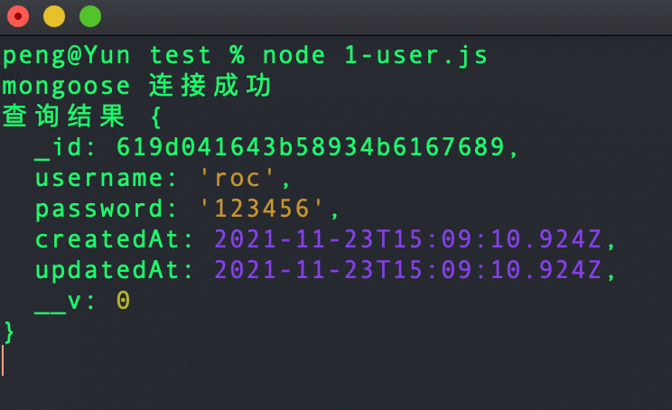
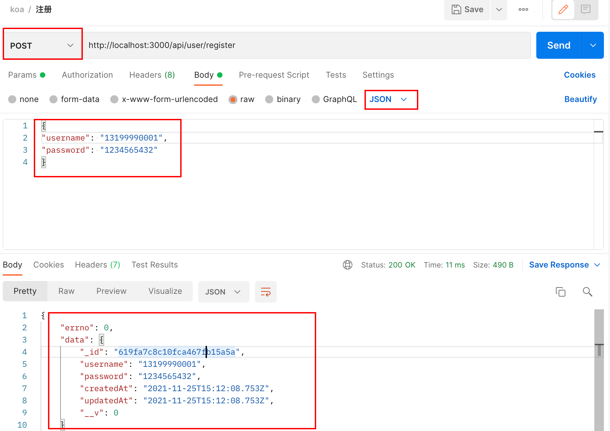
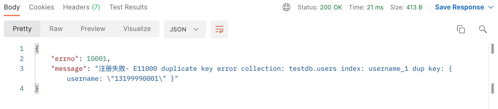
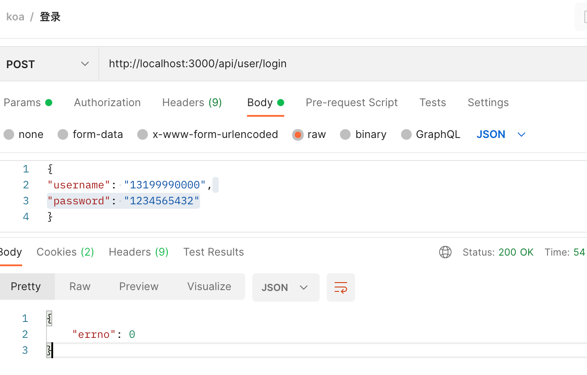
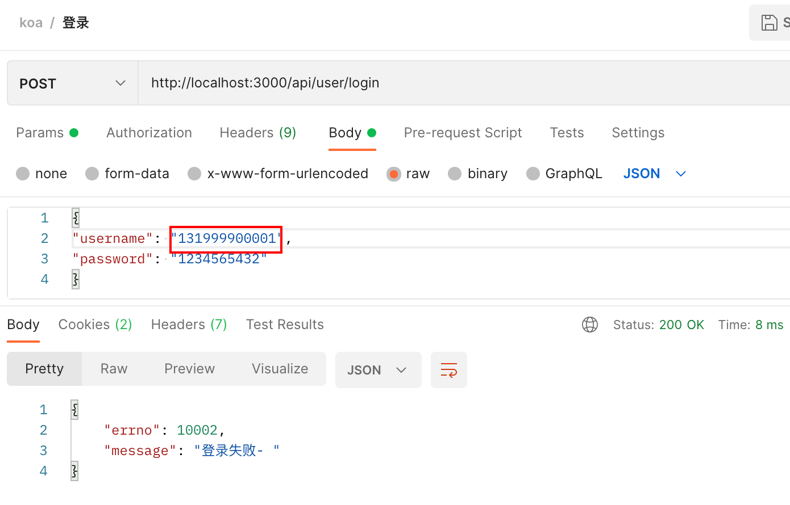

# Brew & MongoDB

## 安装

<https://brew.sh/>

```javascript
/bin/bash -c "$(curl -fsSL https://raw.githubusercontent.com/Homebrew/install/HEAD/install.sh)"

```

## brew切换源

<https://lug.ustc.edu.cn/wiki/mirrors/help/brew.git/>

<https://www.jianshu.com/p/bea984d27cd2>


```javascript
# 替换brew.git
cd "$(brew --repo)"
git remote set-url origin https://mirrors.tuna.tsinghua.edu.cn/git/homebrew/brew.git

# 替换homebrew-core.git
cd "$(brew --repo)/Library/Taps/homebrew/homebrew-core"
git remote set-url origin https://mirrors.tuna.tsinghua.edu.cn/git/homebrew/homebrew-core.git

# 刷新源
brew update
```


## 使用brew安装mongodb

现在已经不开源了，只能安装供学习的mongodb社区版本

<https://github.com/mongodb/homebrew-brew>


mac如下安装 windows到社区下载

<https://www.mongodb.com/try/download/community>

```javascript
// 第一步
brew tap mongodb/brew
// 第二步
brew install mongodb-community
```

安装好后怎么启动呢

### 启动mongodb

```纯文本
brew services start mongodb-community
```

启动后会提示success

```javascript
Successfully started `mongodb-community`
```

怎么验证启动了呢

接着输入 `mongo`

就会进入命令行模式

### 停止mongodb

```javascript
brew services stop mongodb-community
```


### 下载mongodb compass图像化界面

安装后，先启动mongodb

```javascript
brew services start mongodb-community
```

然后compass内connect后就会出现各个database, database下有collection

### 使用mongoose v5版本连接数据库

```javascript
/**
 * @description mongoose 连接数据库
 * @auther roc
 */
const mongoose = require("mongoose"); // v5版本

const url = "mongodb://localhost:27017"; // 本地默认数据库
const dbName = "testdb"; // 数据库名称

// 配置
mongoose.set("useCreateIndex", true); // v5版本 6版本会报错
mongoose.set("useFindAndModify", false);

// 开始连接
mongoose.connect(`${url}/${dbName}`, {
  useNewUrlParser: true,
  useUnifiedTopology: true,
});

// 连接对象
const db = mongoose.connection;

db.on("error", (err) => {
  console.error("mongoose connect error", err);
});

db.once("open", () => {
  console.log("mongoose 连接成功");
});

module.exports = mongoose;

```

检验是否连接成功 `node 该文件`，执行前需要执行以下步骤，否则不成功

1.  命令行启动mongodb

    `brew services start mongodb-community`

2.  打开 MongoDB Compass , connect连接


### 创建Models

可以通过以下方式定义Model，先定义Schema，然后根据Schema通过mongoose.model()生成Model

user Model

```javascript
// 定义用户的Model
const mongoose = require("../db/db");
const Schema = mongoose.Schema(
  {
    username: {
      type: String,
      require: true, // 必须
      unique: true, // 唯一不可重复
    },
    password: String,
  },
  {
    timestamps: true,
  }
);

const User = mongoose.model("user", Schema);

module.exports = User;
```

address Model

```javascript
const mongoose = require("../db/db");
const Schema = mongoose.Schema(
  {
    username: {
      type: String,
      require: true, // 必须
    },
    city: String,
    department: String,
    houseNumber: String,
    name: String,
    phone: String,
  },
  {
    timestamps: true,
  }
);
const Address = mongoose.model("address", Schema);
module.exports = Address;
```


商店 model

```javascript
const Schema = mongoose.Schema(
  {
    name: String,
    imgUrl: String,
    sales: Number,
    expressLimit: {
      type: Number,
      default: 0,
    },
    expressPrice: Number,
    slogan: String,
  },
  {
    timestamps: true,
  }
);

const Shop = mongoose.model("shop", Schema);

module.exports = Shop;
```

商品 Model

```javascript
const mongoose = require("../db/db");

const Schema = mongoose.Schema(
  {
    shopId: {
      type: String,
      require: true,
    },
    name: String,
    imgUrl: String,
    sales: Number,
    price: Number,
    oldPrice: Number,
    //   侧边的tabs 规定此商品属于哪个tab
    tabs: [String], // ['all', 'kill']
  },
  {
    timestamps: true,
  }
);

const Product = mongoose.model("product", Schema);

module.exports = Product;
```

### 模拟创建用户

在db目录下新建test.sj文件

```javascript
const User = require("../../models/User");

!(async () => {
  // 创建一个用户
  //   await User.create({
  //     username: "roc",
  //     password: "123456",
  //   });

  //   在创建一个用户
  //   await User.create({
  //     username: "peng",
  //     password: "456",
  //   });

  const roc = await User.findOne({
    username: "roc",
    password: "123456",
  });

  console.log("查询结果", roc);
})();
```

User.create()可以创建一个用户，User.findOne是查找用户，创建和查找结果如下

创建结果


查找结果



### 注册接口

首先在`src/controller`下新建用户相关的操作文件`user.js` ,内容如下

```javascript
const User = require("../models/User");
/**
 *注册
 * @param {string} username 用户名
 * @param {string} password 密码
 * @returns 创建结果
 */
async function register(username, password) {
  const newUser = await User.create({
    username,
    password,
  });
  return newUser;
}

module.exports = {
  register
};

```

controller主要是操作数据库，那么在哪里调接口呢，是在`src/routes/users.js` ,在这里定义注册登录等接口，先来写注册接口

```javascript
const router = require("koa-router")();
const { register } = require("../controller/user");

router.prefix("/api/user"); // 路由前缀

// 注册
router.post("/register", async function (ctx, next) {
  const { username, password } = ctx.request.body;
  try {
    const newUser = await register(username, password);
     ctx.body = {
      error: 0, // 成功
      data: newUser,
    };
  } catch (error) {
    console.error(error);
    ctx.body = {
      error: 10001,
      message: "创建失败- " + error.message,
    };
  }
});
```

完整注册地址为 `/api/user/register` ,方法为post, 当注册时，会调用controller中的register方法，会通过User.create()方法去创建这个用户， 返回创建结果，然后await 拿到注册结果，通过ctx.body 返回给前端。

问题：这样返回成功或错误信息会很繁琐，每次都得手动写，以后也不好维护，所以先定义好成功和失败的错误信息，统一处理

### 统一处理结果信息

在 `src/res-models` 下新建 `SuccessModel.js` 文件和 `ErrorModel.js` 文件，分别如下

成功的class

```javascript
class SuccessModel {
  constructor(data) {
    this.errno = 0;
    if (data !== null) this.data = data;
  }
}

module.exports = SuccessModel;
```

失败的class

```javascript
class ErrorModel {
  constructor(error = -1, message = "error") {
    this.errno = error;
    this.message = message;
  }
}

module.exports = ErrorModel;
```

成功可以选择是否返回data，失败会返回error和message

有了这两个类，就可以完善下之前的注册接口了

```javascript
const { ErrorModel, SuccessModel } = require("../res-model/index");

router.post("/register", async function (ctx, next) {
  const { username, password } = ctx.request.body;
  try {
    const newUser = await register(username, password);
    ctx.body = new SuccessModel(newUser);
  } catch (error) {
    console.error(error);
    ctx.body = new ErrorModel(10001, "注册失败- " + error.message);
  }
});
```

启动程序，打开postman 进行测试，结果如下



通过post传给koa json的数据，会返回注册后的信息，如果同样的信息，再次注册就会是如下结果了，提示注册失败




### 登录接口

有了上面的铺垫，登录就容易多了 ， 数据库相关的放在controller/user.js中

```javascript
/**
 *登录
 * @param {string} username 用户名
 * @param {string} password 密码
 * @returns 查询结果
 */
async function login(username, password) {
  const user = await User.findOne({
    username,
    password,
  });
  return user != null ? true : false;
}
```

接口逻辑写在和注册一个文件里 `src/routes/users.js`

```javascript
// 登录
router.post("/login", async function (ctx, next) {
  const { username, password } = ctx.request.body;
  console.log("** --- result --- **", username); // wsp-log
  const result = await login(username, password);
  if (result) {
    ctx.session.userInfo = { username };
    ctx.body = new SuccessModel();
  } else {
    ctx.body = new ErrorModel(10002, "登录失败- ");
  }
});
```

下面分别测试登录成功和失败的结果

成功



失败



失败的是username多了个1，所以会返回登录失败

### 创建地址

创建地址需要登录人在登录状态，所以需要校验登录状态，由于登录后会返回给前端用户信息 `ctx.session.userInfo = { username };` ，所以创建地址可以拿到用户信息。

地址的逻辑

地址controller

```javascript
const Address = require("../models/Address");

/**
 * 创建地址
 * @param {string} username 用户名
 * @param {Object} data 地址信息
 * @returns 新的地址
 */
async function createAddress(username, data) {
  const address = await Address.create({
    username,
    ...data,
  });
  return address;
}
```

创建地址api

```javascript
router.prefix("/api/user/address");

// 创建收货地址 loginCheck 是登录校验 只有登录了才可以创建
router.post("/", loginCheck, async (ctx, next) => {
  const userInfo = ctx.session.userInfo;
  const data = ctx.request.body;

  try {
    const newAddress = await createAddress(userInfo.username, data);
    ctx.body = new SuccessModel(newAddress);
  } catch (error) {
    console.error(error);
    ctx.body = new ErrorModel(10003, "创建地址失败");
  }
});
```

可以发现，post的第二个参数是loginCheck，用来做登录校验，他是一个中间件 在`middleware/logincheck.js` ，内容如下

```javascript
/**
 * 登录验证中间件
 */
const { ErrorModel } = require("../res-model/index");
module.exports = async (ctx, next) => {
  const session = ctx.session;
  if (session && session.userInfo) {
    await next();
    return;
  } else {
    ctx.body = new ErrorModel(10003, "session不存在");
  }
};

```

如果没有session信息，就会返回登录不存在

以上就是创建地址的流程，逻辑写完，别忘了在入口文件app.js中引入，并注册路由信息

```javascript
const address = require("./routes/address");

app.use(address.routes(), address.allowedMethods());

```

[创建地址 、获取地址列表、详情、更新路由](https://www.wolai.com/5BcTgDLEjdwd8wiS2UytTW "创建地址 、获取地址列表、详情、更新路由")

