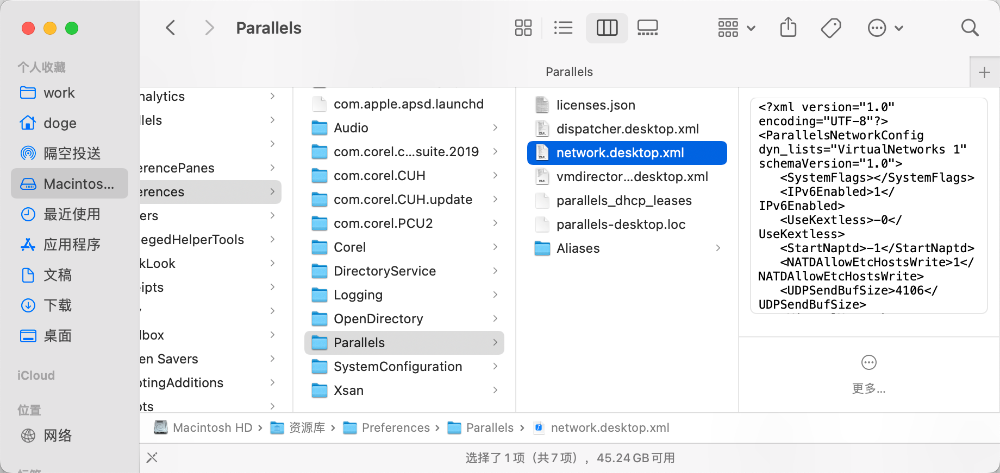

# Parallels 安装window10

### 提示网络问题的话

在下方文件打开，修改\<UseKextless>-1\</UseKextless>  中 1改为0

### 操作失败

[Parallels Desktop 17.1.1 操作失败(执行该操作失败) 解决方案\_h领小白帽的博客-CSDN博客](https://blog.csdn.net/weixin_46944519/article/details/123016399 "Parallels Desktop 17.1.1 操作失败(执行该操作失败) 解决方案_h领小白帽的博客-CSDN博客")

高级 → 虚拟选择Parallels 然后重新启动

***

***

### ios 安装 tiktok

[我在iPhone上安装ios版Tiktok抖音国际版 无需拔卡完美使用方法 苹果iPhone版Tiktok抖音国际版不拔卡安装教程 - YouTube](https://www.youtube.com/watch?v=_r9qTGoxefQ "我在iPhone上安装ios版Tiktok抖音国际版 无需拔卡完美使用方法 苹果iPhone版Tiktok抖音国际版不拔卡安装教程 - YouTube")

